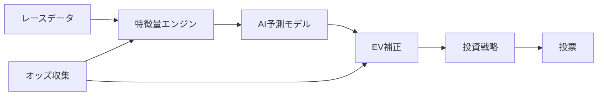

# 競馬AI予測システム v5.5

過去のレースデータから学習し、投票の「期待値」を計算するオープンソースの競馬予測システムです。

## 特徴

- **2段階AI予測** — 「当たる確率」と「当たった時の払戻し額」を別々に学習することで、予測精度を高めています
- **自動資金管理** — ドローダウン（資金の減少）を自動検知し、投資額を安全に調整します
- **市場状態検知** — オッズの動きから「人気馬が勝ちやすい日」や「荒れやすい日」を見分けます
- **厳密な検証** — ウォークフォワード検証とホールドアウト検証の2段階で、過去データへの過学習を防ぎます

## 全体フロー



## クイックスタート

```bash
# 1. Python 3.11 をインストール・アクティベート
mise install && mise activate

# 2. 依存パッケージをインストール
pip install -e ".[dev]"

# 3. テストを実行して動作確認
python -m pytest tests/ -v
```

データベースのセットアップや各機能の詳細な使い方は [Getting Started](docs/guide/04_getting_started.md) をご覧ください。

## ドキュメントマップ

知識レベルに合わせてお好きなところから読めます。

### 入門編（競馬やAIの基礎から）

- [競馬の基礎知識](docs/guide/01_keiba_basics.md) — 競馬のルールとデータの見方
- [AI予測の基礎](docs/guide/02_ai_prediction_basics.md) — AIはどうやって予測しているのか
- [システム全体像](docs/guide/03_system_overview.md) — このシステムがやっていることの全体像
- [はじめ方](docs/guide/04_getting_started.md) — 環境構築から最初の予測まで

### 中級編（各モジュールの仕組み）

- [データパイプライン](docs/concepts/01_data_pipeline.md) — データ収集から特徴量生成まで
- [予測モデル](docs/concepts/02_prediction_models.md) — 2段階モデルの仕組みと学習方法
- [高度なモデル手法](docs/concepts/03_advanced_models.md) — EV補正・レジーム検知・市場モデル
- [投票戦略](docs/concepts/04_betting_strategy.md) — 資金管理とDDコントローラー
- [バックテストと検証](docs/concepts/05_backtest_validation.md) — ウォークフォワード検証の設計

### 上級編（開発・運用の詳細）

- [アーキテクチャ](docs/reference/01_architecture.md) — 全体設計と設計判断の理由
- [コード構成](docs/reference/02_code_structure.md) — ディレクトリ構造と主要モジュール
- [設定ファイル](docs/reference/03_configuration.md) — settings.yaml の全項目解説
- [コントリビューション](docs/reference/04_contributing.md) — 開発参加の手引き

## 期待できる成果とリスク

| 項目 | 目標 |
|------|------|
| 回収率 | **101%以上**（100円賭けて平均101円以上の払戻し） |
| 最大ドローダウン | **16%以内** |

> **注意:** 過去のデータでの検証結果は、将来の成績を保証するものではありません。競馬は不確実性の高いギャンブルであり、本システムを使用して生じた損失について、開発者は一切の責任を負いません。

## 免責事項

本システムは**学習・研究目的**で公開されているオープンソースソフトウェアです。実際の投票に使用するかどうかは自己責任でお願いします。ギャンブルには依存リスクがあり、法的に制限されている地域もあります。健全な範囲で楽しみましょう。

## 技術スタック

| カテゴリ | 技術 |
|----------|------|
| 言語 | Python 3.11 |
| 機械学習 | LightGBM, scikit-learn |
| データベース | PostgreSQL (EveryDB2 / JRA-VAN DataLab) |
| 実験管理 | MLflow |
| 品質ツール | Ruff (lint/format), Mypy (型チェック), pytest (テスト) |

## ライセンス

MIT License
