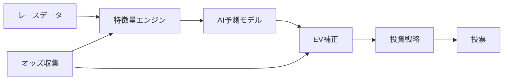

# 競馬AI予測システム v5.5

過去のレースデータから学習し、投票の「期待値」を計算するオープンソースの競馬予測システムです。

## 特徴

- **2段階AI予測** — 「当たる確率」と「当たった時の払戻し額」を別々に学習することで、予測精度を高めています
- **自動資金管理** — ドローダウン（資金の減少）を自動検知し、投資額を安全に調整します
- **市場状態検知** — オッズの動きから「人気馬が勝ちやすい日」や「荒れやすい日」を見分けます
- **厳密な検証** — ウォークフォワード検証とホールドアウト検証の2段階で、過去データへの過学習を防ぎます

## 全体フロー



## クイックスタート

```bash
# 1. Python 3.11 をインストール・アクティベート
mise install && mise activate

# 2. 依存パッケージをインストール
pip install -e ".[dev]"

# 3. テストを実行して動作確認
python -m pytest tests/ -v
```

データベースのセットアップや各機能の詳細な使い方は [Getting Started](docs/guide/04_getting_started.md) をご覧ください。

## パイプライン実行方法

PostgreSQL (EveryDB2) が `localhost:5432` で稼働している前提です。

```bash
# 環境変数の設定
export PGPASSWORD=<your_password>

# Step 1: ETL — EveryDB2のデータをParquetにエクスポート
python scripts/run_etl.py --start 20140101 --end 20231231

# Step 2: 学習 — 特徴量生成 + LightGBMモデルの学習
python scripts/run_train.py --start 20200101 --end 20231231

# Step 3: バックテスト — 学習+テスト期間の投資シミュレーション
python scripts/run_backtest.py \
  --train-start 20200101 --train-end 20231231 \
  --test-start 20240101 --test-end 20241231
```

### スクリプト一覧

| スクリプト | 役割 | 所要時間 |
|-----------|------|---------|
| `scripts/run_etl.py` | PostgreSQL (EveryDB2) → Parquetファイル群へのETL | ~5分 |
| `scripts/run_train.py` | HorseHistoryFeatures生成 + LightGBM Ranker + 補正モデル学習 | ~68分 |
| `scripts/run_backtest.py` | 学習 → テスト期間でレース毎にシミュレーション → ROI計算 | ~80分 |

### バックテスト結果（2020-2023学習 / 2024テスト）

| 項目 | 値 |
|------|------|
| テストベット数 | 2,967 |
| 投資額 | 296,700 円 |
| 払戻額 | 196,780 円 |
| ROI | 66.3% |
| 最大ドローダウン | 99.9% |

> 現状は固定100円ベットの簡易戦略であり、ROIは市場を上回れていません。改善の余地があります。

## Paper Trading（ペーパートレード）

学習済みモデルを使って、**実際のレース当日にリアルタイムで予測を出力する**システムです。実際の投票は行わず、予測結果と実際のレース結果を比較してモデルの精度を検証します。

### 追加した機能

- **リアルタイム予測** — レース出走前にモデルがベット対象を自動判定
- **Slack通知** — 予測結果・ベット対象・日次サマリーをSlackに通知
- **自動確定処理** — レース結果取得後にベットの勝敗を自動計算（冪等設計）
- **HTMLレポート** — 日次のベット履歴・ROI・ドローダウンをHTMLで可視化
- **ドライラン** — 過去のレースデータを使って一連の流れをシミュレーション

### アーキテクチャ

```
PaperTradingConfig（設定管理）
       │
ModelLoader（MLflow → 学習済みモデルを読み込み）
       │
RacePredictor（共通推論パイプライン: BacktestEngine + PaperPredictor共用）
       │
PaperPredictor（setup: 特徴量事前計算 → predict_race: リアルタイム予測）
       │
RaceWatcher（レース時刻待機 + リトライ + Slack通知）
       │
PaperReconciler（ベット確定・ROI計算・冪等性保証）
       │
PaperTradingReport（HTMLレポート生成: Jinja2）
```

### 実行方法

```bash
# 環境変数の設定
export PGPASSWORD=<your_password>
export SLACK_WEBHOOK_URL=<your_slack_webhook_url>

# Step 1: Setup — その日のレース情報と特徴量を事前計算
python scripts/run_paper_trading.py --mode setup --date 2026-04-05

# Step 2: Watch — レース時刻に合わせて予測を実行（Slack通知付き）
python scripts/run_paper_trading.py --mode watch --date 2026-04-05

# Step 3: Reconcile — レース結果を取得してベットの勝敗を確定
python scripts/run_paper_trading.py --mode reconcile --date 2026-04-05

# (参考) Dry-run — 過去データで一連の流れをシミュレーション
python scripts/run_paper_trading.py --mode dry-run --date 2024-07-13
```

### 各モードの説明

| モード | やること | タイミング |
|--------|---------|-----------|
| `setup` | レース出走表を取得し、全馬の特徴量を事前計算して保存 | レース前（例: 前日または当日朝） |
| `watch` | レース時刻まで待機し、馬体重・最新オッズを取得して予測・ベット判定 | レース当日 |
| `reconcile` | レース結果を取得し、未確定ベットの勝敗を計算してHTMLレポート生成 | レース終了後 |
| `dry-run` | 過去データで setup→watch→reconcile の全工程を一括シミュレーション | いつでも |

### 次のステップ（稼働前に必要な準備）

1. **EveryDB2のテーブル名確認** — `src/db/everydb2_queries.py` 内のSQLテーブル名を実際のEveryDB2インスタンスに合わせて修正
2. **モデルの再学習** — `run_train.py` を実行してMLflowに全モデルを保存（ModelLoaderが読み込める形式）
3. **ドライランで動作確認** — `--mode dry-run --date 2024-07-13` で過去データを使って一連の流れをテスト
4. **cron等で自動化** — setup/watch/reconcile をそれぞれ適切な時刻に定期実行するようスケジュール設定

### 追加ファイル一覧

| ファイル | 行数 | 役割 |
|----------|------|------|
| `src/paper_trading/config.py` | 50 | PaperTradingConfig 設定クラス |
| `src/paper_trading/predictor.py` | 179 | setup/predict_race オーケストレーション |
| `src/paper_trading/reconciler.py` | 147 | 冪等性保証のベット確定処理 |
| `src/paper_trading/watcher.py` | 141 | レース時刻待機 + リトライロジック |
| `src/paper_trading/report.py` | 156 | HTMLレポート生成（Jinja2） |
| `src/backtest/race_predictor.py` | 185 | BacktestEngineと共用の推論パイプライン |
| `src/db/model_loader.py` | 177 | MLflow → TrainedModelsV5 復元 |
| `src/db/everydb2_queries.py` | 160 | EveryDB2 PostgreSQL クエリラッパー |
| `src/monitoring/notifier.py` | +57 | Slack通知機能（追加） |
| `src/pipelines/training_pipeline.py` | +75 | MLflow ログ拡張（追加） |
| `scripts/run_paper_trading.py` | 393 | CLI エントリーポイント |

## ドキュメントマップ

知識レベルに合わせてお好きなところから読めます。

### 入門編（競馬やAIの基礎から）

- [競馬の基礎知識](docs/guide/01_keiba_basics.md) — 競馬のルールとデータの見方
- [AI予測の基礎](docs/guide/02_ai_prediction_basics.md) — AIはどうやって予測しているのか
- [システム全体像](docs/guide/03_system_overview.md) — このシステムがやっていることの全体像
- [はじめ方](docs/guide/04_getting_started.md) — 環境構築から最初の予測まで

### 中級編（各モジュールの仕組み）

- [データパイプライン](docs/concepts/01_data_pipeline.md) — データ収集から特徴量生成まで
- [予測モデル](docs/concepts/02_prediction_models.md) — 2段階モデルの仕組みと学習方法
- [高度なモデル手法](docs/concepts/03_advanced_models.md) — EV補正・レジーム検知・市場モデル
- [投票戦略](docs/concepts/04_betting_strategy.md) — 資金管理とDDコントローラー
- [バックテストと検証](docs/concepts/05_backtest_validation.md) — ウォークフォワード検証の設計

### 上級編（開発・運用の詳細）

- [アーキテクチャ](docs/reference/01_architecture.md) — 全体設計と設計判断の理由
- [コード構成](docs/reference/02_code_structure.md) — ディレクトリ構造と主要モジュール
- [設定ファイル](docs/reference/03_configuration.md) — settings.yaml の全項目解説
- [コントリビューション](docs/reference/04_contributing.md) — 開発参加の手引き

## 期待できる成果とリスク

| 項目 | 目標 | 現状 |
|------|------|------|
| 回収率 | **101%以上**（100円賭けて平均101円以上の払戻し） | 66.3% |
| 最大ドローダウン | **16%以内** | 99.9% |

> **注意:** 過去のデータでの検証結果は、将来の成績を保証するものではありません。競馬は不確実性の高いギャンブルであり、本システムを使用して生じた損失について、開発者は一切の責任を負いません。

## 免責事項

本システムは**学習・研究目的**で公開されているオープンソースソフトウェアです。実際の投票に使用するかどうかは自己責任でお願いします。ギャンブルには依存リスクがあり、法的に制限されている地域もあります。健全な範囲で楽しみましょう。

## 技術スタック

| カテゴリ | 技術 |
|----------|------|
| 言語 | Python 3.11 |
| 機械学習 | LightGBM, scikit-learn |
| データベース | PostgreSQL (EveryDB2 / JRA-VAN DataLab) |
| 実験管理 | MLflow |
| 品質ツール | Ruff (lint/format), Mypy (型チェック), pytest (テスト) |

## ライセンス

MIT License
