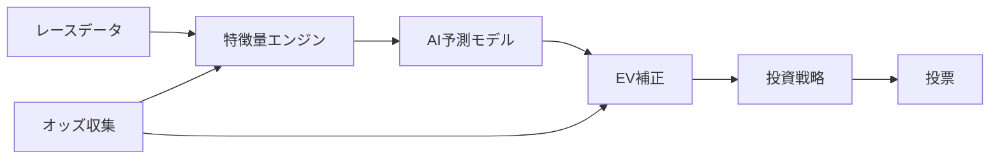

# 競馬AI予測システム v5.5

過去のレースデータから学習し、投票の「期待値」を計算するオープンソースの競馬予測システムです。

## 特徴

- **2段階AI予測** — 「当たる確率」と「当たった時の払戻し額」を別々に学習することで、予測精度を高めています
- **自動資金管理** — ドローダウン（資金の減少）を自動検知し、投資額を安全に調整します
- **市場状態検知** — オッズの動きから「人気馬が勝ちやすい日」や「荒れやすい日」を見分けます
- **厳密な検証** — ウォークフォワード検証とホールドアウト検証の2段階で、過去データへの過学習を防ぎます

## 全体フロー



## クイックスタート

```bash
# 1. Python 3.11 をインストール・アクティベート
mise install && mise activate

# 2. 依存パッケージをインストール
pip install -e ".[dev]"

# 3. テストを実行して動作確認
python -m pytest tests/ -v
```

データベースのセットアップや各機能の詳細な使い方は [Getting Started](docs/guide/04_getting_started.md) をご覧ください。

## パイプライン実行方法

PostgreSQL (EveryDB2) が `localhost:5432` で稼働している前提です。

```bash
# 環境変数の設定
export PGPASSWORD=<your_password>

# Step 0: 馬キャリア統計の事前計算（horse_career_stats.py を変更した場合のみ必要）
python scripts/precompute_career_stats.py

# Step 1: ETL — EveryDB2のデータをParquetにエクスポート
python scripts/run_etl.py --mode full --start 20140101 --end 20251231

# Step 2: 学習 — 特徴量生成 + LightGBMモデルの学習（4年ウィンドウ推奨）
python scripts/run_train.py --start 20220101 --end 20251231

# Step 3: バックテスト — 学習+テスト期間の投資シミュレーション
python scripts/run_backtest.py \
  --train-start 20220101 --train-end 20251231 \
  --test-start 20260101 --test-end 20261231
```

### スクリプト一覧

| スクリプト | 役割 | 所要時間 |
|-----------|------|---------|
| `scripts/precompute_career_stats.py` | 各馬×各レース時点での累積成績を事前計算（PIT安全） | ~2分 |
| `scripts/run_etl.py` | PostgreSQL (EveryDB2) → Parquetファイル群へのETL | ~10分 (full) |
| `scripts/run_train.py` | HorseHistoryFeatures生成 + LightGBM Ranker + 補正モデル学習 | ~17分 |
| `scripts/run_backtest.py` | 学習→バックテスト（単一年度/マルチ年度、アンサンブル/Kelly/manifest対応） | ~57分/年 |
| `scripts/run_wf_validation.py` | 2-fold ウォークフォワード検証（過学習検出 + feature importance安定性） | ~4時間 |
| `scripts/run_strategy_optimization.py` | Optuna 16次元戦略パラメータ最適化（multi-seed安定性検証対応） | ~2.5h/trial |
| `scripts/run_paper_trading.py` | リアルタイム予測・結果照合（setup/predict/reconcile/dry-run） | ~25秒/日 |
| `scripts/run_tuning.py` | Optuna によるハイパーパラメータチューニング | ~30分 (50trials) |

### スクリプト引数詳細

#### run_etl.py

```bash
python scripts/run_etl.py --mode full --start 20140101 --end 20251231  # 全量抽出
python scripts/run_etl.py --mode delta                                 # 差分マージ
```

| 引数 | 型 | デフォルト | 説明 |
|------|-----|-----------|------|
| `--mode` | `full`\|`delta` | **必須** | `full`=全量抽出、`delta`=差分マージ |
| `--start` | YYYYMMDD | — | 開始日 (`full`で必須) |
| `--end` | YYYYMMDD | — | 終了日 (`full`で必須) |
| `--tables` | list[str] | — | 対象テーブル (省略時は全テーブル) |

#### run_train.py

```bash
python scripts/run_train.py --start 20200101 --end 20231231 --ensemble
```

| 引数 | 型 | デフォルト | 説明 |
|------|-----|-----------|------|
| `--start` | YYYYMMDD | **必須** | 学習開始日 |
| `--end` | YYYYMMDD | **必須** | 学習終了日 |
| `--ensemble` | flag | False | StackedEnsemble有効化 (LGBM+XGB+CB→Ridge) |
| `--experiment` | str | `keiba-v5` | MLflow実験名 |

#### run_backtest.py

学習→テスト期間の投資シミュレーション。毎回学習し直す設計（再現性保証）。モデルは `data/models-backtest/` に保存。

```bash
# 単一年度
python scripts/run_backtest.py \
  --train-start 20200101 --train-end 20231231 \
  --test-start 20240101 --test-end 20241231 --ensemble

# マルチ年度
python scripts/run_backtest.py --years 2023 2024 2025 --train-window 4 --ensemble

# Optuna最適化済みパラメータで検証
python scripts/run_backtest.py \
  --ensemble --strategy-manifest data/strategy_manifest.json \
  --train-start 20200101 --train-end 20231231 \
  --test-start 20240101 --test-end 20241231
```

| 引数 | 型 | デフォルト | 説明 |
|------|-----|-----------|------|
| `--train-start` | YYYYMMDD | — | 学習開始日 (単一年度モード) |
| `--train-end` | YYYYMMDD | — | 学習終了日 (単一年度モード) |
| `--test-start` | YYYYMMDD | — | テスト開始日 (単一年度モード) |
| `--test-end` | YYYYMMDD | — | テスト終了日 (単一年度モード) |
| `--years` | list[int] | — | テスト年度リスト (マルチ年度モード) |
| `--train-window` | int | 4 | 学習年数 (マルチ年度モード) |
| `--ensemble` | flag | False | アンサンブルモデル有効化 |
| `--betting-mode` | `flat`\|`kelly` | `flat` | `flat`=100円固定、`kelly`=Fractional Kelly |
| `--betting-target` | `win`\|`place`\|`wide` | `win` | 投票対象 |
| `--report` | flag | False | HTMLレポート + parquet出力 |
| `--skip-train` | flag | False | 学習スキップ (キャッシュモデル使用、`--ensemble`必須) |
| `--profile` | flag | False | pyinstrumentプロファイリング (`data/profiles/`) |
| `--strategy-manifest` | str | — | Optuna最適化済みmanifest JSON (`--ensemble`必須) |
| `--calibration-bt` | flag | False | OddsBandFilter キャリブレーション用軽量BT (直近12ヶ月) |

**キャリブレーションBT:** `--calibration-bt` 指定時のみ直近12ヶ月の軽量BTを実行（~57分、ROI改善）。未指定時はスキップ（~41分）。`--strategy-manifest` とは独立して動作。
**モード切替:** `--years`指定→マルチ年度、4つのtrain/test指定→単一年度。いずれか必須。
**出力:** `backtest_result.json`、`data/validation/validation_report.json`、`data/backtest/bt_{year}_*.{csv,parquet}`

#### run_wf_validation.py

2-fold WF検証で過学習を検出。Feature importance安定性 (Spearman rho) とROI gapを測定。

```bash
python scripts/run_wf_validation.py --ensemble
```

| 引数 | 型 | デフォルト | 説明 |
|------|-----|-----------|------|
| `--ensemble` | flag | False | アンサンブルモデル有効化 |
| `--betting-target` | `win`\|`place`\|`wide` | `win` | 投票対象 |
| `--profile` | flag | False | pyinstrumentプロファイリング |

**Fold定義 (ハードコード):** Fold0=train 2020-2023/test 2024、Fold1=train 2021-2024/test 2025
**出力:** `data/backtest/wf_validation_result.json`
**判定:** `roi_gap_verdict`, `consistency_verdict`, `stability_verdict`, `overall_verdict`

#### run_strategy_optimization.py

学習済みモデルに対して16次元戦略パラメータをOptuna TPEで最適化。

```bash
# 単一seed
python scripts/run_strategy_optimization.py \
  --n-trials 100 --models-dir data/models-backtest \
  --output data/strategy_manifest.json

# multi-seed安定性検証
python scripts/run_strategy_optimization.py \
  --n-trials 100 --seeds 42,43,44 \
  --models-dir data/models-backtest \
  --output data/stability/strategy_manifest.json
```

| 引数 | 型 | デフォルト | 説明 |
|------|-----|-----------|------|
| `--n-trials` | int | 100 | Optuna試行回数 |
| `--seed` | int | 42 | TPESampler乱数シード (単一seed時) |
| `--models-dir` | str | `data/models` | 学習済みモデルディレクトリ |
| `--output` | str | `data/strategy_manifest.json` | 出力manifestパス |
| `--min-bets` | int | 1000 | 1foldあたりの最低ベット数 |
| `--seeds` | str | — | multi-seed安定性検証 (カンマ区切り、例: `42,43,44`) |

**16次元:** fk_aggressive/conservative, ev_aggressive/conservative, edge_aggressive/conservative, dd_threshold_1/2, multiplier_reduced, rolling_window, min_stay_races, target_ev, max_scale, roi_threshold, ev_lower_threshold_turf/dirt

#### run_tuning.py

```bash
python scripts/run_tuning.py --model win_hit --start 20200101 --end 20231231 --trials 50
```

| 引数 | 型 | デフォルト | 説明 |
|------|-----|-----------|------|
| `--model` | `win_hit`\|`win_return`\|`place_hit`\|`place_return`\|`ability` | **必須** | 対象モデル |
| `--start` | YYYYMMDD | **必須** | 学習開始日 |
| `--end` | YYYYMMDD | **必須** | 学習終了日 |
| `--trials` | int | 50 | Optuna試行回数 |

### precompute_career_stats.py について

`src/features/horse_career_stats.py` を変更した場合（馬場状態別列の追加など）、**必ず事前計算を再実行**してください。このスクリプトは各馬×各レース時点での累積成績を Point-in-Time 安全に計算し、`data/raw/horse_career_stats.parquet` に出力します。

```bash
# 実行例（出力: data/raw/horse_career_stats.parquet）
python scripts/precompute_career_stats.py
# => Career stats: 546266 entries, 60254 horses
```

**PIT安全性:** `shift(1).fillna(0).cumsum()` パターンにより、当日のレース結果が特徴量に混入しないことを保証しています。`run_train.py` や `run_backtest.py` は内部でこの parquet を読み込むため、事前計算が完了していないと新しい特徴量列は NaN になります。

### バックテスト結果（学習期間比較: 2023-2025テスト）

| 指標 | 3年学習 | **4年学習 (推奨)** | 5年学習 |
|------|---------|-------------------|---------|
| 全体ROI | 113.6% | **123.2%** | 121.7% |
| 総利益 | +¥259,590 | **+¥436,700** | +¥412,450 |

年度別ROI:

| テスト年 | 3年 | **4年** | 5年 |
|----------|-----|---------|-----|
| 2023 | 97.3% (赤字) | **112.0%** | 117.4% |
| 2024 | 112.1% | **127.8%** | 131.1% |
| 2025 | 132.5% | **130.3%** | 117.2% |

> **4年学習が最適**: 全年度黒字でROI最高。3年はデータ不足で不安定、5年は古いデータがノイズになる。

## B群モデル改善

A群改善 (リーク修正・体重特徴量・休養期間) に続き、予測精度をさらに向上させる4つの改善を追加しました。

### 追加した改善

| 改善 | 内容 | ファイル |
|------|------|---------|
| **B3: 過去走拡張** | 過去走参照を3→5走に拡張 + フォームサイクル特徴量 (form_trend, form_consistency, form_peak_flag) | `src/features/form_cycle_features.py` |
| **B4: コンビ特徴量** | 騎手-調教師コンビの過去実績 (Beta平滑) | `src/features/jockey_trainer_combo.py` |
| **B1: アンサンブル** | LightGBM + XGBoost + CatBoost → Ridge メタラーナー | `src/models/stacked_ensemble.py` |
| **B2: Optunaチューニング** | ハイパーパラメータ最適化 CLI | `src/tuning/optuna_tuner.py`, `scripts/run_tuning.py` |

### バックテスト結果 (2025年テスト, 学習: 2021-2024)

| 指標 | A群 (Before) | B群のみ | **B群+アンサンブル** | **B群+Ens+Kelly** |
|------|-------------|---------|---------------------|-------------------|
| ROI | 129.9% | 138.0% | **221.2%** | **229.4%** |
| 利益 | +¥185,200 | +¥232,630 | +¥249,250 | **+¥7,904,130** |
| 最大DD | 7.3% | 4.1% | 0.6% | 9.0% |
| ベット数 | 6,199 | 6,121 | 2,056 | 2,056 |
| 複勝的中率 | — | — | **48.2%** | — |

> アンサンブルによりベット数が減少 (より厳選) しつつ、ROIと的中率が大幅に向上。

### 実行コマンド

```bash
# バックテスト (アンサンブル有効)
python scripts/run_backtest.py \
  --train-start 20210101 --train-end 20241231 \
  --test-start 20250101 --test-end 20251231 \
  --betting-mode flat --ensemble --report

# バックテストの出力ファイル:
#   data/backtest/bt_{year}_horse_features.parquet — 全馬の特徴量+予測値 (乖離分析用)
#   data/backtest/bt_{year}_horse_diagnostics.csv   — 診断ログ
#   data/backtest/backtest_result.json               — ROI等のサマリー

# バックテスト (アンサンブル + Kelly)
python scripts/run_backtest.py \
  --train-start 20210101 --train-end 20241231 \
  --test-start 20250101 --test-end 20251231 \
  --betting-mode kelly --ensemble

# Optunaハイパーパラメータチューニング
python scripts/run_tuning.py --model win_hit --start 20210101 --end 20241231 --trials 50

# ペーパートレード (アンサンブル有効)
python scripts/run_paper_trading.py --mode predict --date 2026-04-12 --ensemble
```

## Paper Trading（ペーパートレード）

学習済みモデルを使って、**実際のレース当日にリアルタイムで予測を出力する**システムです。実際の投票は行わず、予測結果と実際のレース結果を比較してモデルの精度を検証します。

### 追加した機能

- **リアルタイム予測** — レース出走前にモデルがベット対象を自動判定
- **Slack通知** — 予測結果・ベット対象・日次サマリーをSlackに通知
- **自動確定処理** — レース結果取得後にベットの勝敗を自動計算（冪等設計）
- **HTMLレポート** — 日次のベット履歴・ROI・ドローダウンをHTMLで可視化
- **ドライラン** — 過去のレースデータを使って一連の流れをシミュレーション
- **特徴量診断出力** — 全馬の特徴量+予測値を parquet に出力（バックテストとの乖離分析用）

### アーキテクチャ

```
PaperTradingConfig（設定管理）
       │
ModelLoader（MLflow → 学習済みモデルを読み込み）
       │
RacePredictor（共通推論パイプライン: BacktestEngine + PaperPredictor共用）
       │
PaperPredictor（setup: 特徴量事前計算 → predict_race: リアルタイム予測）
       │
RaceWatcher（レース時刻待機 + リトライ + Slack通知）
       │
PaperReconciler（ベット確定・ROI計算・冪等性保証）
       │
PaperTradingReport（HTMLレポート生成: Jinja2）
```

### 実行方法

```bash
# 環境変数の設定
export PGPASSWORD=<your_password>
export SLACK_WEBHOOK_URL=<your_slack_webhook_url>

# Setup — 当日のレース一覧を確認
python scripts/run_paper_trading.py --mode setup --date 2026-04-04

# Predict — アンサンブル有効で予測
python scripts/run_paper_trading.py --mode predict --date 2026-04-04 --ensemble

# Reconcile — レース結果を取得してベットの勝敗を確定
python scripts/run_paper_trading.py --mode reconcile --date 2026-04-04

# Dry-run — 過去データで一連の流れをシミュレーション
python scripts/run_paper_trading.py --mode dry-run --date 2024-07-13
```

> **Windows PowerShell の場合:** `PGPASSWORD=xxx command` 構文は使えません。事前に `$env:PGPASSWORD = "xxx"` を実行してください。

### 各モードの説明

| モード | やること | タイミング |
|--------|---------|-----------|
| `setup` | EveryDB2から当日のレース一覧・出走馬を取得し、スケジュールを保存 | レース前 |
| `predict` | EveryDB2から最新データを取得し、特徴量生成→AI推論→ベット判定→結果保存 | レース当日（発走直前推奨） |
| `reconcile` | レース結果を取得し、未確定ベットの勝敗を計算してHTMLレポート生成 | レース終了後 |
| `dry-run` | 過去データで predict と同じパイプラインを一括シミュレーション | いつでも |

### `predict` モードの詳細

`PGPASSWORD=aa8940aa python scripts/run_paper_trading.py --mode predict --date 2026-04-04`

このコマンドは以下のパイプラインを一括実行する:

```
1. EveryDB2 (PostgreSQL) から当日データを直接取得
   ├── s_race / n_race          → レース情報 (距離、コース、馬場状態 etc.)
   ├── s_uma_race / n_uma_race  → 出走馬 (馬名、馬体重、騎手 etc.)
   ├── s_jodds_tanpuku          → 最新オッズスナップショット (各馬の最新 tanodds, fukuoddslow)
   └── s_jodds_tanpuku          → オッズ時系列 (前日からのオッズ変遷)

2. readers.py パイプラインで型変換
   ├── _apply_type_conversions() — ETLルールに従い数値変換 (odds10: tanodds, fukuoddslow を÷10)
   ├── _compute_race_date()     — year + monthday → datetime
   ├── _compute_race_id()       — year+monthday+jyocd+kaiji+nichiji+racenum → race_id
   ├── _coerce_types()          — 文字列列以外を pd.to_numeric で数値化
   └── _exclude_steeple()       — 障害レース (trackcd 51-59) を除外

3. 特徴量生成 (FeatureEngine + 各特徴量モジュール)
   ├── FeatureEngine.build_all()      — 基本特徴量 + オッズ特徴量 + 市場特徴量
   ├── SubModelManager.add_distance_band_features() — 距離帯特徴量
   ├── HorseHistoryFeatures.compute() — 過去走行データ (Parquet 5年分)
   ├── JockeyContextFeatures.compute() — 騎手コンテキスト
   ├── TrainerContextFeatures.compute() — 調教師コンテキスト
   ├── JockeyTrainerComboFeatures.compute() — 騎手-調教師コンビ実績
   └── BloodlineFeatures.compute()    — 血統特徴量

4. AI推論 (WinTwoStageModel / PlaceTwoStageModel)
   ├── Stage1 (能力モデル) — p_place_pred: 複勝的中確率
   ├── Stage2 (返還モデル) — e_return_place_pred: 的中時払戻予測
   └── EV = p_place_pred × e_return_place_pred

5. ベット選択 (RacePredictor)
   ├── should_bet() — EV >= 1.0 の馬のみベット対象
   └── select_bets() — EV上位2頭を複勝100円でベット

6. 結果保存
   ├── data/paper_trading/predictions/YYYYMMDD.parquet  — ベット履歴
   ├── data/paper_trading/bets.parquet                  — 累積ベット
   ├── data/paper_trading/diag_YYYYMMDD_horse_features.parquet  — 全馬の特徴量+予測値
   └── data/paper_trading/diag_YYYYMMDD_*_diagnostics.csv       — 診断ログ
```

**出力例 (2026-04-04 阪神9R アザレア賞):**

| 馬番 | 馬名 | 複勝オッズ | EV |
|------|------|-----------|-----|
| 9 | タガノアルトゥーラ | 1.7倍 | 3.66 |
| 5 | サントルドパリ | 4.3倍 | 3.80 |

### EveryDB2 オッズ取得の設計 (2026-04-04 修正)

**問題:** `s_odds_tanpuku` は初回発売時のスナップショットのまま更新されず、netkeibaの実際のオッズと乖離があった。

| 馬番 | s_odds_tanpuku (古い) | netkeiba実際 |
|------|---------------------|-------------|
| 5 | 複勝2.1倍 | 複勝4.2-15.4 |
| 9 | 複勝2.6倍 | 複勝1.6-5.1 |

**修正:** `get_odds_snapshots()` を `s_odds_tanpuku` → `s_jodds_tanpuku` (時系列テーブル) に変更し、`DISTINCT ON` で各馬の最新エントリを取得するようにした。

```sql
SELECT DISTINCT ON (year, monthday, jyocd, kaiji, nichiji, racenum, umaban)
    *
FROM s_jodds_tanpuku
WHERE year || monthday = %s
ORDER BY year, monthday, jyocd, kaiji, nichiji, racenum, umaban, happyotime DESC
```

**修正後のオッズ:** netkeibaの複勝下限とほぼ一致。

| 馬番 | 修正後 | netkeiba複勝下限 |
|------|--------|---------------|
| 5 | 複勝4.3倍 | 4.2 |
| 9 | 複勝1.7倍 | 1.6 |

**その他の修正:**
- `_connect()` に `set_client_encoding("UTF8")` を追加し、Windows環境での日本語文字化けを解消

### 週末予想ワークフロー（推奨）

学習期間の多年度バックテスト (2023-2025テスト) の結果に基づく、**4年学習**をベースとした運用手順です。

#### 学習期間の設計指針

```
予想対象年の前年から4年遡る:

  2026年の予想 → 学習: 2022-01-01 ~ 2025-12-31 (4年)
  2027年の予想 → 学習: 2023-01-01 ~ 2026-12-31 (4年)
```

- **学習データは完結した年次を使用** (2026年の予想なら2025年末まで)
- **特徴量は最新**: 予測時に HorseHistoryFeatures 等が Parquet 全期間データから直近成績を計算するため、学習終了日より後のデータも特徴量として反映される
- **月1回の再学習で十分**: LightGBM は4年分のデータでロバスト。週次再学習は不要

#### Phase 0: 初回セットアップ (初回のみ)

```bash
export PGPASSWORD=<your_password>

# 全量ETL (初回のみ。以降はdeltaで更新)
python scripts/run_etl.py --mode full --start 20140101 --end 20251231

# 4年ウィンドウで学習 (約17分)
python scripts/run_train.py --start 20220101 --end 20251231 --experiment keiba-v5
```

#### Phase 1: データ更新 (予想のたびに)

```bash
# delta ETL — 前回以降のレース結果・オッズをParquetに反映
python scripts/run_etl.py --mode delta
```

delta ETLは差分のみ更新するため高速です。これにより HorseHistoryFeatures 等の特徴量計算に直近のレース結果が反映されます。

#### Phase 2: 週末予想

```bash
# Setup — 当日のレース一覧・出走馬を確認
python scripts/run_paper_trading.py --mode setup --date 2026-04-11
python scripts/run_paper_trading.py --mode setup --date 2026-04-12

# Predict — 発走5分前に実行 (データ取得+特徴量生成+推論 ≈ 25秒)
python scripts/run_paper_trading.py --mode predict --date 2026-04-11
python scripts/run_paper_trading.py --mode predict --date 2026-04-12
```

**発走5分前**が最適なタイミング。JRAは前レース発走時に当該レースの投票が締め切られるため、5分前にはオッズがほぼ安定しています。

#### Phase 3: レース後の照合

```bash
# Reconcile — 全レース確定後に実行
python scripts/run_paper_trading.py --mode reconcile --date 2026-04-11
python scripts/run_paper_trading.py --mode reconcile --date 2026-04-12
```

#### Phase R: 再学習 (月1回 or トリガーベース)

再学習は以下のいずれかのタイミングで実施します:

| トリガー | 例 | 理由 |
|----------|-----|------|
| 月1回の定期 | 毎月1回 | 新しい月のデータを学習に反映 |
| 累積ROI低下 | 直近4週ROI < 100% | モデルの劣化兆候 |
| 大規模レース後 | GI週の後 | 新しいパターンの学習 |

```bash
# 再学習 (学習期間は毎年初めにスライド)
python scripts/run_train.py --start 20220101 --end 20251231 --experiment keiba-v5
```

> 学習期間の更新は年末年始の中山GIシリーズ終了後が自然です。2027年の予想からは `--start 20230101 --end 20261231` にスライドします。

#### 週次ワークフローの全体像

```
月例再学習が必要か確認
  │
  ├─ YES → run_train.py (4年ウィンドウで学習、約17分)
  │
  └─ NO ↓
      │
delta ETL (直近データをParquetに反映)
      │
setup → レース一覧確認
      │
predict → 発走5分前にベット生成 (各レース25秒)
      │
レース終了後 → reconcile → 結果記録・HTMLレポート更新
```

#### 自動化イメージ (cron)

```
月1回 日曜 22:00  run_train.py (再学習判定あり)
毎週 金曜 22:00   run_etl.py --mode delta
毎日 09:00        run_etl.py --mode delta (当日分の登録馬・馬体重を更新)
毎日 発走5分前    run_paper_trading.py --mode predict
毎日 19:00        run_paper_trading.py --mode reconcile
```

### 追加ファイル一覧

| ファイル | 役割 |
|----------|------|
| `src/paper_trading/config.py` | PaperTradingConfig 設定クラス |
| `src/paper_trading/predictor.py` | setup/predict_race オーケストレーション |
| `src/paper_trading/reconciler.py` | 冪等性保証のベット確定処理 |
| `src/paper_trading/watcher.py` | レース時刻待機 + リトライロジック |
| `src/paper_trading/report.py` | HTMLレポート生成（Jinja2） |
| `src/backtest/race_predictor.py` | BacktestEngineと共用の推論パイプライン |
| `src/db/model_loader.py` | MLflow → TrainedModelsV5 復元 |
| `src/db/everydb2_queries.py` | EveryDB2 PostgreSQL クエリラッパー |
| `src/monitoring/notifier.py` | Slack通知機能 |
| `src/pipelines/training_pipeline.py` | MLflow ログ拡張 |
| `scripts/run_paper_trading.py` | CLI エントリーポイント |
| `src/features/form_cycle_features.py` | フォームサイクル特徴量 (好調/不調トレンド) |
| `src/features/jockey_trainer_combo.py` | 騎手-調教師コンビ実績特徴量 |
| `src/models/stacked_ensemble.py` | スタックド・アンサンブル (LGBM+XGB+CB→Ridge) |
| `src/tuning/optuna_tuner.py` | Optunaハイパーパラメータチューナー |
| `src/tuning/__init__.py` | パッケージ初期化 |
| `scripts/run_tuning.py` | Optunaチューニング CLI |

## ドキュメントマップ

知識レベルに合わせてお好きなところから読めます。

### 入門編（競馬やAIの基礎から）

- [競馬の基礎知識](docs/guide/01_keiba_basics.md) — 競馬のルールとデータの見方
- [AI予測の基礎](docs/guide/02_ai_prediction_basics.md) — AIはどうやって予測しているのか
- [システム全体像](docs/guide/03_system_overview.md) — このシステムがやっていることの全体像
- [はじめ方](docs/guide/04_getting_started.md) — 環境構築から最初の予測まで

### 中級編（各モジュールの仕組み）

- [データパイプライン](docs/concepts/01_data_pipeline.md) — データ収集から特徴量生成まで
- [予測モデル](docs/concepts/02_prediction_models.md) — 2段階モデルの仕組みと学習方法
- [高度なモデル手法](docs/concepts/03_advanced_models.md) — EV補正・レジーム検知・市場モデル
- [投票戦略](docs/concepts/04_betting_strategy.md) — 資金管理とDDコントローラー
- [バックテストと検証](docs/concepts/05_backtest_validation.md) — ウォークフォワード検証の設計

### 上級編（開発・運用の詳細）

- [アーキテクチャ](docs/reference/01_architecture.md) — 全体設計と設計判断の理由
- [コード構成](docs/reference/02_code_structure.md) — ディレクトリ構造と主要モジュール
- [設定ファイル](docs/reference/03_configuration.md) — settings.yaml の全項目解説
- [コントリビューション](docs/reference/04_contributing.md) — 開発参加の手引き

## 期待できる成果とリスク

| 項目 | 目標 | 現状 (B群+アンサンブル) |
|------|------|---------------|
| 回収率 | **101%以上**（100円賭けて平均101円以上の払戻し） | 229.4% (アンサンブル+Kelly) / 221.2% (アンサンブル+flat) |
| 年度別ROI | 全年度黒字 | 2025: 221% (アンサンブル+flat) |

> **注意:** バックテストの良好な結果は将来の成績を保証するものではありません。競馬は不確実性の高いギャンブルであり、本システムを使用して生じた損失について、開発者は一切の責任を負いません。

## 免責事項

本システムは**学習・研究目的**で公開されているオープンソースソフトウェアです。実際の投票に使用するかどうかは自己責任でお願いします。ギャンブルには依存リスクがあり、法的に制限されている地域もあります。健全な範囲で楽しみましょう。

## 技術スタック

| カテゴリ | 技術 |
|----------|------|
| 言語 | Python 3.11 |
| 機械学習 | LightGBM, XGBoost, CatBoost, scikit-learn, Optuna |
| データベース | PostgreSQL (EveryDB2 / JRA-VAN DataLab) |
| 実験管理 | MLflow |
| 品質ツール | Ruff (lint/format), Mypy (型チェック), pytest (テスト) |

## ライセンス

MIT License
