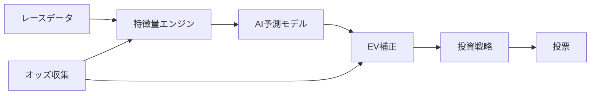

# 競馬AI予測システム v5.5

過去のレースデータから学習し、投票の「期待値」を計算するオープンソースの競馬予測システムです。

## 特徴

- **2段階AI予測** — 「当たる確率」と「当たった時の払戻し額」を別々に学習することで、予測精度を高めています
- **自動資金管理** — ドローダウン（資金の減少）を自動検知し、投資額を安全に調整します
- **市場状態検知** — オッズの動きから「人気馬が勝ちやすい日」や「荒れやすい日」を見分けます
- **厳密な検証** — ウォークフォワード検証とホールドアウト検証の2段階で、過去データへの過学習を防ぎます

## 全体フロー



## クイックスタート

```bash
# 1. Python 3.11 をインストール・アクティベート
mise install && mise activate

# 2. 依存パッケージをインストール
pip install -e ".[dev]"

# 3. テストを実行して動作確認
python -m pytest tests/ -v
```

データベースのセットアップや各機能の詳細な使い方は [Getting Started](docs/guide/04_getting_started.md) をご覧ください。

## パイプライン実行方法

PostgreSQL (EveryDB2) が `localhost:5432` で稼働している前提です。

```bash
# 環境変数の設定
export PGPASSWORD=<your_password>

# Step 1: ETL — EveryDB2のデータをParquetにエクスポート
python scripts/run_etl.py --start 20140101 --end 20231231

# Step 2: 学習 — 特徴量生成 + LightGBMモデルの学習
python scripts/run_train.py --start 20200101 --end 20231231

# Step 3: バックテスト — 学習+テスト期間の投資シミュレーション
python scripts/run_backtest.py \
  --train-start 20200101 --train-end 20231231 \
  --test-start 20240101 --test-end 20241231
```

### スクリプト一覧

| スクリプト | 役割 | 所要時間 |
|-----------|------|---------|
| `scripts/run_etl.py` | PostgreSQL (EveryDB2) → Parquetファイル群へのETL | ~5分 |
| `scripts/run_train.py` | HorseHistoryFeatures生成 + LightGBM Ranker + 補正モデル学習 | ~68分 |
| `scripts/run_backtest.py` | 学習 → テスト期間でレース毎にシミュレーション → ROI計算 | ~80分 |

### バックテスト結果（2020-2023学習 / 2024テスト）

| 項目 | 値 |
|------|------|
| テストベット数 | 2,967 |
| 投資額 | 296,700 円 |
| 払戻額 | 196,780 円 |
| ROI | 66.3% |
| 最大ドローダウン | 99.9% |

> 現状は固定100円ベットの簡易戦略であり、ROIは市場を上回れていません。改善の余地があります。

## Paper Trading（ペーパートレード）

学習済みモデルを使って、**実際のレース当日にリアルタイムで予測を出力する**システムです。実際の投票は行わず、予測結果と実際のレース結果を比較してモデルの精度を検証します。

### 追加した機能

- **リアルタイム予測** — レース出走前にモデルがベット対象を自動判定
- **Slack通知** — 予測結果・ベット対象・日次サマリーをSlackに通知
- **自動確定処理** — レース結果取得後にベットの勝敗を自動計算（冪等設計）
- **HTMLレポート** — 日次のベット履歴・ROI・ドローダウンをHTMLで可視化
- **ドライラン** — 過去のレースデータを使って一連の流れをシミュレーション

### アーキテクチャ

```
PaperTradingConfig（設定管理）
       │
ModelLoader（MLflow → 学習済みモデルを読み込み）
       │
RacePredictor（共通推論パイプライン: BacktestEngine + PaperPredictor共用）
       │
PaperPredictor（setup: 特徴量事前計算 → predict_race: リアルタイム予測）
       │
RaceWatcher（レース時刻待機 + リトライ + Slack通知）
       │
PaperReconciler（ベット確定・ROI計算・冪等性保証）
       │
PaperTradingReport（HTMLレポート生成: Jinja2）
```

### 実行方法

```bash
# 環境変数の設定
export PGPASSWORD=<your_password>
export SLACK_WEBHOOK_URL=<your_slack_webhook_url>

# Setup — 当日のレース一覧を確認
python scripts/run_paper_trading.py --mode setup --date 2026-04-04

# Predict — 特徴量生成→推論→ベット保存（当日レースの予測を実行）
python scripts/run_paper_trading.py --mode predict --date 2026-04-04

# Reconcile — レース結果を取得してベットの勝敗を確定
python scripts/run_paper_trading.py --mode reconcile --date 2026-04-04

# Dry-run — 過去データで一連の流れをシミュレーション
python scripts/run_paper_trading.py --mode dry-run --date 2024-07-13
```

> **Windows PowerShell の場合:** `PGPASSWORD=xxx command` 構文は使えません。事前に `$env:PGPASSWORD = "xxx"` を実行してください。

### 各モードの説明

| モード | やること | タイミング |
|--------|---------|-----------|
| `setup` | EveryDB2から当日のレース一覧・出走馬を取得し、スケジュールを保存 | レース前 |
| `predict` | EveryDB2から最新データを取得し、特徴量生成→AI推論→ベット判定→結果保存 | レース当日（発走直前推奨） |
| `reconcile` | レース結果を取得し、未確定ベットの勝敗を計算してHTMLレポート生成 | レース終了後 |
| `dry-run` | 過去データで predict と同じパイプラインを一括シミュレーション | いつでも |

### `predict` モードの詳細

`PGPASSWORD=aa8940aa python scripts/run_paper_trading.py --mode predict --date 2026-04-04`

このコマンドは以下のパイプラインを一括実行する:

```
1. EveryDB2 (PostgreSQL) から当日データを直接取得
   ├── s_race / n_race          → レース情報 (距離、コース、馬場状態 etc.)
   ├── s_uma_race / n_uma_race  → 出走馬 (馬名、馬体重、騎手 etc.)
   ├── s_jodds_tanpuku          → 最新オッズスナップショット (各馬の最新 tanodds, fukuoddslow)
   └── s_jodds_tanpuku          → オッズ時系列 (前日からのオッズ変遷)

2. readers.py パイプラインで型変換
   ├── _apply_type_conversions() — ETLルールに従い数値変換 (odds10: tanodds, fukuoddslow を÷10)
   ├── _compute_race_date()     — year + monthday → datetime
   ├── _compute_race_id()       — year+monthday+jyocd+kaiji+nichiji+racenum → race_id
   ├── _coerce_types()          — 文字列列以外を pd.to_numeric で数値化
   └── _exclude_steeple()       — 障害レース (trackcd 51-59) を除外

3. 特徴量生成 (FeatureEngine + 各特徴量モジュール)
   ├── FeatureEngine.build_all()      — 基本特徴量 + オッズ特徴量 + 市場特徴量
   ├── SubModelManager.add_distance_band_features() — 距離帯特徴量
   ├── HorseHistoryFeatures.compute() — 過去走行データ (Parquet 5年分)
   ├── JockeyContextFeatures.compute() — 騎手コンテキスト
   ├── TrainerContextFeatures.compute() — 調教師コンテキスト
   └── BloodlineFeatures.compute()    — 血統特徴量

4. AI推論 (TwoStageReturnModel)
   ├── Stage1 (能力モデル) — p_place_pred: 複勝的中確率
   ├── Stage2 (返還モデル) — e_return_place_pred: 的中時払戻予測
   └── EV = p_place_pred × e_return_place_pred

5. ベット選択 (RacePredictor)
   ├── should_bet() — EV >= 1.0 の馬のみベット対象
   └── select_bets() — EV上位2頭を複勝100円でベット

6. 結果保存
   └── data/paper_trading/predictions/YYYYMMDD.parquet
```

**出力例 (2026-04-04 阪神9R アザレア賞):**

| 馬番 | 馬名 | 複勝オッズ | EV |
|------|------|-----------|-----|
| 9 | タガノアルトゥーラ | 1.7倍 | 3.66 |
| 5 | サントルドパリ | 4.3倍 | 3.80 |

### EveryDB2 オッズ取得の設計 (2026-04-04 修正)

**問題:** `s_odds_tanpuku` は初回発売時のスナップショットのまま更新されず、netkeibaの実際のオッズと乖離があった。

| 馬番 | s_odds_tanpuku (古い) | netkeiba実際 |
|------|---------------------|-------------|
| 5 | 複勝2.1倍 | 複勝4.2-15.4 |
| 9 | 複勝2.6倍 | 複勝1.6-5.1 |

**修正:** `get_odds_snapshots()` を `s_odds_tanpuku` → `s_jodds_tanpuku` (時系列テーブル) に変更し、`DISTINCT ON` で各馬の最新エントリを取得するようにした。

```sql
SELECT DISTINCT ON (year, monthday, jyocd, kaiji, nichiji, racenum, umaban)
    *
FROM s_jodds_tanpuku
WHERE year || monthday = %s
ORDER BY year, monthday, jyocd, kaiji, nichiji, racenum, umaban, happyotime DESC
```

**修正後のオッズ:** netkeibaの複勝下限とほぼ一致。

| 馬番 | 修正後 | netkeiba複勝下限 |
|------|--------|---------------|
| 5 | 複勝4.3倍 | 4.2 |
| 9 | 複勝1.7倍 | 1.6 |

**その他の修正:**
- `_connect()` に `set_client_encoding("UTF8")` を追加し、Windows環境での日本語文字化けを解消

### 理想的な運用ワークフロー

#### 週次: モデル再学習 (日曜夜)

競馬データは非定常（市場構造・馬の状態が時期によって変化）のため、定期的に再学習してモデルを鮮度に保つ。

```bash
# 1. ETL delta — 前週のレース結果をParquetに追加
python scripts/run_etl.py --start <先週木曜> --end <今週日曜>

# 2. 学習 — 直近日までのデータで再学習 (約17分)
python scripts/run_train.py --start 2020-01-01 --end <今週日曜>
```

- **学習期間**: 2020-01-01 〜 直近の日曜日（5年+のデータ）
- **頻度**: 週1回。日より頻度を上げるのは過学習リスクがあり非推奨
- **理由**: 遅いオッズの市場構造・新種牡馬の産駒デビュー等の変化に追従するため

#### 当日: 予測 (発走5分前)

**発走5分前**に predict を実行するのが最適。遅いオッズ（プロの情報が反映された締め切り直前のオッズ）を捕捉するため。

```
例: 阪神9R 14:15発走 の場合

  14:10  predict 実行 (データ取得5秒 + 特徴量生成20秒 ≈ 25秒で完了)
  14:10  予測結果をコンソール/Slackに表示
  14:15  レース発走
  18:30  reconcile 実行 (結果照合)
```

**なぜ5分前か:**

| タイミング | オッズ情報量 | リスク |
|-----------|------------|------|
| 30分前 | 低い（一般層の賭けのみ） | 精度低下 |
| **5分前** | **高い（遅いオッズ反映済み）** | **最適** |
| 1分前 | 最高（ほぼ確定） | パイプライン遅延リスク |

- JRAは前レース発走時に当該レースの投票が締め切られるため、5分前にはオッズがほぼ安定している
- オッズ動態特徴量 (`odds_drop_rate`, `odds_velocity`) は前日〜直前までの時系列が必要
- パイプラインは約25秒で完了するため、5分の余裕で安全

```bash
# 当日の予測 (PowerShell)
$env:PGPASSWORD = "xxx"
python scripts/run_paper_trading.py --mode predict --date 2026-04-04

# 当日の結果照合 (レース終了後)
python scripts/run_paper_trading.py --mode reconcile --date 2026-04-04
```

#### 自動化イメージ (cron)

```
日曜 22:00  ETL delta + 学習 (週次)
毎日 09:00  ETL delta (当日分の登録馬・馬体重を更新)
毎日 発走5分前  predict (watch モードで自動化予定)
毎日 19:00  reconcile (全レース確定後)
```

### 追加ファイル一覧

| ファイル | 行数 | 役割 |
|----------|------|------|
| `src/paper_trading/config.py` | 50 | PaperTradingConfig 設定クラス |
| `src/paper_trading/predictor.py` | 179 | setup/predict_race オーケストレーション |
| `src/paper_trading/reconciler.py` | 147 | 冪等性保証のベット確定処理 |
| `src/paper_trading/watcher.py` | 141 | レース時刻待機 + リトライロジック |
| `src/paper_trading/report.py` | 156 | HTMLレポート生成（Jinja2） |
| `src/backtest/race_predictor.py` | 185 | BacktestEngineと共用の推論パイプライン |
| `src/db/model_loader.py` | 177 | MLflow → TrainedModelsV5 復元 |
| `src/db/everydb2_queries.py` | 160 | EveryDB2 PostgreSQL クエリラッパー |
| `src/monitoring/notifier.py` | +57 | Slack通知機能（追加） |
| `src/pipelines/training_pipeline.py` | +75 | MLflow ログ拡張（追加） |
| `scripts/run_paper_trading.py` | 393 | CLI エントリーポイント |

## ドキュメントマップ

知識レベルに合わせてお好きなところから読めます。

### 入門編（競馬やAIの基礎から）

- [競馬の基礎知識](docs/guide/01_keiba_basics.md) — 競馬のルールとデータの見方
- [AI予測の基礎](docs/guide/02_ai_prediction_basics.md) — AIはどうやって予測しているのか
- [システム全体像](docs/guide/03_system_overview.md) — このシステムがやっていることの全体像
- [はじめ方](docs/guide/04_getting_started.md) — 環境構築から最初の予測まで

### 中級編（各モジュールの仕組み）

- [データパイプライン](docs/concepts/01_data_pipeline.md) — データ収集から特徴量生成まで
- [予測モデル](docs/concepts/02_prediction_models.md) — 2段階モデルの仕組みと学習方法
- [高度なモデル手法](docs/concepts/03_advanced_models.md) — EV補正・レジーム検知・市場モデル
- [投票戦略](docs/concepts/04_betting_strategy.md) — 資金管理とDDコントローラー
- [バックテストと検証](docs/concepts/05_backtest_validation.md) — ウォークフォワード検証の設計

### 上級編（開発・運用の詳細）

- [アーキテクチャ](docs/reference/01_architecture.md) — 全体設計と設計判断の理由
- [コード構成](docs/reference/02_code_structure.md) — ディレクトリ構造と主要モジュール
- [設定ファイル](docs/reference/03_configuration.md) — settings.yaml の全項目解説
- [コントリビューション](docs/reference/04_contributing.md) — 開発参加の手引き

## 期待できる成果とリスク

| 項目 | 目標 | 現状 |
|------|------|------|
| 回収率 | **101%以上**（100円賭けて平均101円以上の払戻し） | 66.3% |
| 最大ドローダウン | **16%以内** | 99.9% |

> **注意:** 過去のデータでの検証結果は、将来の成績を保証するものではありません。競馬は不確実性の高いギャンブルであり、本システムを使用して生じた損失について、開発者は一切の責任を負いません。

## 免責事項

本システムは**学習・研究目的**で公開されているオープンソースソフトウェアです。実際の投票に使用するかどうかは自己責任でお願いします。ギャンブルには依存リスクがあり、法的に制限されている地域もあります。健全な範囲で楽しみましょう。

## 技術スタック

| カテゴリ | 技術 |
|----------|------|
| 言語 | Python 3.11 |
| 機械学習 | LightGBM, scikit-learn |
| データベース | PostgreSQL (EveryDB2 / JRA-VAN DataLab) |
| 実験管理 | MLflow |
| 品質ツール | Ruff (lint/format), Mypy (型チェック), pytest (テスト) |

## ライセンス

MIT License
