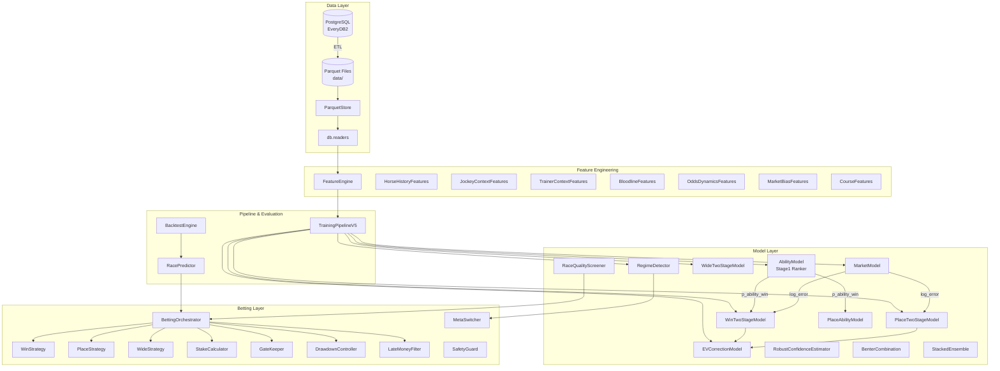

<!-- generated-by: gsd-doc-writer -->

# Architecture

## System Overview

keiba-ai is a statistical horse racing prediction system that uses LightGBM, XGBoost, CatBoost, and scikit-learn to generate expected-value (EV) estimates for win, place, and wide bets on JRA (Japan Racing Association) races. The system ingests race data from PostgreSQL (EveryDB2/JRA-VAN DataLab), transforms it into Parquet files, engineers features, trains a multi-stage ML pipeline, and simulates betting strategies through backtesting. Its architecture follows a layered data-flow pattern: ETL (PostgreSQL to Parquet), feature engineering, multi-model training with MLflow tracking, and a betting orchestration layer with drawdown control and regime detection.

## Component Diagram



## Data Flow

A typical prediction request follows this path:

1. **ETL (run_etl.py):** Raw data is extracted from PostgreSQL (EveryDB2 external tables) into Parquet files under `data/raw/`, `data/odds/`, etc. This step is run once per data refresh (approximately 10 minutes for a full extract).

2. **Data Loading:** `ParquetStore` reads Parquet files with pyarrow predicate pushdown for date filtering. `db.readers` helper functions (`load_races`, `load_entries`, `load_odds_snapshots`, etc.) provide typed DataFrames to the pipeline.

3. **Feature Engineering (FeatureEngine):** The `FeatureEngine` orchestrates multiple feature modules:
   - **Category A:** Horse ability (Stage1 output, computed later)
   - **Category B:** Intra-race relative features (`intra_race_features.py`)
   - **Category C:** Odds change rates (`odds_dynamics_features.py`)
   - **Category D:** Market bias (`market_bias_features.py`)
   - **Category E:** Information asymmetry (`info_asymmetry_features.py`, `race_difficulty_model.py`)
   - **Category F:** Distance band and surface one-hot encoding (handled by `SubModelManager`)

4. **Model Training (TrainingPipelineV5):** Trains models in dependency order per surface submodel (turf/dirt):
   - `AbilityModel` (Stage1 LightGBM Ranker, no odds features)
   - `MarketModel` (predicts market probability, outputs log_error only)
   - `WinTwoStageModel` (P(win) x E(odds|win))
   - `PlaceTwoStageModel` (P(place) x E(payout|place))
   - `WideTwoStageModel` (joint probability for wide pairs)
   - `EVCorrectionModel` / `PlaceEVCorrectionModel` (P/E decomposition correction)
   - `RaceQualityScreener` (filters low-quality races)
   - `RegimeDetector` (market state classification: aggressive/conservative/collapsed)
   - `RobustConfidenceEstimator` (prediction confidence bands)
   - `BenterCombination` with optional temperature scaling
   - Optional `StackedEnsemble` (LightGBM + XGBoost + CatBoost -> Ridge meta-learner)
   - `PlaceSelectionGateModel` and `WinSelectionGateModel` for bet selection filtering

5. **Backtesting (BacktestEngine):** Loads trained models, iterates over test-period races, generates predictions via `RacePredictor`, applies betting strategies via `BettingOrchestrator`, and computes ROI, drawdown, and hit-rate metrics. Produces `backtest_result.json` and optional HTML reports.

6. **Paper Trading / Live:** `RaceWatcher` monitors upcoming race schedules, `OddsCollector` captures t-3min/t-2min snapshots for late money detection, and `BettingOrchestrator` generates final bet selections with drawdown control and safety guard checks.

## Key Abstractions

| Abstraction | File | Description |
|---|---|---|
| `ParquetStore` | `src/db/parquet_store.py` | Low-level Parquet read/write with pyarrow predicate pushdown and year/month partitioning |
| `DatabaseConnection` | `src/db/connection.py` | PostgreSQL connection via SQLAlchemy Core; ETL-only (EveryDB2 to Parquet) |
| `FeatureEngine` | `src/features/feature_engine.py` | Feature engineering orchestrator; coordinates all feature modules and caching |
| `TrainingPipelineV5` | `src/pipelines/training_pipeline.py` | Main training pipeline; loads data, generates features, trains all models, logs to MLflow |
| `AbilityModel` | `src/models/stage1_ability_model.py` | Stage1 LightGBM Ranker (lambdarank); predicts horse ability without odds features |
| `WinTwoStageModel` | `src/models/two_stage_return_model.py` | Two-stage win model: P(win) x E(odds\|win) to avoid zero-inflation bias |
| `PlaceTwoStageModel` | `src/models/two_stage_return_model.py` | Two-stage place model: P(place) x E(payout\|place) |
| `WideTwoStageModel` | `src/models/wide_two_stage_model.py` | Joint probability model for wide (quinella place) bets |
| `MarketModel` | `src/models/market_model.py` | Predicts market probability; outputs normalized log_error only (not p_market_pred) |
| `EVCorrectionModel` | `src/models/ev_correction_model.py` | P/E decomposition correction model; independent P-correction and E-correction |
| `RegimeDetector` | `src/models/regime_detector.py` | Market regime classifier (aggressive/conservative/collapsed) with hysteresis |
| `BettingOrchestrator` | `src/betting/orchestrator.py` | Protocol-based orchestrator combining strategies, stake sizing, gate keeping, drawdown control |
| `BacktestEngine` | `src/backtest/engine.py` | Simulates betting on historical data; computes ROI, drawdown, and exclusion stats |
| `BenterCombination` | `src/models/benter_combination.py` | Benter's methodology for combining multiple model outputs with temperature scaling |
| `StackedEnsemble` | `src/models/stacked_ensemble.py` | Multi-model ensemble (LightGBM + XGBoost + CatBoost) with Ridge meta-learner |
| `DrawdownController` | `src/betting/drawdown_controller.py` | Manages bankroll drawdown with three recovery states (normal/reduced/stop) |
| `WalkForwardCV` | `src/models/walk_forward_cv.py` | Time-series walk-forward cross-validation to prevent look-ahead bias |
| `SubmodelSet` | `src/domain/models.py` | Container for all trained models within a single surface (turf or dirt) |
| `TrainedModelsV5` | `src/domain/models.py` | Top-level container holding submodel sets, quality screener, and regime detector |

## Directory Structure

```
keiba-ai/
├── config/                   # Configuration files
│   ├── settings.yaml         # Database, paths, logging, feature engine, betting strategy
│   └── etl_tables.yaml       # ETL table definitions (EveryDB2 table mappings)
├── data/                     # Data directory (Parquet files, MLflow runs, model artifacts)
│   ├── raw/                  # Raw Parquet: races, entries, payouts
│   ├── odds/                 # Odds Parquet: snapshots, time_series/, wide
│   ├── features/             # Feature cache: horse_features.parquet
│   ├── predictions/          # Prediction outputs
│   ├── bets/                 # Bet history
│   ├── models/               # Production trained models (joblib)
│   ├── models-backtest/      # Backtest-trained models (never overwrite production)
│   └── backtest/             # Backtest results (multi_year_result.json)
├── docs/                     # Documentation
│   ├── design.md             # System design document (v5.5, ~2900 lines)
│   └── everydb2-data-reference.md  # EveryDB2 data schema reference
├── scripts/                  # Entry-point scripts
│   ├── run_etl.py            # ETL: PostgreSQL -> Parquet
│   ├── run_train.py          # ML model training with MLflow
│   ├── run_backtest.py       # Backtesting (single-year or multi-year)
│   ├── run_wf_validation.py  # Walk-forward validation
│   ├── run_tuning.py         # Optuna hyperparameter tuning
│   ├── run_paper_trading.py  # Paper trading mode
│   └── run_strategy_optimization.py  # Strategy parameter optimization
├── src/                      # Source code
│   ├── db/                   # Data access layer (ParquetStore, DatabaseConnection, ETL, readers)
│   ├── features/             # Feature engineering modules
│   ├── models/               # ML models (Stage1, two-stage, market, ensemble, regime)
│   ├── betting/              # Betting strategies and orchestration
│   ├── backtest/             # Backtesting engine and reporting
│   ├── pipelines/            # Training pipeline orchestration
│   ├── domain/               # Domain types (enums, dataclasses, type aliases)
│   ├── ingestion/            # Data ingestion (OddsCollector, JVLinkFetcher)
│   ├── automation/           # Automation (scheduler, PAT voter, safety guard)
│   ├── monitoring/           # Model monitoring and retrain triggers
│   ├── tuning/               # Optuna hyperparameter optimization
│   ├── paper_trading/        # Paper trading system (watcher, predictor, reconciler)
│   └── utils/                # Utilities (timing, profiling)
├── tests/                    # Test suite (all mock-based, no DB required)
├── pyproject.toml            # Project metadata and tool config (Ruff, mypy, pytest)
└── mise.toml                 # Python version pinning (3.11)
```

### Rationale

- **`src/db/`** encapsulates all data access. `ParquetStore` handles file I/O while `DatabaseConnection` is restricted to ETL operations only. ML pipeline components use `db.readers` exclusively, never direct database queries.
- **`src/models/`** contains all ML models. Each model class is self-contained with its own `train()` and `predict()` methods. Surface-specific submodels (turf/dirt) are managed by `SubModelManager`.
- **`src/features/`** is organized by feature category. `FeatureEngine` serves as the single entry point, delegating to specialized modules. This separation allows independent testing and caching of feature groups.
- **`src/betting/`** implements the strategy layer using Protocol-based dependency injection (`BettingOrchestrator` accepts protocol interfaces, not concrete classes), enabling easy testing with mock implementations.
- **`src/domain/`** defines shared types and data classes (`Race`, `Entry`, `Bet`, `OddsSnapshot`, enums) used across all layers, avoiding circular imports.
- **`scripts/`** provides CLI entry points that wire up dependencies and invoke the pipeline. Each script is standalone and reproducible (e.g., `run_backtest.py` always retrains from scratch).
