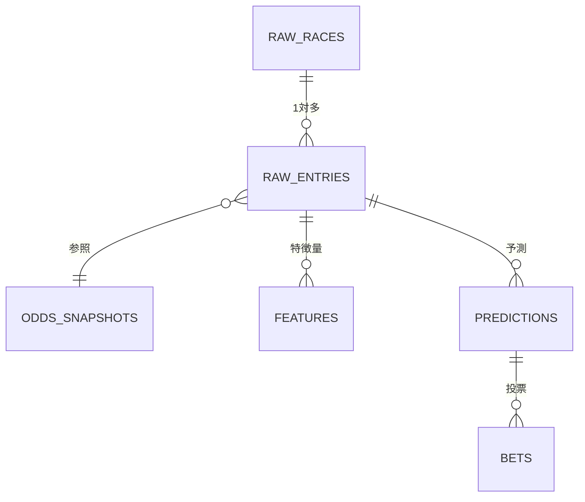
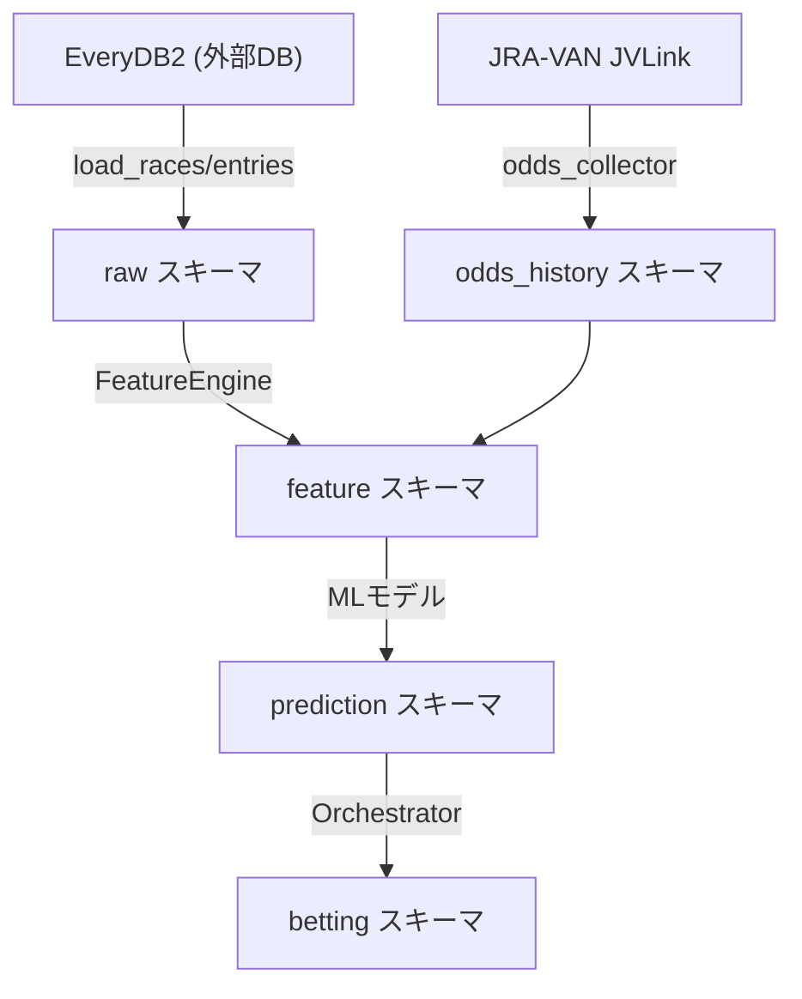

# データの流れ

競馬AI予測システムでは、膨大な過去レースデータを蓄積・加工し、機械学習モデルに入力することで勝馬の予測を行います。本ドキュメントでは、データがどのように流れて予測に至るかを概念レベルで解説します。

## データソース

### EveryDB2（過去データベース）

EveryDB2 は、JRA-VAN DataLab が提供する競馬の過去データベースです。JRA（日本中央競馬会）の全レース結果を体系的に整理しており、PostgreSQL にインポートして利用します。本システムでは、EveryDB2 を主要なデータソースとして扱い、以下のテーブルから情報を取得します。

| テーブル名 | 内容 |
|-----------|------|
| `n_race` | レース条件（場所・距離・コース種別・馬場状態・天候・クラス） |
| `n_uma_race` | 出走馬ごとの結果（着順・タイム・オッズ・人気・馬体重・騎手） |
| `n_uma` | 馬のマスタ情報（血統・能力統計・脚質傾向・獲得賞金） |
| `n_harai` | 払戻情報（単勝・複勝・ワイドの払戻金） |
| `n_odds_tanpuku` | 単勝・複勝オッズ |
| `n_odds_wide` | ワイドオッズ（組番ごとのオッズ） |
| `n_jodds_tanpuku` | 時系列単勝・複勝オッズ（Late Money Filter用） |

EveryDB2 のテーブルは読み取り専用として扱い、本システム独自の計算結果は別スキーマに保存します。

### JVLink（リアルタイムデータ）

JVLink は、JRA が提供する専用のデータ取得ソフトウェアです。リアルタイムのオッズ変動やレース結果をプログラム経由で取得でき、**実運用時**にのみ使用します。バックテストや学習には EveryDB2 の過去データを使用し、実際の投票判断には JVLink からのリアルタイムオッズを利用します。

## データベース構造

本システムでは PostgreSQL 上に 5 つのスキーマを定義し、データの段階ごとに整理しています。以下の ER 図は、各スキーマ間の関係を示したものです。

各スキーマの役割を以下のテーブルにまとめます。

| スキーマ | 役割 | 対応テーブル |
|---------|------|------------|
| `raw` | EveryDB2 からの生データコピー | `races`, `entries`, `payouts` |
| `odds_history` | 時系列オッズとワイドオッズ | `odds_snapshots`, `odds_time_series`, `wide_odds` |
| `feature` | 特徴量エンジンの出力結果 | `features` |
| `prediction` | MLモデルの予測値・EV計算結果 | `predictions` |
| `betting` | 投票記録と結果 | `bets` |

`raw.races` テーブルでは、6 列の複合主キー（`year`, `month_day`, `jyo_cd`, `kaiji`, `nichiji`, `race_num`）を文字列化した `race_id` を自動生成列（`GENERATED ALWAYS AS`）として保持しています。この `race_id` を介して、全ての子テーブルがレースを参照します。

## データフロー

データは以下のパイプラインを経て、予測から投票まで一連の流れを形成します。

各ステップの詳細:

1. **EveryDB2 からのデータ読込**: `load_races()` と `load_entries_with_results()` で指定期間のレース・出走馬データを `raw` スキーマにコピーします。
2. **オッズ取得**: JVLink からリアルタイムにオッズを収集し、`odds_history` スキーマに保存します。過去データは EveryDB2 の `n_jodds_tanpuku` から読み込みます。
3. **特徴量エンジニアリング**: `FeatureEngine.build_all()` が raw データとオッズデータを結合し、各種特徴量を計算して `feature` スキーマに保存します。
4. **予測**: ML モデル（LightGBM）が特徴量を受け取り、各馬の勝率・EV（期待値）を計算して `prediction` スキーマに保存します。
5. **投票**: `BettingOrchestrator` が予測結果と市場状態（レジーム）に基づいて投票対象を決定し、`betting` スキーマに記録します。

## 特徴量エンジニアリングとは

特徴量エンジニアリングとは、生データから**馬の実力を数字で表す**作業です。単に「勝率」や「タイム」を見るだけでなく、レース状況や市場の歪みなど多角的な指標を組み合わせることで、モデルがより正確な予測を行えるようになります。

本システムでは `FeatureEngine` クラスがオーケストレータとして、複数のサブモジュールを協調させて特徴量を生成します。

| カテゴリ | モジュール | 内容 |
|---------|-----------|------|
| レース内相対値 | `intra_race_features` | そのレース内での人気順位・馬体重ランクなど、相対的な位置づけ |
| オッズ動態 | `odds_dynamics_features` | 発走直前のオッズ変化率・速度・ボラティリティ（人気の急変を検出） |
| 市場歪み | `market_bias_features` | エントロピー・オーバーラウンドなど市場の非効率性を定量化 |
| 情報非対称性 | `info_asymmetry_features` | 騎手成績と馬の成績から、他の参加者より有利な情報を持っているかを評価 |
| レース難易度 | `race_difficulty_model` | 出走馬の実力バラつきから、レースの予測難易度スコアを計算 |

特徴量は JSONB 形式で `feature.features` テーブルに保存され、後続の予測ステップで利用されます。

## リーク防止（Data Leakage Prevention）

機械学習において、**リーク（情報漏洩）** は最も注意すべき問題の一つです。リークとは、モデルの学習時に「本来は使えないはずの未来の情報」が紛れ込んでしまうことです。競馬AIでは特に以下のケースに注意が必要です。

### 起きやすいリークの例

| パターン | 問題 | 影響 |
|---------|------|------|
| 未来のオッズを使う | 学習データに発走後の確定オッズを含める | バックテスト成績は良いが実運用で崩壊する |
| 当日の結果を含める | 着順やタイムを特徴量に混ぜる | 当たり前のように的中するが意味のないモデルになる |
| 統計の計算期間が未来を含む | 「過去5走の平均」の計算に未来のレースを含める | 過去のデータを使うはずが未来が漏れる |

### 本システムの対策

1. **時間的分割（Time-based Split）**: 学習データと評価データを時系列で分割し、必ず「過去のデータで学習し、未来のデータで評価する」ようにします。
2. **特徴量のカットオフ時刻**: オッズ動態特徴量では、発走の N 分前までのオッズのみを使用します（例: 発走 10 分前時点のスナップショット）。発走後のオッズは絶対に使いません。
3. **Stage1 にオッズを入れない**: 能力モデル（Stage1）では馬の過去成績のみを使用し、市場情報は Stage2 以降で扱います。これにより、モデルが「オッズが低いから勝つ」という自明な関係を学習してしまうのを防ぎます。
4. **Late Money Filter**: オッズが発走直前に急落（25%以上）した馬は情報の非対称性が疑われるため、投票対象から除外するフィルタを設けています。

これらの対策により、バックテストでの成績が実運用でも維持される堅牢なパイプラインを実現しています。

---

> **次のドキュメント:** [予測モデル](02_prediction_models.md) | **前のドキュメント:** [セットアップガイド](../guide/04_getting_started.md) | **ドキュメント一覧:** [README](../../README.md)
