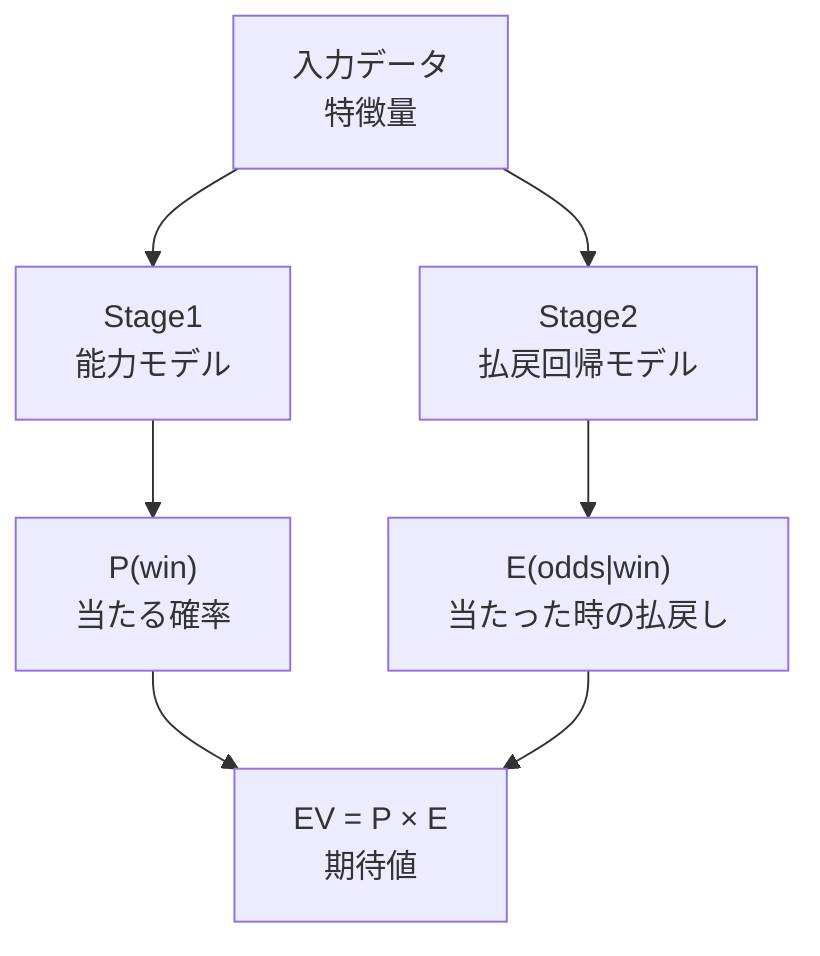
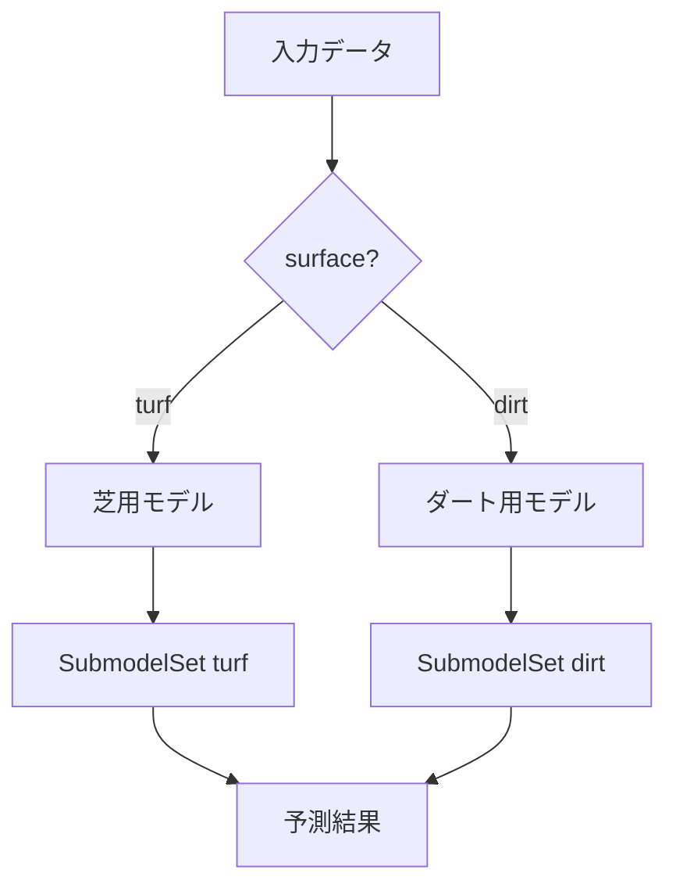

# 予測モデル（基礎）

このシステムのコアとなる予測モデルの基本構造を解説します。

## 2段階モデルとは

### 従来の問題

「1頭あたりの期待値」を直接予測しようとすると、深刻な問題が起きます。

18頭立てのレースで1着になるのは1頭だけです。つまり、学習データの17/18（約94%）は払戻金ゼロです。モデルは「とりあえずゼロにしておけば94%の確率で当たる」と学習してしまい、意味のある予測ができません。これを**ゼロ偏重問題**と呼びます。

### 解決策：分解して考える

そこで、「期待値」を2つの要素に分解します。

| 要素 | 意味 | 比喩 |
|------|------|------|
| P(win) | 当たる確率 | 宝くじの当選確率 |
| E(odds\|win) | 当たった時の払戻し | 当選した時の賞金額 |

「確率」と「賞金額」を別々に予測すれば、ゼロ偏重の問題は起きません。確率モデルには全出走馬のデータが使えますし、賞金モデルには的中した馬のデータだけを絞り込めるからです。



最終的な期待値（EV）は、2つのモデルの出力を単純に掛け合わせるだけです。

## Stage1: 能力モデル（AbilityModel）

Stage1は馬の「基本能力」を測るモデルです（`src/models/stage1_ability_model.py`）。

**特徴**: オッズ情報を一切使わず、馬とレース条件だけで能力を評価します。これは「市場の予測に引きずられない純粋な能力値」を出すためです（Rule 1）。

**出力**:
- `p_ability_win` -- 単勝的中確率（レース内の相対スコアをsoftmaxで確率に変換）
- `p_ability_place` -- 複勝的中確率（単勝確率からの近似値）

**特徴量**: surface（芝/ダート）、distance_bin（距離帯）、track_condition_code（馬場状態）、grade_code（クラス）、field_size（頭数）、weight_diff_from_mean（馬体重偏差）、difficulty_score（レース難易度）

**学習方式**: LightGBMのランキング学習（lambdarank）。レース内で「どの馬が上位に来るか」を直接学習します。出力された順位スコアをレース内でsoftmax変換することで、確率として扱えるようにしています。

このStage1の出力 `p_ability_win` は、Stage2の重要な入力特徴量となります。

## Stage2: 2段階モデル

Stage2は、Stage1の出力に市場情報を加えて期待値を計算するモデルです（`src/models/two_stage_return_model.py`）。

### 単勝モデル（WinTwoStageModel）

2つのサブモデルで構成されます。

**Stage A（的中モデル）**: 全出走馬を対象に、その馬が1着になる確率を予測します。2値分類（binary classification）で、1着=1、それ以外=0として学習します。

**Stage B（払戻回帰モデル）**: 1着になった馬だけを対象に、その時のオッズ（払戻金）を予測します。回帰（regression_l1）で学習し、ゼロ偏重を完全に排除します。

**期待値の計算**:
```
EV_win = P(win) x E(win_odds | win)
```

### 複勝モデル（PlaceTwoStageModel）

単勝モデルと同じ構造ですが、複勝（3着以内）に最適化されています。

**Stage A**: 3着以内=1、4着以降=0として学習。的中率が高い（約18〜35%）ため、学習が安定します。

**Stage B**: 3着以内の馬だけを対象に払戻オッズを回帰予測。サンプル数が多いため、決定木の葉数（num_leaves）を少し増やして表現力を上げています。

### Stage2の特徴量

| カテゴリ | 特徴量 | 説明 |
|----------|--------|------|
| Stage1出力 | `p_ability_win` | 能力モデルの予測確率 |
| 市場差分 | `signed_log_error_win` | 市場予測と能力予測の乖離（符号付き） |
| 市場差分 | `abs_log_error_win` | 同上（絶対値） |
| オッズ変化 | `odds_drop_rate_60_10`, `odds_drop_rate_30_10`, `odds_velocity`, `odds_volatility` | オッズの変動パターン |
| 人気変化 | `popularity_change_30_10` | 人気の変動 |
| 市場歪み | `market_entropy`, `popularity_rank`, `overround` | 市場の状態 |
| レース条件 | `surface`, `distance_bin`, `track_condition_code`, `grade_code`, `field_size` | レースの属性 |

**ポイント**: `p_market_pred_win`（市場予測値そのもの）はStage2に入れません。市場の予測をそのままコピーするのを防ぐため、差分（log_error）だけを使用します。

### ハイパーパラメータ（TwoStageConfig）

的中モデル（Stage A）と払戻回帰モデル（Stage B）で異なる設定を使います。

| パラメータ | Stage A（的中） | Stage B（払戻回帰） |
|-----------|-----------------|-------------------|
| 評価指標 | AUC | MAE |
| 葉の数 | 31 | 15 |
| 学習率 | 0.03 | 0.03 |
| ブースト回数 | 500 | 300 |
| 目的関数 | binary | regression_l1 |

Stage Bは的中サンプルだけを使うため、モデルを小さく（葉=15）して過学習を防ぎます。

## サブモデル（芝/ダート分割）

競馬の世界では「芝」と「ダート」はまったく別の競技です。芝はスピードと脚質、ダートはパワーとスタミナが求められます。そのため、路面ごとに別のモデルを学習させます（`src/models/submodel_manager.py`）。



**分割は2つだけ**: 芝（turf）とダート（dirt）の2分割です。距離帯や馬場状態でさらに細かく分けたことも検討しましたが、サンプル数が不足するため、それらは特徴量（距離帯のone-hotや馬場状態フラグ）でモデル内に吸収させています。

**SubModelManagerの役割**:
- 入力データの `surface` 値に応じて適切なモデルを切り替える
- 各サブモデルには20,000件以上の学習データが必要（`MIN_SAMPLES = 20,000`）
- 将来的な分割拡張の判定ロジックも備えている

**各SubmodelSetに含まれるモデル**:
- MarketModel -- 市場予測
- AbilityModel -- 能力評価（Stage1）
- WinTwoStageModel -- 単勝期待値（Stage2）
- PlaceTwoStageModel -- 複勝期待値（Stage2）
- WideTwoStageModel -- ワイド期待値
- EVCorrectionModel -- 期待値補正
- RobustConfidenceEstimator -- 信頼度推定

## ワイド予測の基礎

ワイド（3着以内に2頭を当てる馬券）の予測は、馬単位ではなく**ペア単位**で行います（`src/models/wide_pair_builder.py`）。

### ペア構築

18頭立てのレースでは C(18, 2) = 153通りのペアが存在しますが、実際にはオッズが存在するペア（通常18通り程度）だけを対象にします。

**WideJointPairBuilderの処理**:
1. レースごとに馬番順に全馬を並べる
2. 全ペア（馬番の組み合わせ）を生成する
3. 各ペアに以下の情報を付与する:
   - `joint_hit` -- 両馬とも3着以内か（1/0）
   - `popularity_sum` -- 2頭の人気順位の合計
   - `running_style_combo` -- 2頭の脚質の組み合わせ
   - `wide_odds` -- そのペアのワイドオッズ

### 分散を考慮したスコアリング

ワイド予測の特徴は「分散」を意識している点です。人気順位の合計値（`popularity_sum`）や脚質の組み合わせ（`running_style_combo`）を使うことで、単に強い馬を2頭選ぶだけでなく、「異なるタイプの馬の組み合わせ」を評価できます。これは、実際のワイド馬券の払戻特性（穴馬の組み合わせほど高配当になる）に合致したアプローチです。

---

> **次のドキュメント:** [高度なモデル](03_advanced_models.md) | **前のドキュメント:** [データの流れ](01_data_pipeline.md) | **基礎を復習:** [AI予測の基礎](../guide/02_ai_prediction_basics.md) | **ドキュメント一覧:** [README](../../README.md)
