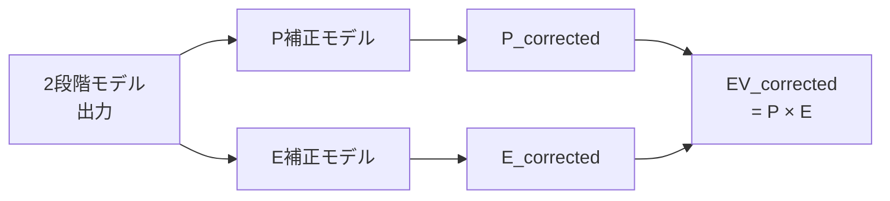
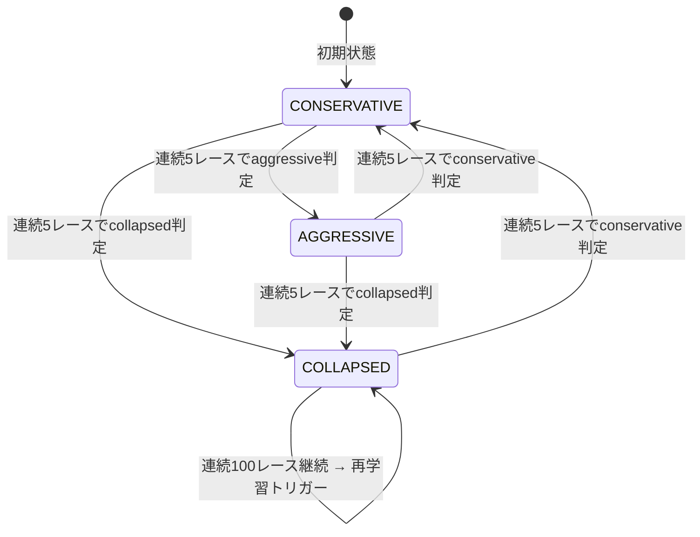

# 高度なモデル

2段階モデル (Stage1: 能力モデル, Stage2: 払戻回帰) で得られた予測値を、さらに精緻化するためのモデル群を解説する。これらは単独では機能せず、2段階モデルの出力を入力として受け取り、予測精度や運用の安全性を向上させるレイヤーとして動作する。

モデルの学習順序は以下の通り:

```
Market Model → Stage1 → WinTwoStageModel → EV補正モデル → PlaceTwoStageModel → WideTwoStageModel
                                                                      ↓
                                                          RobustConfidenceEstimator (キャリブレーション)
```

---

## Market Model（市場モデル）

**ソースコード**: `src/models/market_model.py`

### 役割

オッズが反映する「市場の予測」と、AIモデルが独自に推定した予測の「ズレ」を定量化する。市場は膨大な資金を集約する分散型の情報源であり、単純に無視するのは得策ではない。しかし、そのまま活用するとモデルが市場の予測をコピーするだけで独自の価値を失う。

### 出力: 差分のみ

Market Model は `p_market_win_adj`（市場確率）を LightGBM で予測するが、**その予測値 `p_market_pred` を下流には渡さない**。代わりに、予測値と実際の市場確率の差分のみを特徴量として出力する。

```
p_market_pred (AIによる市場予測) × p_market_win_adj (実際の市場確率)
    ↓ log_error 正規化
signed_log_error_win  ... ズレの方向（AIが過大評価か過小評価か）
abs_log_error_win     ... ズレの大きさ
market_error_rank_in_race ... レース内での相対順位
```

### p_market_pred を含めない理由

Stage2（払戻回帰モデル）に `p_market_pred` をそのまま渡すと、モデルが市場確率を直接的にコピーしてしまう。オッズはすでに強力な予測子であり、モデルは「オッズをそのまま出力すれば精度が高くなる」ことを学習してしまう。これは本質的に「市場のコピー」であり、モデルに独自の付加価値を持たせることができない。

差分（log_error）のみを渡すことで、Stage2 は「市場がどれくらい間違っているか」を手がかりに払戻額を予測するようになり、市場の歪みを活用しつつ独自の予測力を維持できる。

### 数学的定義

```python
# v5.3: 両側クリップで発散防止 (Rule 13)
p_pred_clipped = clip(p_market_pred, 0.01, 0.99)
p_market_clipped = clip(p_market_win_adj, 0.01, 0.99)

market_log_error_win = log(p_market_clipped / p_pred_clipped)

signed_log_error_win = market_log_error_win    # 正 = AIが過小評価, 負 = AIが過大評価
abs_log_error_win    = |market_log_error_win|  # ズレの絶対量
```

---

## EV補正モデル

**ソースコード**: `src/models/ev_correction_model.py`

### 役割

2段階モデルの出力 `EV = P(hit) × E(odds|hit)` を、実績データに基づいて補正する調整レイヤー。2段階モデルは P と E を独立に推定する設計だが、現実のデータでは両者に相関が生じる（独立性破綻）。EV補正モデルは、このズレを検出して補正する。

### v5.5: P補正 × E補正の2モデル分解

v5.3 では P と E をまとめて1つのモデルで補正していたが、P のズレ（的中確率の誤差）と E のズレ（払戻額の誤差）の性質が異なるため、1つのモデルでは両方を適切に補正できず、訓練が不安定になっていた。v5.5 ではこれを2つの独立したモデルに分解した。



### P補正モデル

| 項目 | 内容 |
|------|------|
| タイプ | binary classification |
| 目的変数 | `finish_pos == 1`（1着フラグ） |
| 入力特徴量 | `e_return_win_pred`, `p×e交互作用`, `log_error`, `市場エントロピー`, 人気順位, レース条件 等 |
| 目的関数 | `binary`（LightGBM） |
| **init_score** | `logit(p_win_pred)` = `log(p / (1-p))` |

**init_score の重要性**: `init_score = logit(p_win_pred)` を設定することで、P補正モデルは2段階モデルの P 予測を「ベースライン」として受け取り、そこからの「補正量」のみを学習する。これにより、P補正モデルが2段階モデルの出力をゼロから再学習してしまう（＝モデルが独自の予測を忘れてしまう）問題を防ぐ。

```python
# P補正の推論
p_correction_logit = p_correction_model.predict(features) + init_score
p_win_corrected = sigmoid(p_correction_logit)  # 常に [0, 1] に制約される
```

### E補正モデル

| 項目 | 内容 |
|------|------|
| タイプ | 回帰（regression_l1） |
| 学習データ | **1着馬のみ** |
| 目的変数 | `log(実際のオッズ) - log(e_return_win_pred)`（log residual） |
| **重み** | `1 / √p_win_pred` |

**1着馬のみで学習する理由**: E は「的中した場合の払戻額」の予測であり、未的中馬の払戻額は 0 である。未的中馬を含めるとノイズが増大し、回帰が不安定になる。

**weight = 1/√p の理由**: 高確率馬（人気馬）の的中事例は豊富だが、低確率馬（穴馬）の的中事例は少ない。そのまま学習すると高確率馬に過剰適合してしまう。`1/√p` の重み付けにより、低確率馬の的中事例の影響を相対的に大きくし、ノイズ過剰適合を防ぐ。

```python
# E補正の推論
log_e_correction = e_correction_model.predict(features)
e_return_win_corrected = e_return_win_pred × exp(log_e_correction)
```

### 最終補正EV

```python
EV_corrected = P_corrected × E_corrected
```

P補正と E補正を独立に適用した結果を掛け合わせることで、両方のズレを同時に補正した最終的な EV が得られる。

---

## レジーム検知（RegimeDetector）

**ソースコード**: `src/models/regime_detector.py`

### 役割

市場の状態を3つのレジームに分類し、レジームに応じて投資戦略のパラメータを動的に調整する。市場は常に同じ状態ではなく、穴場が多い時期と効率的で歪みが少ない時期が交互に訪れる。これを検知して戦略を切り替えることで、リターンの安定性を向上させる。

### 3状態の定義

| レジーム | 状態 | 市場の特徴 | 戦略 |
|----------|------|------------|------|
| **aggressive** | 穴場 | 市場効率が低く、エントロピーが高い | EV閾値 1.10、最大3口 |
| **conservative** | 安定 | 市場効率が高い | EV閾値 1.30、最大2口 |
| **collapsed** | 異常 | 市場効率が極端に低い | EV閾値 1.50、最大1口（ほぼ停止） |

### 判定基準: 市場側指標

レジーム判定には **fav_rate（人気馬の勝率）× overround（市場の控除率を超えた余剰）** を主軸に使用する。これらは「市場がどれくらい効率的か」を示す市場側の指標であり、自モデルの予測結果に依存しない。戦略パラメータの決定に自モデルの結果を使うと循環参照が生じるため、市場側指標のみで判定する。

```python
# 市場効率スコア
market_efficiency = fav_rate × (1 - clip(overround - 0.20, 0, 0.15) / 0.15)

# 3状態の判定
if market_efficiency < 0.28 and entropy > median(entropy):
    → AGGRESSIVE
elif market_efficiency < 0.18:
    → COLLAPSED
else:
    → CONSERVATIVE
```

### ヒステリシスによる安定化

レジーム遷移には **ヒステリシス（遅延）** を導入している。新しいレジームへの遷移は、連続5レースで同じ判定が続いた場合にのみ実行される。これにより、一時的なノイズによる不要なレジーム切り替えを防止する。



### collapsed 継続時の再学習トリガー

COLLAPSED 状態が連続100レース（デフォルト）続いた場合、市場構造が根本的に変化した可能性が高いとみなし、モデルの再学習をトリガーする。これは自動的なモデル更新メカニズムとして機能する。

---

## 信頼区間推定（RobustConfidenceEstimator）

**ソースコード**: `src/models/robust_confidence_estimator.py`

EV予測の「信頼区間下限」を推定する。単一のEV値だけで判断すると過信に陥るリスクがあるため、EVの下限値を推定して安全側の判断を可能にする。

### 2つの手法の min 採用

| 手法 | 概要 |
|------|------|
| Conformal Prediction | 分布を仮定しない非適合スコアに基づく信頼区間 |
| Rolling Quantile | 時系列残差の標準偏差に基づく信頼区間（1.5σ） |

2つの手法のうち、**より低い（保守的な）方の下限**を採用する（Rule 4）。これは「楽観的な推定を排除し、最悪ケースを前提に投資判断する」という安全性原則に基づく。

```python
# 推定される出力
EV_lower_win_corrected  ... 単勝EVの信頼区間下限（下限 < 0 なら 0 にクリップ）
EV_lower_place          ... 複勝EVの信頼区間下限
```

---

## MLflow による実験管理

全モデルの学習結果は MLflow に記録される。これにより、異なるバージョンのモデル性能を比較し、再現性のある実験管理を実現する。

### 記録内容

学習パイプライン (`src/pipelines/training_pipeline.py`) は、各 surface（芝/ダート）ごとに以下を記録する:

- **モデル**: Stage1, Win Hit/Return, EV補正P/E, Place Hit/Return（LightGBM Booster）
- **共通モデル**: RaceQualityScreener, RegimeDetector
- **パラメータ**: `train_end`（学習データ終了日）, `n_surfaces`（芝/ダートの数）

### 設定

```yaml
# config/settings.yaml
mlflow_tracking_uri: "file:///mlruns"
```

`mlruns/` ディレクトリにローカル保存される。リモートサーバ（MLflow Tracking Server）に変更する場合は、環境変数 `MLFLOW_TRACKING_URI` または設定ファイルの `mlflow_tracking_uri` を更新する。

### バージョン管理

MLflow の run_name には `v5.4_YYYY-MM-DD` 形式を使用する。これにより、MLflow UI 上でバージョンと学習期間を一目で識別できる。過去の実験との比較は、MLflow UI または `mlflow.compare_runs()` API で行う。

---

> **次のドキュメント:** [投資戦略](04_betting_strategy.md) | **前のドキュメント:** [予測モデル](02_prediction_models.md) | **ドキュメント一覧:** [README](../../README.md)
