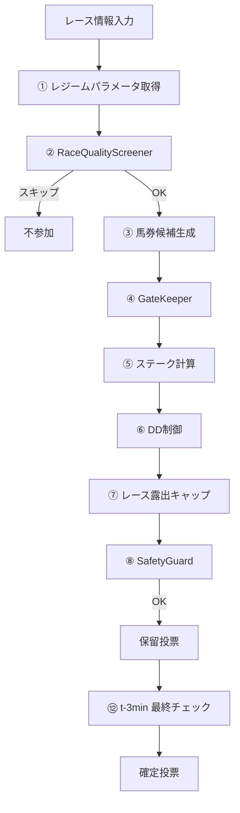

# 投資戦略

「どのレースに、どの馬に、いくら賭けるか」を決定する仕組みを解説する。
本システムの投資判断は単一の直感ではなく、複数のフィルター・計算・制御層が連動する
12ステップパイプラインによって構成される。すべてのステップはリスク管理を第一目的とし、
期待値(EV)が閾値を満たす場合にのみ投資を実行する。

## 投資判断の全体フロー



オーケストレーター(`BettingOrchestrator`)がこのフロー全体を統括する。
`process_race()`でステップ①〜⑩を実行し保留投票リストを生成したのち、
発走3分前に`finalize_bets()`でステップ⑫の最終チェックを行い確定投票に至る。

## レース品質スクリーニング

**対象:** `RaceQualityScreener`（`src/models/race_quality_screener.py`）

投資判断の入口で「このレースは市場歪みが十分か」をLightGBMモデルで判定する。
モデルの目的変数には**結果ベースのproxyのみ**を使用し、将来の払戻金を使った
リークを完全に遮断する（Rule 16）。

### 目的変数の構成

```
target = 市場歪みスコア x 利益性proxy x 安定性係数
```

- **市場歪みスコア**: `market_log_error_max_abs` x `market_entropy` x
  `(1 + n_positive_errors / field_size)`
- **利益性proxy**: `hist_roi_topk`（過去上位馬のROI）を0.5〜2.0でクリップ
- **安定性係数**: `hist_positive_return_ratio`（正リターン率）を0.0〜1.0でクリップ

### 特徴量

市場モデル由来（正規化差分）のほか、分布特徴量、市場構造（エントロピー・オーバーラウンド）、
レース条件（サーフェス・距離帯・馬場状態・グレード）、難易度スコア、過去統計を総合して入力する。

### 閾値

学習データの60パーセンタイルをデフォルト閾値とし、`calibrate_threshold()`で
目標投資レース比率（デフォルト40%）に合わせて調整可能。out-of-sampleでは閾値を固定する。

## ゲートキーパー

**対象:** `GateKeeper`（`src/betting/gate_keeper.py`）

EV下限値(`ev_lower_corrected`)を基準にベットの最終可否を判定する。
レジーム別閾値（後述メタスイッチャー）を適用し、信頼区間下限が閾値を下回るベットを除外する。

```
判定: bet.ev_lower_corrected >= ev_threshold → 通過
```

EVの点推定ではなく下限値を使うことで、過度に楽観的な賭けを排除する。
閾値はレジーム状態に応じて動的に変動する（aggressive: 1.10, conservative: 1.30, collapsed: 1.50）。

## ステーク計算

**対象:** `StakeCalculator`（`src/betting/stake_calculator.py`）

EV下限値に連動したケリー基準で賭け金を算出する。

### 計算式

```
edge = ev_lower - 1.0
kelly_fraction = edge / (odds - 1.0)
kelly_fraction = min(kelly_fraction, 0.25)  # 上限キャップ（full Kellyの1/4）
raw_stake = bankroll x kelly_fraction
stake = floor(raw_stake / 100) x 100        # 100円単位に切り捨て
```

### 安全ガードライン

| パラメータ | 値 | 意味 |
|---|---|---|
| `MIN_EV_THRESHOLD` | 1.05 | EV下限が1.05未満なら投票しない |
| `KELLY_FRACTION_CAP` | 0.25 | Kelly fractionの最大値 |
| `RACE_EXPOSURE_CAP` | 0.02 | 1レースの最大露出率（2%） |
| `MIN_STAKE` | 100円 | 最低投票額 |

### 1レース露出キャップ（Rule 6）

同一レース内の全ベットの合計が資金の2%を超えないよう、比例配分で各ベットのstakeを削減する。
これにより単一レースへの過度な集中リスクを防ぐ。

## ドローダウン（DD）制御

**対象:** `DrawdownController`（`src/betting/drawdown_controller.py`）

DD（資金の最大下落率）とRolling ROIを複合判定し、ベットサイズを動的に制御する。
v5.1でEWMAハイブリッド、v5.3でヒステリシス付き回復ロジック、v5.4でNベット制限を導入した。

### DD x ROI 乗数テーブル

| DD下限 | DD上限 | ROI下限 | ROI上限 | 乗数 |
|---|---|---|---|---|
| 0% | 10% | 90% | - | 1.00 |
| 0% | 10% | 0% | 90% | 0.75 |
| 10% | 15% | 95% | - | 0.80 |
| 10% | 15% | 0% | 95% | 0.50 |
| 15% | 20% | 95% | - | 0.60 |
| 15% | 20% | 0% | 95% | 0.30 |
| 20% | 25% | 0% | - | 0.15 |
| 25% | - | 0% | - | 0.00 |

DDが25%を超えると投票を完全に停止する。

### 回復の3段階（ヒステリシス）

1. **NORMAL -> REDUCED**: 乗数テーブルで0.80未満になった時点でREDUCEDに遷移
2. **REDUCED -> RECOVERING**: ROIが0.98以上かつDDが15%未満でRECOVERINGに遷移
3. **RECOVERING -> NORMAL**: DDが5%未満でNORMALに復帰

RECOVERING状態では、ベットごとに乗数を0.05ずつ段階的に引き上げる。
ただしROIが0.90を下回るとREDUCEDに戻る（ヒステリシス）。

### Rolling ROI（SMA + EWMA ハイブリッド）

直近150ベットのROIを、単純移動平均(SMA)と指数加重移動平均(EWMA, alpha=0.1)の
平均として算出する。EWMAにより最近の成績をより重視しつつ、SMAで安定性を確保する。

### Nベット制限（v5.4）

20ベットごとに乗数の変更幅を前回ウィンドウ開始時の値から +/-0.15に制限する。
これにより短期間の成績変動による過剰なステーク調整を防止する。

## レートマネー・フィルター

**対象:** `LateMoneyFilter`（`src/betting/late_money_filter.py`）

発走直前のオッズ急変を検知し、投票の取消または追加検討を行う。

### 2つのトリガー

| タイミング | 閾値 | アクション |
|---|---|---|
| t-3min | オッズ25%以上急落 | **キャンセル**（投票取消） |
| t-3min | オッズ30%以上急騰 | **追加候補**（未投票馬を検討） |
| t-2min | オッズ20%以上変動 | ログのみ（将来チューニング用） |

変化率は `change_rate = (odds_t10 - odds_t3) / odds_t10` で計算する。
急落は「他の投資家が同じ馬に集中している」ことを示唆し、EVが悪化した可能性が高い。
v5.1でt-2minの判定をログのみに変更し、実務上の安全マージンを確保している。

## メタスイッチャー

**対象:** `MetaSwitcher`（`src/betting/meta_switcher.py`）

`RegimeDetector`の出力（市場レジーム状態）をベッティング層で使いやすい形に変換し、
戦略パラメータを動的に切り替える。

### レジーム別パラメータ

| レジーム | EV閾値 | ワイドスコア閾値 | 最大ベット数/レース | 方針 |
|---|---|---|---|---|
| **AGGRESSIVE** | 1.10 | 0.010 | 3 | 歪みが強い -> 攻める |
| **CONSERVATIVE** | 1.30 | 0.020 | 2 | 効率的市場 -> 絞る |
| **COLLAPSED** | 1.50 | 0.050 | 1 | 市場崩壊 -> ほぼ停止 |

COLLAPSED状態が連続する場合は、`should_retrain()`経由でモデルの再学習をトリガーする。
これにより市場構造の変化に適応し、陳腐化したモデルの継続使用を防ぐ。

## オーケストレーター

**対象:** `BettingOrchestrator`（`src/betting/orchestrator.py`）

全戦略を統括し、レースごとに一連の投資判断フローを実行する。

### process_race() — ステップ①〜⑩

1. **① レジームパラメータ取得**: `MetaSwitcher.get_strategy_params()`から
   EV閾値・スコア閾値・最大ベット数を取得。COLLAPSED連続時は再学習トリガー。
2. **② RaceQualityScreener**: レースレベル特徴量を構築し、市場歪みが不十分なら不参加。
3. **③ 馬券候補生成**: 複勝戦略・単勝戦略・ワイド戦略のそれぞれからベット候補を生成。
4. **④ GateKeeper**: `ev_lower_corrected`が閾値未満の候補を除外。
5. **⑤ ステーク計算**: ケリー基準で各ベットの賭け金を算出。
6. **⑥ DD制御**: `DrawdownController.adjust_stake()`でDD乗数を適用。
7. **⑦ レース露出キャップ**: 同一レースの総stakeが資金の2%を超えないよう調整。
8. **⑧ SafetyGuard**: 資金・日次損失・週次損失・連敗回数の安全チェック。
9. **⑨ 最小投票額フィルタ**: 100円未満のベットを除外。
10. **⑩ 保留投票リスト返却**: 最終候補を返す。

### finalize_bets() — ステップ⑫

発走3分前に保留中ベットを`LateMoneyFilter`で再チェックし、オッズ急落ベットをキャンセル。
キャンセルされたベットはログに記録され、残りのベットが確定投票となる。

### 依存関係

`BettingOrchestrator`はProtocolベースの依存注入で構成されており、
各コンポーネントはインタフェースのみに依存する。これによりテスト時のモック置換が容易で、
個別コンポーネントの差し替えがオーケストレーターに影響しない。

---

> **次のドキュメント:** [バックテストと検証](05_backtest_validation.md) | **前のドキュメント:** [高度なモデル](03_advanced_models.md) | **ドキュメント一覧:** [README](../../README.md)
