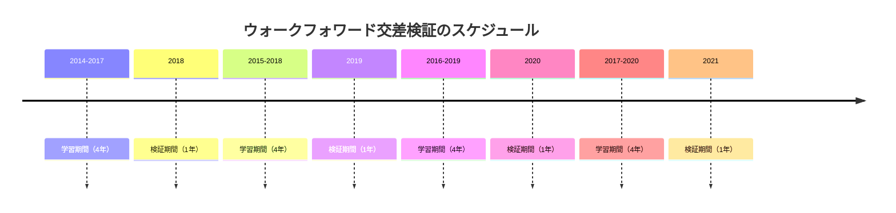
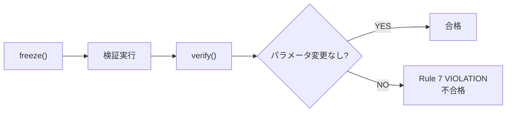
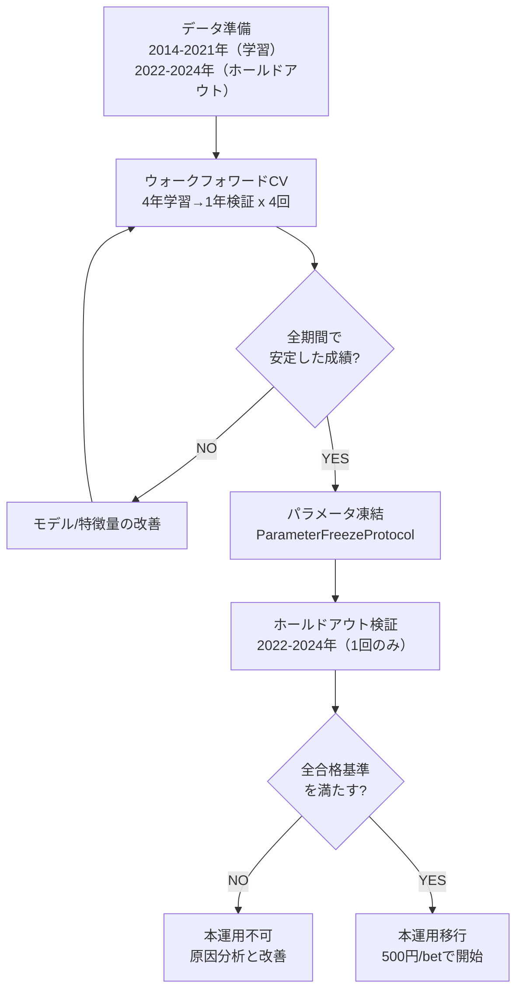

# バックテストと検証

「過去のデータで検証して、本当に利益が出せるかを確認する」— これがバックテストの役割です。
このシステムでは、時系列を考慮した検証手法と厳格な合格基準を組み合わせて、「なぜこのシステムを信頼できるのか」に答えます。

## バックテストとは

バックテスト (Backtest) は、過去のデータを使って投資戦略をシミュレーションする手法です。
株式投資やFX（外国為替証拠金取引）でも広く使われる、金融分野の標準的な検証方法です。

例えるなら「過去のレースビデオをもう一度見て、この戦略ならどう賭けていたか、結果はどうなっていたか」を計算することです。バックテストの結果が良ければ、実運用でも同様の成績が期待できます。

ただし、バックテストには落とし穴があります。**未来の情報を使ってしまえば、結果はいくらでも良く見えてしまう**のです。「あのレースではこの馬が勝つと知っているから、その馬に賭ける戦略」を作るのは簡単です。しかし、それは過去のデータに過剰に適合しただけで、未来のレースでは全く通用しません。このシステムでは、情報リークを防ぐための厳格な仕組みを導入しています。

### バックテストの3つの落とし穴

1. **未来リーク**: 検証データの情報が学習に混入すること。時系列データでは特に注意が必要です。
2. **過学習 (Overfitting)**: 特定のデータに合わせすぎて、別のデータでは性能が落ちること。
3. **サンプルサイズの不足**: 統計的な有意性が出るだけのデータ量がないと、偶然を意味のある結果と見間違えます。

競馬のレースは年間約3,600レース（1日12レース x 300日）あります。3年間のホールドアウト期間で約10,000レース、出走馬数にして約130,000頭分のデータがあり、統計的に十分なサンプルサイズを確保しています。

## ウォークフォワード交差検証

### なぜ通常の交差検証では不適切か

機械学習では「交差検証 (Cross Validation)」という手法がよく使われます。データを複数のグループに分け、一部をテスト用に残して学習を繰り返す方法です。

しかし、時系列データ（競馬のレース結果など）に通常の交差検証を適用すると、**未来のデータで学習して過去を予測する**という矛盾が生じます。2024年のデータで学習したモデルで2022年のレースを予測するのは、現実にはあり得ません。これを「未来リーク」と呼びます。

```mermaid
flowchart LR
    subgraph 通常のCV（問題あり）
        A1["2022年データ"] --> C["学習"]
        A2["2024年データ"] --> C
        C --> D["2022年を予測 ← 未来データを使っている!"]
    end
    subgraph ウォークフォワード（正しい）
        B1["2022年データ"] --> E["学習"]
        E --> F["2023年を予測 ← 過去データのみ"]
    end
```

### 4年学習 → 1年検証 → 1年進む

このシステムでは、時間の順序を守る「ウォークフォワード交差検証 (Walk-Forward Cross Validation)」を採用しています。過去のデータだけで学習し、その先の未来のデータだけで検証するという原則を守ります。

具体的には以下のスケジュールで検証を繰り返します。



学習期間を4年としているのは、十分なサンプルサイズ（約14,000レース）を確保しつつ、市場の傾向変化に追従できるようにするためです。1年ずつウィンドウを進めることで、以下の点を確認できます。

- **2018年**: 好調な市場での性能
- **2019年**: 中期的な市場変化への対応
- **2020年**: COVID-19による市場混乱（無観客レース等）での耐性
- **2021年**: 回復期での性能

各ステップでモデルを学習し、検証期間の成績を記録します。4つの検証期間すべてで安定した成績が出てこそ、「たまたまある年だけ良かった」という偶然を排除できます。

## ホールドアウト検証

ウォークフォワード交差検証で良い結果が出ても、まだ安心はできません。検証期間の結果を見ながらパラメータを調整した場合、間接的に未来の情報を使ってしまっている可能性があるからです。

例えば「2018年の検証結果が良くなかったので、パラメータを少し変えてみよう」という調整を繰り返すと、最終的には全ての検証期間で良い結果が出るパラメータにたどり着きますが、それは**新しいデータでは通用しない**過学習状態です。

そこで、このシステムでは**ホールドアウト検証 (Hold-out Validation)** を最終関門として設けています。

- **検証期間**: 2022年1月〜2024年12月（3年間）
- **ルール**: この期間のデータは、モデルの選択やパラメータ調整に一切使用しない
- **位置づけ**: ウォークフォワード検証（2014-2021）で最適化したモデルに対する「見たこともないデータ」での本番テスト

ホールドアウト検証は、テスト勉強の過程で一度も解いたことがない「本番の試験問題」に相当します。ここで合格してはじめて、システムの信頼性が保証されます。

## パラメータ凍結プロトコル

ホールドアウト検証の信頼性をさらに高めるため、このシステムでは `ParameterFreezeProtocol` を導入しています。

これは、検証期間中にモデルのパラメータが変更されていないことを保証する仕組みです。具体的には以下の手順で動作します。

1. **freeze()** — モデルの状態をハッシュ値（SHA-256）として記録。pickleシリアライズしたモデル全体のハッシュを取るため、いかなる変更も検出可能。
2. **検証の実行** — ホールドアウト期間でバックテストを実行。この間、モデルのパラメータは一切変更してはならない。
3. **verify()** — 検証後にモデルの状態を再度ハッシュ化し、変更があれば不合格とする。

一度でもパラメータが変更された場合は「Rule 7 VIOLATION」として不合格になります。これにより、「結果を見てパラメータを微調整した」という過学習（データスヌーピング）を確実に防ぎます。

また、`frozen_period()` コンテキストマネージャを使うことで、検証の終了時に自動的にverify()が呼ばれ、変更があれば `RuntimeError` を送出します。



## 評価指標

バックテストの成績を評価するため、以下の4つの指標を使用します。

| 指標 | 説明 | 理想的な値 |
|------|------|-----------|
| **ROI (回収率)** | 投資した総額に対する総回収額の割合。100円賭けて105円戻れば ROI=105% | 100%以上 |
| **最大DD (ドローダウン)** | 資金の最高値から最大でどれだけ減ったか。資金100,000円の最高値から87,000円に減れば DD=13% | 小さいほど良い |
| **月次勝率** | 36ヶ月中、何ヶ月プラスだったか。短期的な運の変動に打ち勝てるかの指標 | 60%以上 |
| **プロフィットファクター** | 総利益を総損失で割った値。利益が損失を上回る程度を示す。1.5なら利益が損失の1.5倍 | 1.3以上 |

### 指標の読み方

ROIが101%であっても、最大DDが30%あれば「途中で資金が3割減るリスクがある」と判断できます。逆に、最大DDが5%でもROIが99%なら「安全だが利益が出ない」となります。単一の指標ではなく、複数の指標を組み合わせて総合的に評価することが重要です。

月次勝率が重要な理由は、人間の心理的耐性に関わるからです。ROIが101%でも、月次勝率が40%（36ヶ月中14ヶ月のみプラス）だと、残り22ヶ月は赤字であり、精神的に続けられない可能性が高いです。22/36ヶ月（約61%）以上の月次勝利を要求するのは、運用者の心理的負担を軽減する意図もあります。

## 合格基準

ホールドアウト検証（2022-2024年）で、以下の**全て**の基準を満たすことが本運用への移行条件です。一部でも満たさない場合は、モデルの改善やパラメータの再調整が必要です。

| 基準 | 値 | 意味 |
|------|-----|------|
| 複勝ROI | >= 100% | 複勝で損益ゼロ以上 |
| ワイドROI | >= 103% | ワイドで3%以上の利益 |
| 全体ROI | >= 101% | 全体で1%以上の利益 |
| 最大DD | <= 16% | 資金減少16%以内 |
| 月次勝利月 | >= 22/36 | 36ヶ月中22ヶ月以上プラス |

### 基準の背景

**ワイドの基準が高い理由**: ワイドは組み合わせ数が多く（18頭立てで最大153組）、一つのレースで複数のベットが発生します。管理の手間とコストを考慮し、複勝より高いROI（103%）を要求しています。

**全体ROIが101%の理由**: 年間数千回のベットを前提とすれば、初期資金10万円で年間3,000〜10,000円の利益が見込めます。101%は「控えめだが確実」というスタンスです。最初は500円/betの小額から始め、信頼性が確認できたら段階的に増額します。

**最大DDが16%の理由**: 10万円スタートで最大16%のDDなら、最悪のケースで資金が84,000円まで減ります。この程度の減少であれば、心理的なダメージも軽微で、回復も現実的です。DD制御（[投資戦略](04_betting_strategy.md)参照）によって、実際のDDは7〜13%に抑えることを目指します。

## 検証パイプラインの全体像

以上の検証ステップをまとめると、以下のパイプラインになります。



## 分析ノートブックガイド

このシステムの検証は、`notebooks/` ディレクトリに配置された12個のJupyterノートブックで行います。各ノートブックは特定の検証テーマに対応しており、段階的に実行することでシステムの信頼性を総合的に確認できます。

| NB | ファイル名 | 目的 |
|----|-----------|------|
| 00 | `00_setup.ipynb` | 環境セットアップ。DB接続、日本語フォント設定、合成データ生成ユーティリティの定義 |
| 01 | `01_eda.ipynb` | 探索的データ分析 (EDA)。レースデータの基本統計、オッズ分布、人気と着順の関係を確認 |
| 02 | `02_odds_dynamics.ipynb` | オッズ動態分析。発売開始からレース直前までのオッズ変動パターンと、レートマネー効果の検証 |
| 03 | `03_market_model_diff_analysis.ipynb` | 差分Market Model分析。市場予測とモデル予測の差（log_error）の分布と予測力を確認 |
| 04 | `04_twostage_win_place_ab_test.ipynb` | 2段階モデルvs1段階モデルのABテスト。P(hit) x E(odds) 分離の有効性を検証 |
| 05 | `05_wide_risk_adjusted_score.ipynb` | ワイドリスク調整スコア。Var_proxy = E x sqrt(P) によるリスク調整の効果を確認 |
| 06 | `06_race_quality_independence.ipynb` | レース品質独立性検証。RaceQualityScreenerが特定のEV水準に依存しないことを確認 |
| 07 | `07_submodel_2split_vs_7split.ipynb` | 2分割（芝/ダート）vs7分割のサブモデル比較。分割粒度の最適性を検証 |
| 08 | `08_dd_rolling_roi_simulation.ipynb` | DD Rolling ROIシミュレーション。ドローダウン制御のヒステリシスとNベット制限の効果を確認 |
| 09 | `09_ev_correction_analysis.ipynb` | EV補正分析。P補正とE補正の独立動作、MAE改善率、中穴ゾーンでの効果を検証 |
| 10 | `10_log_error_normalization.ipynb` | log_error正規化。両側クリップによる発散防止と、正規化がモデル性能に与える影響を確認 |
| 11 | `11_holdout_final_evaluation.ipynb` | ホールドアウト最終評価。2022-2024年の3年間で全合格基準を満たすかの最終判定 |

### ノートブックのグループ分け

12個のノートブックは、大きく4つのグループに分けられます。

**データ理解 (NB00-01)**: システムの動作に必要な環境設定と、データの基本的な性質の把握。

**特徴量・モデル検証 (NB02-05)**: オッズ動態、Market Model、2段階モデル、ワイドスコアなど、システムの中核となる要素の有効性を個別に確認。

**品質・安定性検証 (NB06-10)**: レース品質スクリーニングの独立性、サブモデル分割の最適性、DD制御、EV補正、log_error正規化など、システムの安定性を支える要素の検証。

**最終評価 (NB11)**: 全ての要素を統合した上で、ホールドアウト期間での最終成績を判定する。

### 実行の順序

ノートブックは番号順に実行することを推奨します。NB00のセットアップが完了していれば、NB01〜NB10は独立して実行可能です。NB11（ホールドアウト最終評価）は、全ての検証テストが通過していることを前提とする最終ステップです。

### 重要な注意点

NB11（ホールドアウト最終評価）は**1回のみ実行**してください。複数回実行すると、結果を見て調整したことになり、ホールドアウト検証の意味が失われます。この原則はパラメータ凍結プロトコルによって強制的に守られます。

---

> **深掘り:** 設計書のバックテスト関連セクションは [design.md](../design.md) を参照してください。ノートブックのソースコードは [notebooks/](../../notebooks/) にあります。バックテストエンジンの実装は [backtest/engine.py](../../src/backtest/engine.py)、検証スイートは [backtest/validation_suite.py](../../src/backtest/validation_suite.py)、パラメータ凍結プロトコルは [backtest/parameter_freeze_protocol.py](../../src/backtest/parameter_freeze_protocol.py) を参照してください。

---

> **次のドキュメント:** [アーキテクチャ](../reference/01_architecture.md) | **前のドキュメント:** [投資戦略](04_betting_strategy.md) | **ドキュメント一覧:** [README](../../README.md)
