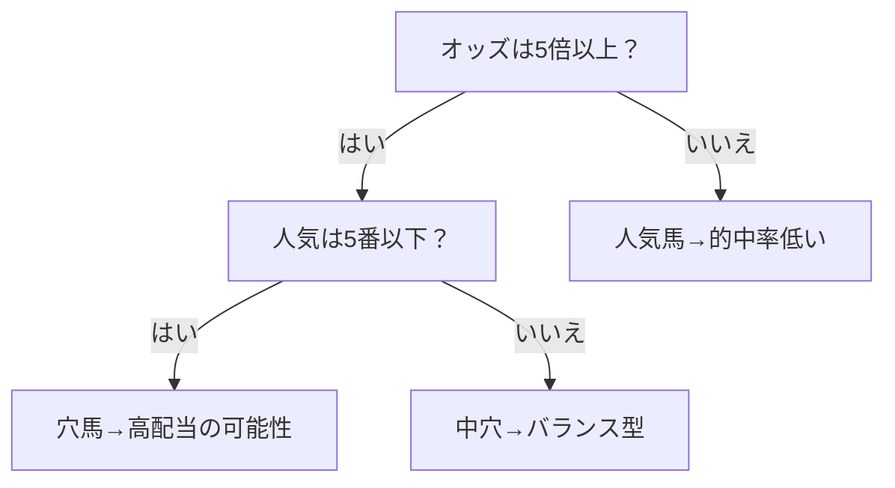
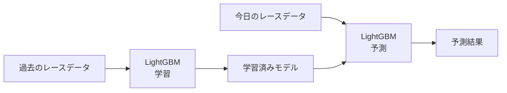

# AI予測の基礎

このシステムが「どうやって勝ち馬を予測しているのか」を理解するために、まずはAI（人工知能）と機械学習の基本的な仕組みを解説します。数式は一切使いません。すべて比喩で説明していきます。

---

## AI（人工知能）とは

AIとは、一言でいうと**「コンピューターが過去のデータからパターンを見つける技術」**です。

人間が「晴れた日は走りが良い」「休み明けは調子が落ちやすい」といった経験則を見つけるのと同じことを、コンピューターは膨大なデータから自動的に行います。ただし、人間が一生かかっても見つけられないような、目に見えない微妙なパターンまで見つけ出すのがコンピューターの強みです。

---

## 機械学習とは

### ルールを書く vs ルールを見つける

従来のプログラミングでは、人間がすべてのルールを書きます。「オッズが5倍以下なら買う」「前走1着なら高く評価する」といった具合にです。

機械学習では逆になります。**人間はデータだけを渡して、コンピューター自身にルールを見つけさせます。**

料理で例えましょう。

- **従来のプログラミング**: 先生から「火加減は中火」「煮る時間は15分」とレシピを教わる
- **機械学習**: 材料と出来上がった料理の評価だけが分かっていて、何千回も失敗を繰り返しながら自分で「火加減は中火がいいらしい」「15分くらいがベストだ」とコツを掴む

機械学習は後者のアプローチです。失敗を繰り返しながら、どの条件が当たったか、どの条件が外れたかを学んでいくのです。

### 学習（トレーニング）と予測（推論）

機械学習には2つのフェーズがあります。

**学習（トレーニング）**:
過去のデータをたくさん読み込んで、「この条件のときは1着が来やすい」というルールを身につける段階です。学生が教科書を読んで知識を蓄えるようなものです。

**予測（推論）**:
学習済みのルールを使って、今日のレースの結果を予測する段階です。学生がテスト本番で知識を試すようなものです。

大事なのは、**学習に使ったデータと予測するデータは別物**だということ。過去のテスト問題を暗記しても、本番で新しい問題が解けなければ意味がないのと同じです。

---

## LightGBMとは

このシステムでは「LightGBM（ライトジービーエム）」という機械学習アルゴリズムを使っています。LightGBMは「決定木（けっていぎ）」と呼ばれる仕組みをベースにしています。

### 決定木の仕組み

決定木は、文字通り「木」のように分岐していくルールの集まりです。「この条件なら右、違うなら左」という質問を繰り返して、最終的に結論にたどり着きます。

次の図は、決定木のイメージです。

現実の決定木はもっと複雑で、何十、何百もの分岐を持っています。「オッズが5倍以上」で「前走の着順が3着以内」で「馬場状態が良」で...というように、たくさんの条件を組み合わせて判断します。

### アンサンブル学習：多数決の力

1本の決定木はあまり精度が高くありません。ある1本の木のルールだけに頼ると、見落としがあります。

そこで**何百本もの決定木を作って、それらの意見を多数決でまとめる**という方法をとります。これを「アンサンブル学習」と呼びます。

例え話で言えば、1人の専門家の意見を聞くより、100人の専門家に意見を聞いて多数決をとったほうが正確だ、ということです。LightGBMは、この多数決を非常に高速に計算できるように最適化されたアルゴリズムです。

### 学習から予測までの流れ

1. 過去のレースデータをLightGBMに読み込ませる（学習）
2. 何百本の決定木からなる「学習済みモデル」ができる
3. 今日のレースデータを学習済みモデルに入力する（予測）
4. 各馬の予測結果が出力される

---

## なぜ競馬予測にAIが有効なのか

### 人間の限界

競馬予測を人間が行う場合、いくつかの限界があります。

- **記憶容量**: 人間が覚えられる過去のレースの数には限界があります。過去10年の全レースのデータを頭に入れておくことは不可能です。
- **認知バイアス**: 「この騎手は強いから」「この馬は血統が良いから」といった先入観が判断を歪めます。人気の馬を無意識に高く評価してしまう傾向もあります。
- **処理速度**: 1つのレースの18頭について、過去の全レース成績・馬場適性・血統・騎手の相性などを同時に分析するのは、人間には現実的ではありません。

### AIの強み

- **大量データ処理**: 過去数万レースのデータを瞬時に処理できます。人間が見落とすような、細かいパターンも見逃しません。
- **感情なし**: 人間のように「お気に入りの馬を応援したい」「前回負けたからリベンジしたい」といった感情はありません。データに基づいて淡々と予測します。
- **微妙なパターン発見**: 「オッズが3.2倍〜3.8倍で、前走の上がり3Fが34.5秒〜35.0秒の馬は、特定の条件下で回収率が高い」といった、人間が気づきにくい微細なパターンを見つけ出します。

---

## AIの限界

AIは万能ではありません。以下の点を理解しておくことが重要です。

### 過去データへの依存

AIは「過去のデータ」から学習しているため、**過去にないような出来事には対応できません**。初めての条件（例えば初めての距離、初めてのコース）の予測精度は下がります。過去の傾向が未来も続くという前提があることを忘れないでください。

### 理由を説明しない

AIは「この馬が勝つ」と予測しても、「なぜ勝つと判断したのか」を人間に分かりやすく説明することは苦手です。「オッズ・騎手・過去成績など500個の要素を総合的に判断した結果です」としか言えません。ブラックボックスと呼ばれる理由です。

### 確率であって確定ではない

AIが出すのは「的中確率」であって、「確実に当たる」という予言ではありません。的中確率80%でも、20%は外れるということです。長期間で見ればトータルでプラスになることを目指すものであり、1回1回のレースで必ず当てるものではありません。

---

> **次のドキュメント:** [システム概要](03_system_overview.md) | **前のドキュメント:** [競馬の基礎知識](01_keiba_basics.md) | **ドキュメント一覧:** [README](../../README.md)
