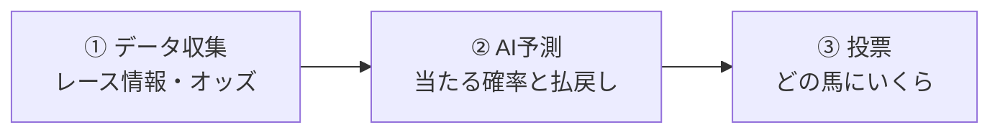

# このシステムは何をするのか

このシステムは、競馬のデータを分析して「どの馬券を買うべきか」「いくら賭けるべきか」を統計的に計算するツールです。

人間の「勘」や「人気の馬だから買おう」という直感ではなく、過去の膨大なレースデータとオッズの変動から、数学的に有利な賭けを見つけ出します。目標は、長期的に投資した総額に対して101%以上の回収率を達成することです。

## 3つのステップ

システムの動きは、大きく3つのステップに分かれます。

**ステップ1: データ収集** — レースの出走馬、過去の成績、騎手情報、リアルタイムのオッズ変動などをデータベースから集めます。

**ステップ2: AI予測** — 収集したデータをAIモデル（LightGBMという機械学習アルゴリズム）に入力し、各馬の「当たる確率」と「的中した場合の払戻し額」を予測します。

**ステップ3: 投票** — 予測結果をもとに「どのレースの、どの馬券を、いくら買うか」を計算し、自動で投票します。

## どんな馬券を買うのか

このシステムが対象とする馬券は、以下の3種類です。

| 馬券の種類 | 当たり方 | 特徴 |
|-----------|---------|------|
| **単勝** | 1着になった馬を当てる | 払戻しは高いが、当てる難易度も高い |
| **複勝** | 1着〜3着のいずれかに入る馬を当てる | 当てやすいが、払戻しは低い |
| **ワイド** | 2頭の組み合わせで、両方とも1着〜3着に入る | 複勝より組み合わせが多い分、当てやすい |

3連単や馬連のような「当たりにくいが払戻しが非常に高い」馬券は対象外です。理由は、当たりにくい馬券ほど予測の誤差が結果に大きく影響し、統計的に安定した利益を出すのが難しいためです。複勝とワイドを中心に、堅実にコツコツと利益を積み上げることを目指します。

## どうやって予測するのか

AIモデルが予測に使う「特徴量（データから抽出した手がかり）」には、大きく5つのグループがあります。

### 1. 過去成績
その馬が過去に走ったレースの結果（着順、タイム、上がり3ハロン※）などです。過去の実績が良い馬は、今後も良い成績を出す傾向があります。

※上がり3ハロン：ゴール前の600メートルのタイム。脚の残りを示す指標です。

### 2. 騎手の力量
騎手ごとの勝率や連対率です。トップジョッキーが騎乗することは、馬のパフォーマンスにプラスに働く傾向があります。

### 3. 馬の調子
最近のレースでのパフォーマンスの変化や、休養明けかどうかなどの情報です。「今上がり調子か」を見極めます。

### 4. オッズの変動
発売開始からレース直前までのオッズの動きです。オッズは「市場（みんなの予想）」を反映しています。人気馬のオッズが急激に下がる（多くの人が買う）場合、何か情報が出回っている可能性があります。このシステムは、オッズの変動から「市場が見落としている価値」を見つけ出します。

### 5. レース条件
芝かダートか、距離、クラス（未勝利戦からG1まで）、出走頭数、天候・馬場状態などです。条件によってレースの性質が大きく変わります。

### 2段階予測の仕組み

このシステムは、予測を2つの段階に分けています。

- **第1段階（能力モデル）**: 各馬が「何着になるか」を予測します。
- **第2段階（払戻し回帰モデル）**: 中儿した場合の「払戻し額」を予測します。

これを「当たる確率」と「払戻し額」を掛け合わせることで、各馬券の**期待値**を計算します。期待値が100%を超える馬券が「統計的に買う価値がある」馬券です。

## どうやって「いくら買うか」

どの馬券を買うか決めたら、次は「いくら賭けるか」を計算します。ここが最も重要なステップです。

### 期待値（EV: Expected Value）

期待値とは、「同じ賭けを何度も繰り返した場合、1回あたりに戻ってくる金額の平均値」です。例えば、100円賭けて期待値が105円の馬券なら、長期的には5円の利益が出ます。

システムは各馬券の期待値を計算し、期待値が高い順に優先して購入します。

### 資金管理（DD制御）

「いくら賭けるか」は単純に期待値が高いからといって全額を賭けるわけにはいきません。連続で負ける期間（ドローダウンと呼びます）にも耐えられるよう、資金管理が不可欠です。

このシステムのDD制御（Drawdown Control）では、以下のルールで賭け金を調整します。

- **最大損失の制限**: 資金の最大16%までの損失に抑えます
- **1レースあたりの上限**: 1回のレースに資金の2%までしか賭けません
- **市場の状態に応じた調整**: 市場が混乱している時期は賭け金を減らします
- **連敗時の自動縮小**: 成績が悪化している時期は、賭け金を段階的に減らします

これにより、一度の不運で資金を大きく減らすリスクを抑えつつ、調子が良い時期には適切に利益を追求します。

## どうやって「どのレース」に参加するか

すべてのレースに参加するわけではありません。参加するレースは、以下の3つの基準で絞り込みます。

### 1. 障害除外（Gate Keeper）

- 出走頭数が極端に少ない（4頭以下）レースは除外
- オッズデータが不十分なレースは除外
- 発走直前（3分前）に急激なオッズ変動があるレースは除外（情報の非対称性が高い可能性があるため）

### 2. レース品質スクリーニング（Race Quality Screener）

- 過去の同条件レースの「当てやすさ」や「配当の安定性」を評価
- 予測モデルがうまく機能しそうなレースだけに参加

### 3. 市場状態の判定（Regime Detector）

市場（みんなの投票の傾向）の状態を3つに分類し、攻め方を変えます。

| 状態 | 特徴 | 対応 |
|------|------|------|
| **Aggressive**（攻撃的） | 1番人気が支持されすぎている | 人気馬以外の穴馬に注目 |
| **Conservative**（保守的） | オッズが比較的分散している | 通常通り |
| **Collapsed**（崩壊） | 市場が混乱している | 賭けを大幅に縮小・停止 |

## 検証結果

このシステムが「本当に使えるか」を確認するため、過去3年間（2022〜2024年）のデータで検証を行っています。検証では以下の合格基準をすべて満たす必要があります。

| 合格基準 | 目標値 | 意味 |
|---------|--------|------|
| **全体回収率** | 101%以上 | 100円賭けて平均101円以上戻ってくる |
| **最大ドローダウン** | 16%以下 | 資金の最大減少を16%以内に抑える |
| **月次プラス** | 36ヶ月中22ヶ月以上 | 約6割の月で利益が出ている |

回収率101%は「100円賭けて1円儲かる」ことを意味します。月次プラスが22/36ヶ月という基準は、「運の良い月と悪い月がある中で、全体としてプラスになるか」を確認するものです。3ヶ月に1回は赤字になることも想定しつつ、年間を通じて確実にプラスを目指します。

## 期待できる成果とリスク

### 期待できる成果

バックテスト（過去データでの検証）の結果、以下の数値が期待できます。

- **実運用での回収率**: 103〜110%（複勝・ワイド中心）
- **最大ドローダウン**: 7〜13%
- **破産リスク**: 0.1〜0.3%（10万円スタートで5万円以下になる確率）

年間数千回のベットを想定した場合、初期資金10万円で年間3,000〜10,000円程度の利益が見込めます。大金持ちになるわけではありませんが、堅実な収入源の一つとして機能することを目指しています。

### リスクと注意点

**市場の変化**: 競馬市場は常に変化しています。同じ戦略でも時間が経つと効果が薄れる可能性があります。これに対処するため、システムは市場の状態を監視し、定期的にモデルの再学習を行います。

**短期の損失**: 回収率が105%あっても、「数ヶ月連続で赤字になる」ことは統計的に普通に起こります。短期的な損益は「運」の要素が大きいため、最低1年、理想は2〜3年のスパンで評価する必要があります。

**情報の遅れ**: JRA-VAN DataLab等のデータ提供サービスの更新タイミングや、ネットワークの遅延により、レース直前の最新データが取得できない場合があります。

**過信の危険性**: このシステムは「統計的に有利な賭けを見つけるツール」であり、「必ず勝てる魔法」ではありません。資金管理を守り、感情的なベットを避けることが、長期的な成功の鍵です。

---

> **次のドキュメント:** [セットアップガイド](04_getting_started.md) | **前のドキュメント:** [AI予測の基礎](02_ai_prediction_basics.md) | **ドキュメント一覧:** [README](../../README.md)
