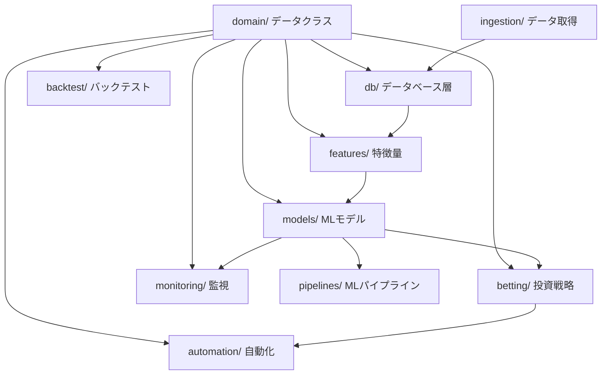

# システムアーキテクチャ

競馬AI予測システム v5.5 の技術的全体像を解説する。10パッケージからなる階層構造で、データ取得から自動投票・監視まで一貫したパイプラインを実現する。

---

## パッケージ依存関係



`domain/` は全パッケージの基盤となるデータクラスを提供し、各パッケージ間の結合を型によって制約する。データフローは `ingestion -> db -> features -> models -> betting -> automation` の方向に流れる。

---

## 全10パッケージの役割

| パッケージ | 行数 | 責任 | Phase |
|-----------|------|------|-------|
| `domain/` | ~315 | データクラス・Enum型定義（Race, Entry, Bet, OddsSnapshot, DDState 等） | A |
| `db/` | ~336 | PostgreSQL DDL・SQLAlchemy Core 接続・データローダー/セーバー | A |
| `features/` | ~630 | 特徴量エンジン（オッズ動態・市場歪み・情報非対称性・リーク検証） | B |
| `models/` | ~1,610 | MLモデル群（2段階モデル・Market Model・EV補正・レジーム検知・Walk-Forward CV） | C |
| `betting/` | ~986 | 投資戦略（単勝/複勝/ワイド戦略・DD制御・late_money・オーケストレーター） | D |
| `backtest/` | ~912 | バックテストエンジン・検証スイート・パラメータフリーズプロトコル | E |
| `pipelines/` | ~296 | 学習パイプライン（MLflow記録・全モデルの学習・評価を統合） | E |
| `automation/` | ~466 | PAT自動投票・スケジューラ（t-3min/t-2min タスク）・SafetyGuard | F |
| `monitoring/` | ~384 | モデル監視・自動再学習トリガー・通知（LINE/Slack） | F |
| `ingestion/` | ~220 | JV-Link データ取得・オッズ収集（t-3min/t-2min 監視） | F |

---

## 主要な設計決定

### SQLAlchemy Core のみ（ORM不使用）

SQLAlchemy ORM を使用せず、Core のみでSQLを構築する。

**理由:**

- EveryDB2 の外部テーブル（`n_race`, `n_uma_race`, `n_harai`, `n_odds_tanpuku` 等）は読取専用であり、ORM のリレーションマッピングが不要
- レース識別子が複合PK（後述）であり、ORM の単一ID前提と相性が悪い
- 複雑な集計クエリ（Walk-Forward CV、rolling統計）を Core の `select()` / `text()` で直接記述する方が可読性が高い
- キャッシュ・セッション管理の隠蔽によるバグの温床を排除

### 2段階モデル

全券種（単勝・複勝・ワイド）で P(hit) x E(odds|hit) の2段階構造を採用する。

```
Stage1（能力モデル）: P(win) / P(place) / P(joint_hit)  <- LightGBM binary
Stage2（リターン）:   E(win_odds|win) / E(place_odds|place) / E(wide_odds|hit)  <- LightGBM regression_l1

EV = Stage1 x Stage2
```

**従来の1段階モデルの問題:**

1着馬は1頭、外れ馬は15頭（16頭立ての場合）。期待リターンのラベルは 93.75% が大きな負値（`log(epsilon)`）となり、MAE最小化が中央値に収束してゼロ偏重バイアスが発生する。2段階化は Stage1 で的中確率、Stage2 で的中時の払戻を独立に学習し、この問題を根本的に排除する。

### Market Model 差分専用

Market Model（オッズの予測モデル）の出力は、オッズ確率そのものではなく **log_error（正規化差分）のみ** Stage2 に入力する。

```python
# Market Model が出力するのはこれだけ
signed_log_error = log(p_market / p_pred)   # 両側クリップ [0.01, 0.99]
abs_log_error = abs(log(p_market / p_pred))
```

**p_market_pred を Stage2 に入れない理由:**

Stage2 は市場オッズと比較して EV > 1.0 の馬を見つけるのが目的。市場確率そのものを入力すると、モデルは「市場をコピーする」学習に収束し、市場の歪み（人気馬過小評価・穴馬過大評価）を利用できなくなる。差分のみを入力することで「市場がどれくらい間違っているか」を純粋に学習できる。

### レース識別子の設計

レースを一意に識別する複合主キーを `(year, month_day, jyo_cd, kaiji, nichiji, race_num)` の6カラムで構成する。DB では `GENERATED ALWAYS AS` で `race_id` 文字列を自動生成する。

```python
# domain/models.py
@property
def race_id(self) -> str:
    """複合主キーを文字列化: YYYYMMDDJyoKaiNiRace"""
    return f"{self.year}{self.month_day}{self.jyo_cd}{self.kaiji}{self.nichiji}{self.race_num}"
```

EveryDB2 の `n_race` テーブルのPK仕様に準拠している。文字列化により DataFrame の merge や groupby が簡潔になる。

### pythonpath 設定

`pyproject.toml` で `pythonpath = [".", "src"]` を設定している。これにより全パッケージからトップレベルの import が可能になる。

```python
# どのパッケージからでも:
from domain.types import Surface, BetType, RegimeState
from domain.models import Race, Entry, Bet, DDState
```

相対 import を排除し、import パスからパッケージ所属が直感的に分かる構造にしている。

---

## 設計思想: 主要ルールの要約

設計書 v5.5 で定義された19の絶対ルールのうち、アーキテクチャに直接影響する主要なものを列挙する。

### ゼロ偏重排除

- **Rule 2**: Stage2 ラベルは2段階（P x E）。単一回帰は使わない
- **Rule 12**: EV補正は P補正（binary, init_score付き） x E補正（1/sqrt(p)重み付き回帰）の2モデルに分解

P（的中確率）と E（的中時払戻）を分離することで、95%がゼロに近いラベル分布の問題を回避する。

### 市場コピー防止

- **Rule 1**: Stage1 にオッズを入れない
- **Rule 11**: Market Model の出力は差分（log_error）のみ Stage2 に入力

オッズを直接入力するとモデルが市場予測をコピーするだけになる。差分のみを使うことで市場の歪みを exploitation できる。

### リーク防止

- **Rule 18**: hist系特徴量は `expanding().shift(1)` で未来情報リークを完全遮断
- **Rule 7**: 戦略パラメータは out-of-sample 期間では変更しない
- **Rule 16**: RaceQualityScreener は結果ベース proxy（EV依存 proxy 禁止）

過去の集計特徴量には必ず shift(1) を適用し、評価対象のレース以降のデータが含まれないようにする。

### p_pred クリップ

- **Rule 13**: market_error は両側クリップ（p_market, p_pred 共に `clip(0.01, 0.99)`）

確率が極端に小さい値での `log(p_a / p_b)` の発散を防止する。片側だけでなく p_market 側もクリップし、両側対称化する。

### リスク管理

- **Rule 6**: 1レースの最大リスクは資金の2%
- **Rule 9**: DDコントローラーは DD x Rolling ROI + ヒステリシス + max_adj/N_bets
- **Rule 3**: ワイドは分散ベースのリスク調整スコア（`EV / (E * sqrt(P))`）を使用

シャープレシオ近似によるリスク調整で、高期待値でも分散が大きいペアを適切にペナルティする。

### 市場適応

- **Rule 19**: 市場状態の切り替えは RegimeDetector で検知（市場側指標メイン）

`favorite_win_rate x overround_mean` で market_efficiency を定義し、AGGRESSIVE / CONSERVATIVE / COLLAPSED の3状態を分類。教師ラベルを戦略依存の rolling_roi から市場指標ベースに変更し、モデルの劣化と市場の崩壊を区別可能にしている。

---

## データフローの全体像

```
[ingestion/]                    [db/]
 JV-Link                        PostgreSQL
 OddsCollector  ──────────────>  EveryDB2外部テーブル（読取専用）
                                  自前5スキーマ（raw, odds_history, feature, prediction, betting）
                                       │
                                       v
                              [features/]
                               FeatureEngine
                               OddsDynamicsFeatures
                               MarketBiasFeatures
                               InfoAsymmetryFeatures
                               LeakageValidators
                                       │
                                       v
                              [models/]
                               Stage1AbilityModel (LightGBM binary)
                               MarketModel (log_error 差分専用)
                               TwoStageReturnModel (P x E)
                               EVCorrectionModel (P補正 binary x E補正 1/sqrt(p))
                               WideTwoStageModel (分散ベーススコア)
                               RaceQualityScreener (結果ベースproxy)
                               RegimeDetector (3状態分類)
                               RobustConfidenceEstimator (CP + Rolling Quantile)
                                       │
                              ┌────────┴────────┐
                              v                 v
                        [pipelines/]      [monitoring/]
                         TrainingPipeline   ModelMonitor
                         (MLflow記録)       AutoRetrainTrigger
                                            Notifier
                              │
                              v
                        [betting/]
                         WinStrategy / PlaceStrategy / WideStrategy
                         StakeCalculator (edge連動ケリー, 2%キャップ)
                         LateMoneyFilter (t-3min判定)
                         DrawdownController (DD x ROI + EWMA + ヒステリシス)
                         GateKeeper / MetaSwitcher
                         Orchestrator (12ステップ決定フロー)
                              │
                              v
                        [automation/]
                         Scheduler (t-3min/t-2min タスク)
                         PatVoter (PAT自動投票)
                         SafetyGuard (min_bankroll, max_loss ガード)
```

---

## 設計書へのリンク

本ドキュメントはアーキテクチャの概要を解説した。各モデルの数式・ハイパーパラメータ・バージョン間比較などの深い技術詳細は設計書を参照すること。

- **設計書**: [`docs/design.md`](../design.md)（v5.5, ~2940行）
  - Section 1: 設計思想・19の絶対ルール
  - Section 2: 2段階モデルの数学的構造と実装
  - Section 3: EV補正モデル（P/E分解）
  - Section 4: Market Model 差分専用化
  - Section 7: ワイドスコアの分散ベース・リスク調整
  - Section 9-9.5: DDコントローラー・レジーム検知
  - Section 10-12: 全体アーキテクチャ・パイプライン・オーケストレーター
  - Section 13: バックテスト検証スイート
  - Section 14: 開発ロードマップ・タスクリスト
  - Section 16: ディレクトリ構成

---

> **次のドキュメント:** [コード構造](02_code_structure.md) | **前のドキュメント:** [バックテストと検証](../concepts/05_backtest_validation.md) | **ドキュメント一覧:** [README](../../README.md)
