# ドキュメント整備 実装計画

> **For agentic workers:** REQUIRED SUB-SKILL: Use superpowers:subagent-driven-development (recommended) or superpowers:executing-plans to implement this plan task-by-task. Steps use checkbox (`- [ ]`) syntax for tracking.

**Goal:** 競馬AI予測システム v5.5 の全ドキュメントを15ファイル（README + guide 4 + concepts 5 + reference 4）で整備する。技術知識のない競馬ファンから上級開発者まで、全レベルの読者が理解できるドキュメントを作成する。

**Architecture:** 3階層構成（入門 guide/ → 中級 concepts/ → 上級 reference/）。README.md がハブとなり、各ファイル末尾に双方向ナビゲーションリンクを配置。全て日本語、Mermaid 図解を含む。

**Tech Stack:** Markdown, Mermaid（GitHub 互換構文）

**Spec:** `docs/superpowers/specs/2026-03-26-documentation-design.md`

---

## ファイル一覧と行数目安

| # | ファイル | 目安行数 | 依存 |
|---|---------|---------|------|
| 1 | `README.md` | 100-150 | なし |
| 2 | `docs/guide/01_keiba_basics.md` | 100-200 | なし |
| 3 | `docs/guide/02_ai_prediction_basics.md` | 100-200 | なし |
| 4 | `docs/guide/03_system_overview.md` | 100-200 | なし |
| 5 | `docs/guide/04_getting_started.md` | 150-250 | なし |
| 6 | `docs/concepts/01_data_pipeline.md` | 150-250 | guide/ |
| 7 | `docs/concepts/02_prediction_models.md` | 150-250 | guide/02 |
| 8 | `docs/concepts/03_advanced_models.md` | 150-250 | concepts/02 |
| 9 | `docs/concepts/04_betting_strategy.md` | 200-300 | concepts/01 |
| 10 | `docs/concepts/05_backtest_validation.md` | 200-300 | concepts/02-04 |
| 11 | `docs/reference/01_architecture.md` | 200-350 | concepts/ |
| 12 | `docs/reference/02_code_structure.md` | 250-400 | 全ソース |
| 13 | `docs/reference/03_configuration.md` | 200-350 | config/ |
| 14 | `docs/reference/04_contributing.md` | 150-250 | CLAUDE.md |
| 15 | リンク整合性チェック | — | 全ファイル |

---

## Task 1: README.md

**Files:**
- Create: `README.md`

- [ ] **Step 1: README.md を作成**

以下の構成で作成。GitHub プロジェクトページの第一印象となるよう、専門用語を避け親しみやすいトーンで。

```markdown
# 競馬AI予測システム v5.5

LightGBM を使った競馬予測システム。単勝・複勝・ワイドの3種類の馬券について、統計的な予測と資金管理を自動化します。

## 特徴

- **2段階AI予測**: 「当たる確率」と「当たった時の払戻し」を別々に学習し、精度を高める仕組み
- **自動資金管理**: 連敗時の資金防衛（ドローダウン制御）を自動で行います
- **市場状態の検知**: オッズの動きから市場の状態（攻撃的/保守的/崩壊）を判定し、戦略を切り替えます
- **厳密な検証**: ウォークフォワード交差検証とホールドアウト検証で、過去のデータで効果を確認済み

## クイックスタート

### 1. 環境準備
[PostgreSQL + EveryDB2 + Python 3.11 のセットアップ手順を簡潔に]

### 2. インストール
```bash
mise install
mise activate
pip install -e ".[dev]"
```

### 3. 最初の予測
[最小限のコマンド例]

> **詳しいセットアップ方法:** [セットアップガイド](docs/guide/04_getting_started.md)

## ドキュメント

### 📗 入門編（競馬AIを初めて知る方）
1. [競馬の基礎知識](docs/guide/01_keiba_basics.md) — 馬券とオッズの仕組み
2. [AI予測の基礎](docs/guide/02_ai_prediction_basics.md) — 機械学習とは何か
3. [システム概要](docs/guide/03_system_overview.md) — このシステムは何をするのか
4. [セットアップガイド](docs/guide/04_getting_started.md) — 環境構築手順

### 📘 中級編（仕組みをもっと知りたい方）
1. [データの流れ](docs/concepts/01_data_pipeline.md) — データがどう流れるか
2. [予測モデル](docs/concepts/02_prediction_models.md) — 2段階モデルの仕組み
3. [高度なモデル](docs/concepts/03_advanced_models.md) — EV補正・レジーム検知
4. [投資戦略](docs/concepts/04_betting_strategy.md) — 資金管理と戦略切り替え
5. [バックテストと検証](docs/concepts/05_backtest_validation.md) — なぜ信頼できるのか

### 📙 上級編（開発・改造したい方）
1. [アーキテクチャ](docs/reference/01_architecture.md) — システム全体設計
2. [コード構造](docs/reference/02_code_structure.md) — モジュール解説
3. [設定リファレンス](docs/reference/03_configuration.md) — 全設定項目
4. [開発ガイド](docs/reference/04_contributing.md) — コーディング規約とテスト

## 期待できる成果とリスク

[backtest_config.yaml の合格基準を素人向けに説明:
- 目標回収率: 101%以上（100円賭けて平均101円以上の返り）
- 最大ドローダウン: 16%以内（資金の最大減少幅）
- 注意: 過去の実績は将来の成果を保証するものではありません]

## 免責事項

このシステムは統計的予測ツールであり、確実に利益を出すことを保証するものではありません。
競馬はギャンブルであり、資金を失うリスクがあります。自己責任でご利用ください。

## ライセンス

[MIT License 等、プロジェクトに適切なライセンス]

## 技術スタック

- **言語:** Python 3.11
- **ML:** LightGBM, scikit-learn
- **DB:** PostgreSQL (EveryDB2/JRA-VAN DataLab)
- **実験管理:** MLflow
- **品質:** Ruff (lint/format), Mypy (型チェック), pytest
```

- [ ] **Step 2: Mermaid 全体像図を追加**

README.md の「特徴」セクションの後に、以下の Mermaid 図を挿入:

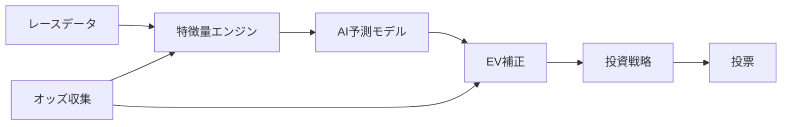

- [ ] **Step 3: 構造とリンクを確認**

- [ ] **Step 4: Commit**

```bash
git add README.md
git commit -m "docs: README.md プロジェクト窓口を作成"
```

---

## Task 2: docs/guide/01_keiba_basics.md

**Files:**
- Create: `docs/guide/01_keiba_basics.md`

- [ ] **Step 1: 競馬の基礎知識ドキュメントを作成**

以下の構成で100-200行。中学校卒業程度の読者が理解できるレベル。比喩を多用。

```markdown
# 競馬の基礎知識

[1段落の概要: 競馬予測AIを理解するために必要な、最小限の競馬の知識を解説]

## 馬券とは

[馬券 = レースの結果を予想して買う「参加券」。このシステムが扱う3種類を紹介:]

### 単勝（たんしょう）
1着の馬を当てる。一番シンプルで配当が高いが、当てるのが難しい。
[比喩: 「1位の人だけが当たり」のクイズ]

### 複勝（ふくしょう）
3着以内に入る馬を当てる。単勝より当てやすいが、配当は低め。
[比喩: 「上位3人まで当たり」のクイズ]

### ワイド
2頭の馬を指定し、その2頭が3着以内に入れば当たり。組み合わせは全部で18通り。
[比喩: 「この2人は表彰台に上がるか？」のクイズ]

## オッズとは

[オッズ = 馬券の「値段」。低いオッズ＝人気がある＝当たりやすいが配当が低い。
オッズは「市場の予想」を数字にしたもの。]

### オッズの見方
- オッズ 2.0 → 100円賭けて当たれば200円返る（利益100円）
- オッズ 10.0 → 100円賭けて当たれば1000円返る（利益900円）
- オッズが低い馬＝みんなが買っている＝人気馬

### オッズは「確率」ではない
[オッズと本当の当たる確率は違う。オッズには「場外馬券売上税（約20%）」が含まれるため、
全馬のオッズから計算した「隠れた確率」を足すと120%くらいになる。
この20%がJRAの取り分。これをオーバーラウンドと呼ぶ。]

## 払戻しの計算

[100円単位で購入。払戻し = 買った金額 × オッズ。
例: 300円賭けてオッズ5.0 → 1500円払戻し（利益1200円）]

## 人気と実力の違い

[人気馬が必ず勝つわけではない。
- 人気＝「みんなが買っている」という事実だけ
- 実力＝「過去のデータから統計的に計算した強さ」
- AIは「人気」ではなく「実力データ」から予測するため、人間の認知バイアスを排除できる]

## 用語集

| 用語 | 意味 |
|------|------|
| 単勝 | 1着を当てる |
| 複勝 | 3着以内を当てる |
| ワイド | 指定した2頭が3着以内に入る |
| オッズ | 馬券の配当倍率 |
| 人気 | 買われている順位 |
| 払戻し | 当たった時に戻ってくる金額 |
| 回収率 | 投資した金額に対する返りの割合（100%で損益ゼロ） |
| ドローダウン | 資金が最大からどれだけ減ったか |
| 芝（しば） | 芝生のコース |
| ダート | 砂のコース |

---

> **次のドキュメント:** [AI予測の基礎](02_ai_prediction_basics.md) | **ドキュメント一覧:** [README](../../README.md)
```

- [ ] **Step 2: 構造とリンクを確認**

- [ ] **Step 3: Commit**

```bash
mkdir -p docs/guide
git add docs/guide/01_keiba_basics.md
git commit -m "docs: 競馬の基礎知識ガイドを作成 (guide/01)"
```

---

## Task 3: docs/guide/02_ai_prediction_basics.md

**Files:**
- Create: `docs/guide/02_ai_prediction_basics.md`

- [ ] **Step 1: AI予測の基礎ドキュメントを作成**

以下の構成で100-200行。全くの初心者向け。数式は使わない。比喩で説明。
**重要:** 「汎用的なML概念」のみ扱う。このシステム特有のモデル構造は concepts/02 に譲る。

```markdown
# AI予測の基礎

[1段落の概要: 「AI」って何？ 競馬予測にAIがなぜ有効なのかを、専門用語なしで解説]

## AI（人工知能）とは

[AI = コンピューターが「過去のデータからパターンを見つける」技術。
「経験から学ぶ人間」に似ているが、コンピューターは何万件ものデータを一瞬で処理できる。]

## 機械学習とは

[機械学習 = AIの一種。プログラマーが「ルール」を書くのではなく、
コンピューターが「データ」からルールを自動で見つける。
比喩: 「料理のレシピを教わる」のではなく「何千回も失敗して自分でコツを掴む」]

### 学習と予測

[学習（トレーニング）: 過去のデータを渡して「パターン」を覚えさせる
予測（推論）: 新しいデータを渡して「結果」を予想させる
比喩: 過去問を解いて実力をつける（学習）→ 本番のテストで解く（予測）]

## LightGBMとは

[このシステムで使っているAIエンジン。
「決定木」という仕組みを何百個も組み合わせて予測する。]

### 決定木のイメージ

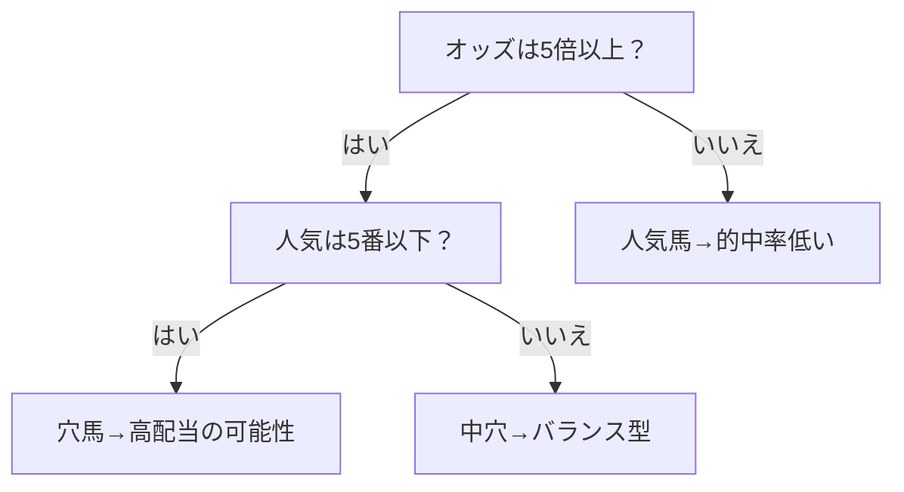

[一本の木は単純なルール。でも何百本の木を「多数決」で組み合わせると、
複雑なパターンも見つけられる。これを「アンサンブル学習」と呼ぶ。]

### 学習→予測の流れ

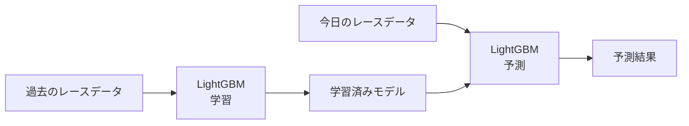

## なぜ競馬予測にAIが有効なのか

### 人間の限界
[人間は一度に見られる情報が限られている。過去のレース結果を何千件も記憶して比較することは不可能。]
[人間には認知バイアスがある。「人気馬は勝ちやすい」と思い込む、最近の印象を重視しすぎる等。]

### AIの強み
[AIは一度に何万件ものデータを処理できる。
AIは感情に左右されない。
AIは人間が見落とす微妙なパターンを見つけられる。]

## AIの限界

[AIも完璧ではない:
- AIは「過去のデータ」から学ぶ。過去にない出来事は予測できない
- AIは「なぜその馬が勝ったか」の理由を説明しない（確率だけを出す）
- AIの予測は「確率」であって「確定」ではない
- レースの結果は偶然の要素も大きい]

---

> **次のドキュメント:** [システム概要](03_system_overview.md) | **前のドキュメント:** [競馬の基礎知識](01_keiba_basics.md) | **ドキュメント一覧:** [README](../../README.md)
```

- [ ] **Step 2: 構造とリンクを確認**

- [ ] **Step 3: Commit**

```bash
git add docs/guide/02_ai_prediction_basics.md
git commit -m "docs: AI予測の基礎ガイドを作成 (guide/02)"
```

---

## Task 4: docs/guide/03_system_overview.md

**Files:**
- Create: `docs/guide/03_system_overview.md`
- Read: `src/betting/orchestrator.py` (オーケストレーターのフロー理解用)

- [ ] **Step 1: システム概要ドキュメントを作成**

以下の構成で100-200行。技術用語を最小限に。

```markdown
# このシステムは何をするのか

[1段落の概要: データを集めて→AIで予測して→自動で投票する。3ステップで説明]

## 3つのステップ

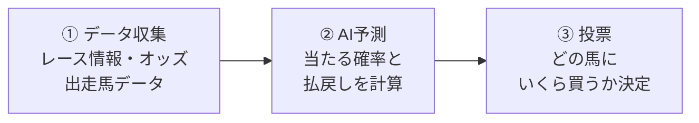

## どんな馬券を買うのか

[単勝・複勝・ワイドの3種類。各々の特徴を表形式で:
| 馬券種 | 当たり条件 | 難しさ | 配当 |
|--------|-----------|--------|------|
| 単勝 | 1着 | 難しい | 高い |
| 複勝 | 3着以内 | 比較的易しい | 低め |
| ワイド | 指定2頭が3着以内 | 中程度 | 中程度 |]

## どうやって予測するのか

[特徴量の概念を素人向けに:
- 過去のレース成績
- 騎手の実力
- 馬の調子（体重変化等）
- オッズの変動（人気の変化）
- レースの条件（距離、馬場状態等）

これらを数字にしてAIに読み込ませる = 「特徴量」]

## どうやって「いくら買うか」を決めるのか

[AIが「どの馬が勝つ確率」を出した後:
1. 期待値（EV）を計算: 確率 × 配当 - 投資額
2. EVがプラスの馬だけを選ぶ
3. レースの「質」をチェック（参加するかどうか）
4. 資金管理（DD制御）: 連敗している時は賭け金を減らす]

## どうやって「どのレース」に参加するか

[全レースに参加するわけではない。以下の条件で絞る:
- 障害レースは除外
- レースの質が一定基準を満たすか
- 市場の状態が正常か（崩壊状態なら不参加）]

## 検証結果

[backtest_config.yaml の合格基準を素人向けに説明:
- 回収率101%以上 → 100円賭けて平均101円以上戻る
- 最大DD16%以内 → 10万円スタートでも最大1.6万円の減少
- 月次勝率: 36ヶ月中22ヶ月以上でプラス

> **詳しい検証方法:** [バックテストと検証](../concepts/05_backtest_validation.md)]

## 期待できる成果とリスク

### 期待できること
[長期的に回収率100%超を目標。AIは感情に左右されず、統計的に有利な馬券を選ぶ。]

### リスクと限界
[過去の実績は将来を保証しない。市場の変化で予測精度が低下する可能性。短期間では大きく損する可能性がある。]

---

> **次のドキュメント:** [セットアップガイド](04_getting_started.md) | **前のドキュメント:** [AI予測の基礎](02_ai_prediction_basics.md) | **ドキュメント一覧:** [README](../../README.md)
```

- [ ] **Step 2: 構造とリンクを確認**

- [ ] **Step 3: Commit**

```bash
git add docs/guide/03_system_overview.md
git commit -m "docs: システム概要ガイドを作成 (guide/03)"
```

---

## Task 5: docs/guide/04_getting_started.md

**Files:**
- Create: `docs/guide/04_getting_started.md`
- Read: `pyproject.toml`, `config/settings.yaml`, `CLAUDE.md`

- [ ] **Step 1: セットアップガイドを作成**

以下の構成で150-250行。コピペで動くコマンドを中心に。

```markdown
# セットアップガイド

[1段落の概要: このシステムを動かすための環境構築手順]

## 必要なもの

| ソフトウェア | バージョン | 用途 |
|-------------|-----------|------|
| Python | 3.11 | 実行環境 |
| PostgreSQL | 14+ | データベース |
| EveryDB2 | — | 競馬データベース |
| mise | 最新 | Pythonバージョン管理 |

## インストール手順

### 1. mise のインストール

[Windows/Mac/Linux別のインストール手順]

### 2. Python のセットアップ

```bash
mise install
mise activate
```

### 3. 依存パッケージのインストール

```bash
pip install -e ".[dev]"
```

### 4. PostgreSQL のセットアップ

[PostgreSQLのインストールと everydb2 データベースの作成手順]

### 5. EveryDB2 のセットアップ

[EveryDB2のデータインポート手順]

## 設定

### config/settings.yaml

[最小限の設定項目を説明:
- database: 接続情報（host, port, dbname, user）
- PGPASSWORD 環境変数の設定方法]

### 環境変数

```bash
export PGPASSWORD="your_password"
```

## 最初の予測を動かすまで

[最小限の手順で予測を実行する例]

## よくあるエラーと対処法

### PostgreSQL 接続エラー

| エラーメッセージ | 原因 | 対処 |
|----------------|------|------|
| `connection refused` | PostgreSQLが起動していない | `pg_ctl start` |
| `database "everydb2" does not exist` | DB未作成 | `createdb everydb2` |
| `password authentication failed` | パスワード不一致 | PGPASSWORD環境変数を確認 |

### Python/mise 環境エラー

| エラーメッセージ | 原因 | 対処 |
|----------------|------|------|
| `Python 3.11 not found` | mise未インストール | `mise install` |
| `ModuleNotFoundError` | パッケージ未インストール | `pip install -e ".[dev]"` |

### EveryDB2 データエラー

| エラーメッセージ | 原因 | 対処 |
|----------------|------|------|
| `relation "n_race" does not exist` | EveryDB2未インポート | EveryDB2データをインポート |

## FAQ

**Q: PostgreSQL がなくても動かせますか？**
A: テストはDB不要で動きます: `python -m pytest tests/`

**Q: Windows で動かせますか？**
A: はい。Python 3.11, PostgreSQL, mise が動けばOKです。

**Q: どれくらいのデータが必要ですか？**
A: 学習には4年以上のデータが必要です。EveryDB2の標準データで十分です。

---

> **次のドキュメント:** [データの流れ](../concepts/01_data_pipeline.md) | **前のドキュメント:** [システム概要](03_system_overview.md) | **ドキュメント一覧:** [README](../../README.md)
```

- [ ] **Step 2: 構造とリンクを確認**

- [ ] **Step 3: Commit**

```bash
git add docs/guide/04_getting_started.md
git commit -m "docs: セットアップガイドを作成 (guide/04)"
```

---

## Task 6: docs/concepts/01_data_pipeline.md

**Files:**
- Create: `docs/concepts/01_data_pipeline.md`
- Read: `src/db/schema.py`, `src/features/feature_engine.py`, `src/db/connection.py`
- Read: `docs/everydb2-data-reference.md`

- [ ] **Step 1: データパイプライン解説を作成**

以下の構成で150-250行。概念レベルで解説。

```markdown
# データの流れ

[1段落の概要: EveryDB2のデータがどう流れて予測に至るか]

## データソース

### EveryDB2とは
[JRA-VAN DataLab から提供される競馬の過去データベース。レース結果、出走馬情報、オッズ、払戻しなどを含む]

### JRA-VAN DataLab とは
[日本中央競馬会が提供するデータサービス。JVLink という専用ソフトでデータを取得]

## データベース構造

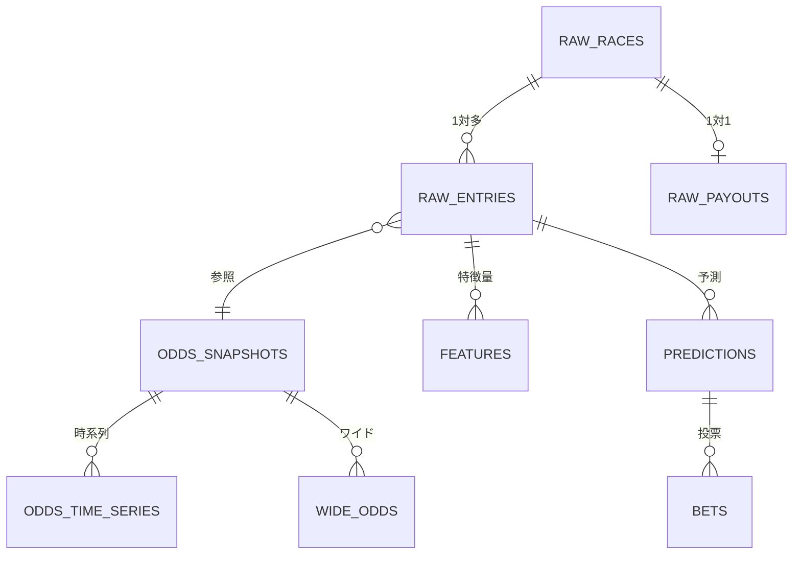

### 5つのスキーマ

| スキーマ | 役割 | テーブル |
|---------|------|---------|
| raw | EveryDB2生データのローカルコピー | races, entries, payouts |
| odds_history | 時系列オッズ | odds_snapshots, odds_time_series, wide_odds |
| feature | 特徴量エンジン出力 | features (JSONB) |
| prediction | モデル予測結果 | predictions |
| betting | 投票記録 | bets |

> **詳細:** [EveryDB2データリファレンス](../everydb2-data-reference.md)

## データフロー

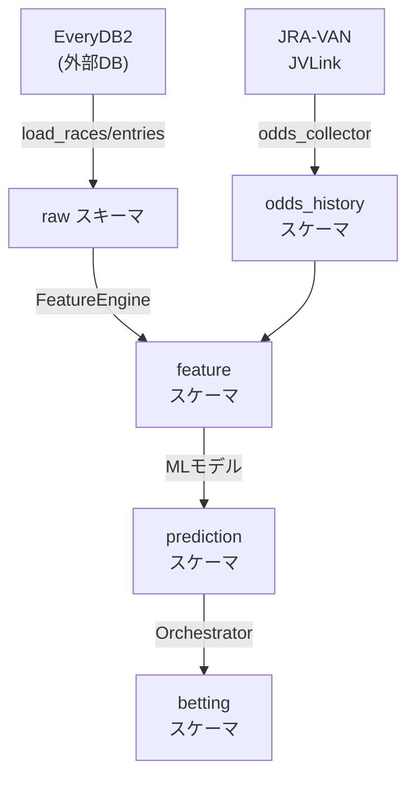

## 特徴量エンジニアリングとは

[「馬の実力を数字で表す」作業。
例: 人気順位、オッズ変化率、馬体重変化、レースの難易度スコア etc.
FeatureEngine クラスが build_all() で一括計算。]

### 特徴量の種類

| カテゴリ | モジュール | 内容 |
|---------|-----------|------|
| レース内相対値 | intra_race_features | レース内での相対的な位置 |
| オッズ動態 | odds_dynamics_features | オッズの変化率・速度・ボラティリティ |
| 市場歪み | market_bias_features | 市場エントロピー・オーバーラウンド |
| 情報非対称性 | info_asymmetry_features | 過去の情報量 |
| レース難易度 | race_difficulty_model | レースの難しさスコア |

## リーク防止

[リーク = 未来の情報が学習データに混入すること。
例: 予測時にしか分からない情報（確定オッズ）を学習に使うと、実運用で性能が落ちる。
leakage_validators.py でリークを検出。]

---

> **次のドキュメント:** [予測モデル](02_prediction_models.md) | **前のドキュメント:** [セットアップガイド](../guide/04_getting_started.md) | **ドキュメント一覧:** [README](../../README.md)
```

- [ ] **Step 2: Mermaid 図の構文チェック**

- [ ] **Step 3: Commit**

```bash
mkdir -p docs/concepts
git add docs/concepts/01_data_pipeline.md
git commit -m "docs: データパイプライン解説を作成 (concepts/01)"
```

---

## Task 7: docs/concepts/02_prediction_models.md

**Files:**
- Create: `docs/concepts/02_prediction_models.md`
- Read: `src/models/two_stage_return_model.py`, `src/models/stage1_ability_model.py`, `src/models/submodel_manager.py`, `src/domain/models.py` (TwoStageConfig, SubmodelSet)

- [ ] **Step 1: 予測モデル（基礎）解説を作成**

以下の構成で150-250行。2段階モデル・Stage1/Stage2・サブモデルを解説。

```markdown
# 予測モデル（基礎）

[1段落の概要: このシステムの予測モデルの基礎構造。2段階モデルとサブモデル分割]

## 2段階モデルとは

[従来のアプローチ: 「期待値」を直接予測 → ほとんどの馬が0円になるため学習が難しい
2段階アプローチ: 「当たる確率」×「当たった時の払戻し」に分解 → 両方とも学習しやすい]

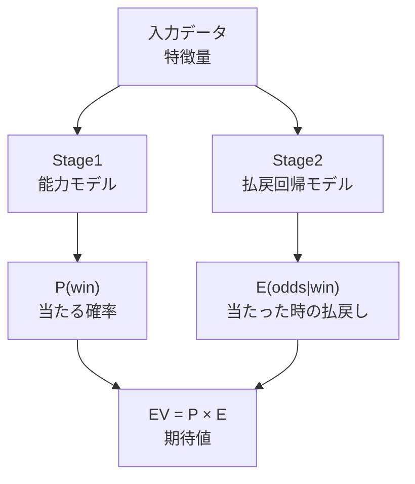

[比喩: 「宝くじの当選確率」と「当選時の賞金額」を別々に予測するイメージ]

## Stage1: 能力モデル（AbilityModel）

[全出走馬を対象に「その馬が何着になる確率」を予測。
LightGBM の binary classification を使用。
出力: p_ability_win, p_ability_place]

## Stage2: 2段階モデル（WinTwoStageModel / PlaceTwoStageModel）

### 単勝2段階モデル

[Stage A: P(win) = 1着になる確率（binary classification）
Stage B: E(win_odds|win) = 1着になった時のオッズ（regression, 1着馬のみ学習）
EV = P × E

特徴量: p_ability_win, signed_log_error_win, abs_log_error_win, odds_drop_rate_*, market_entropy, popularity_rank, overround, surface, distance_bin, track_condition_code, grade_code, field_size]

### 複勝2段階モデル

[Stage A: P(place) = 3着以内になる確率
Stage B: E(place_odds|place) = 3着以内の時のオッズ
構造は単勝と同じだが、的中率が高い（18〜35%）ため学習データが豊富]

## サブモデル（芝/ダート分割）

[芝とダートではレースの性質が全く違うため、別々のモデルを学習。
SubModelManager が surface ごとにモデルを切り替え。

分割: turf（芝）と dirt（ダート）の2分割のみ。
理由: 7分割（芝短距離/芝マイル/...）など細かく分けるとサンプル数が足りなくなる。

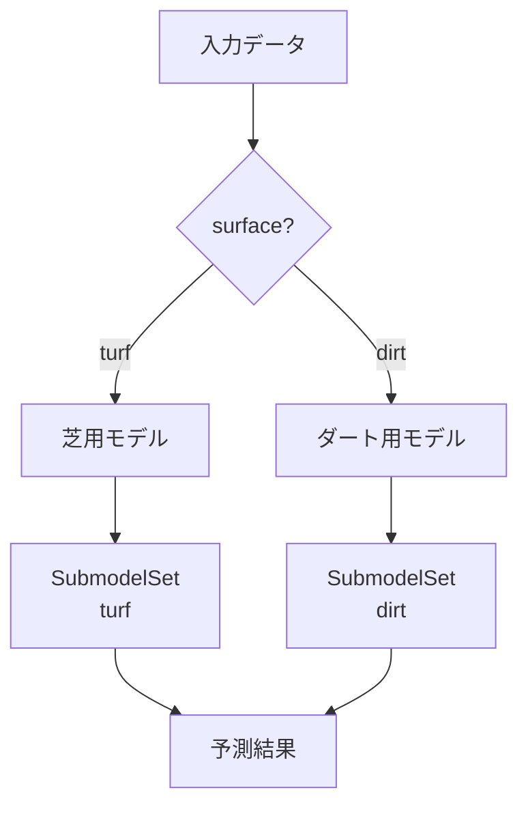

## ワイド予測の基礎

[ワイド = 2頭の組み合わせ。18通りあるため計算量が多い。
WidePairBuilder が馬券対象の全ペアを構築。
WideTwoStageModel がペアごとのスコアを計算。

ワイドの特殊性: 単勝/複勝と違って「2頭の組み合わせ」を予測するため、
分散（不確実性）を考慮したスコアリングが必要。]

> **詳しい技術設計:** [design.md §2-§6](../design.md#2-単勝複勝の2段階モデル化ゼロ偏重問題の根本解決)

---

> **次のドキュメント:** [高度なモデル](03_advanced_models.md) | **前のドキュメント:** [データの流れ](01_data_pipeline.md) | **基礎を復習:** [AI予測の基礎](../guide/02_ai_prediction_basics.md) | **ドキュメント一覧:** [README](../../README.md)
```

- [ ] **Step 2: 構造とリンクを確認**

- [ ] **Step 3: Commit**

```bash
git add docs/concepts/02_prediction_models.md
git commit -m "docs: 予測モデル基礎解説を作成 (concepts/02)"
```

---

## Task 8: docs/concepts/03_advanced_models.md

**Files:**
- Create: `docs/concepts/03_advanced_models.md`
- Read: `src/models/market_model.py`, `src/models/ev_correction_model.py`, `src/models/regime_detector.py`, `src/models/robust_confidence_estimator.py`

- [ ] **Step 1: 高度なモデル解説を作成**

以下の構成で150-250行。Market Model, EV補正, レジーム検知, MLflow。

```markdown
# 高度なモデル

[1段落の概要: 2段階モデルをさらに補正する高度なモデル群]

## Market Model（市場モデル）

[オッズとAI予測の「ズレ」を学習するモデル。
市場（オッズ）が示す確率と、AIが計算した確率の差を分析。

重要: p_market_pred（市場の予測確率）は出力に含めない。
理由: 市場の予測をそのまま使うと「市場のコピー」になってしまい、
独自のエッジ（優位性）が消えるから。

出力: signed_log_error_win（符号付きlog誤差）と abs_log_error_win（絶対値）のみ。
これらはStage2の特徴量として使われる。]

## EV補正モデル

[2段階モデルの予測値を、実績に近づけるための「調整レイヤー」。

v5.5ではP補正とE補正の2モデルに分解:
- P補正: 「当たる確率」のズレを修正（binary classification, init_score付き）
- E補正: 「当たった時の払戻し」のズレを修正（1着馬のみ, weight=1/√p）
- 最終: EV_corrected = P_corrected × E_corrected

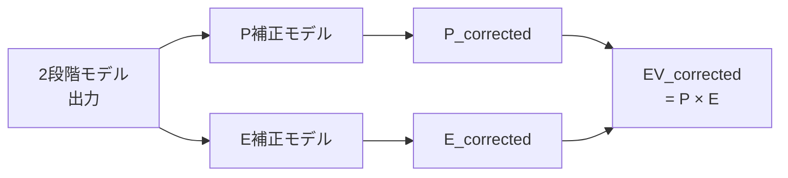

なぜ2つに分けるのか:
v5.3では log(actual_ev) - log(ev_raw) で一つのモデルにしていたが、
「確率のズレ」か「払戻しのズレ」か区別できず学習が不安定だった。
分解することで、それぞれのズレを正確に修正できるようになった。]

## レジーム検知（RegimeDetector）

[市場の「状態」を3つに分類するモデル:
- aggressive（攻撃的）: 人気馬の勝率が低い穴場市場
- conservative（保守的）: 人気馬が勝ちやすい安定市場
- collapsed（崩壊）: 予測不可能な異常市場

判定基準: 直近200レースの fav_rate（1番人気の勝率）× overround（オーバーラウンド）。
これらは戦略の結果ではなく市場側の指標であるため、戦略依存を排除している。

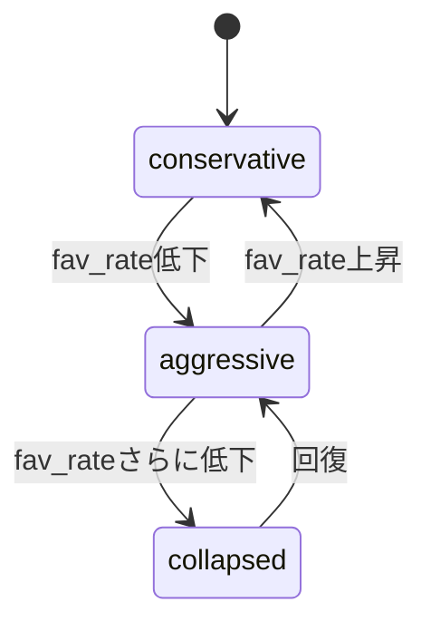

崩壊状態が続くと、自動的に再学習をトリガーする。]

## MLflow による実験管理

[MLflow でモデルのバージョン管理と実験追跡を行う。
config/settings.yaml の paths.mlflow_tracking_uri で保存先を指定。
デフォルト: file:///mlruns（ローカル保存）]

> **詳しい技術設計:** [design.md §3-§4](../design.md#3-ev補正モデル独立性破綻の解決)

---

> **次のドキュメント:** [投資戦略](04_betting_strategy.md) | **前のドキュメント:** [予測モデル](02_prediction_models.md) | **ドキュメント一覧:** [README](../../README.md)
```

- [ ] **Step 2: 構造とリンクを確認**

- [ ] **Step 3: Commit**

```bash
git add docs/concepts/03_advanced_models.md
git commit -m "docs: 高度なモデル解説を作成 (concepts/03)"
```

---

## Task 9: docs/concepts/04_betting_strategy.md

**Files:**
- Create: `docs/concepts/04_betting_strategy.md`
- Read: `src/betting/orchestrator.py`, `src/betting/stake_calculator.py`, `src/betting/drawdown_controller.py`, `src/betting/late_money_filter.py`, `src/betting/meta_switcher.py`, `src/betting/gate_keeper.py`, `src/betting/race_quality_screener.py`

- [ ] **Step 1: 投資戦略解説を作成**

以下の構成で200-300行。

```markdown
# 投資戦略

[1段落の概要: 「どのレースに、どの馬に、いくら」賭けるかを決める仕組み]

## 投資判断の全体フロー

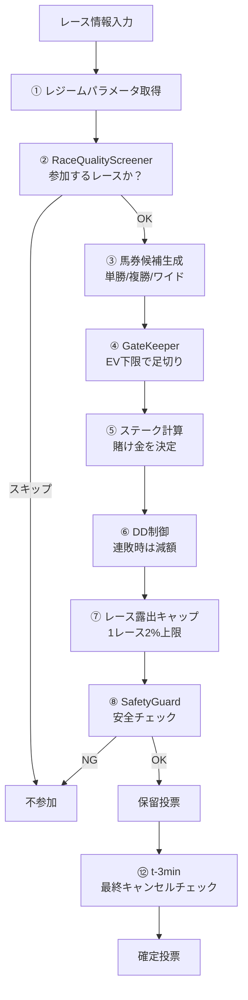

## レース品質スクリーニング（RaceQualityScreener）

[全レースに参加するわけではない。結果ベースのproxy指標でレースの「質」を評価:
- hit_rate: 過去の的中率
- roi: 過去の回収率
- return_ratio: 払戻し比率

これらを使って「予測しやすいレース」と「予測しにくいレース」を判定。
時間リークを完全に遮断（expanding().shift(1)）。]

## ゲートキーパー（GateKeeper）

[最終的な足切り。EV下限値を下回る馬券は買わない。
「期待値がプラスの馬券だけを買う」というルールの実装。]

## ステーク計算（StakeCalculator）

[賭け金の基本計算。
EV下限値とオッズと現在の資金から、最適な賭け金を計算。
1レースの露出は資金の2%を上限とする。]

## ドローダウン（DD）制御

[連敗時に資金を守る仕組み。3つの要素で構成:

1. **Rolling ROI**: 直近の投資回収率を監視。回収率が下がると警戒。
2. **EWMA（指数加重移動平均）**: 急激な変化を滑らかに検知。
3. **ヒステリシス**: 一度「警戒モード」に入ったら、簡単に戻らない。
   「上がったから安心」→すぐにまた下がる、を防ぐ。

さらに max_adjustment_per_n_bets（20回ごとの最大調整幅）で過剰適応を防止。]

## レートマネー・フィルター（LateMoneyFilter）

[発走直前のオッズ変動に対処:
- t-3min: オッズが25%以上急落した馬はキャンセル（「何か知っている人がいるかも」）
- t-2min: オッズ変動をログに記録（分析用）
- t-10min との比較で変動を検出]

## メタスイッチャー（MetaSwitcher）

[レジーム（市場状態）に応じて戦略パラメータを切り替え:
- aggressive: EV閾値を緩め、より多くの馬券を買う
- conservative: EV閾値を厳しく、厳選する
- collapsed: 買わない or 再学習トリガー]

## オーケストレーター（BettingOrchestrator）

[全戦略を統括するクラス。
process_race() でステップ①〜⑩を実行。
finalize_bets() でステップ⑫（t-3min最終チェック）を実行。]

> **詳しい技術設計:** [design.md §9-§12](../design.md#9-ddコントローラーの改善rolling-roi-連動ewma)

---

> **次のドキュメント:** [バックテストと検証](05_backtest_validation.md) | **前のドキュメント:** [高度なモデル](03_advanced_models.md) | **ドキュメント一覧:** [README](../../README.md)
```

- [ ] **Step 2: 構造とリンクを確認**

- [ ] **Step 3: Commit**

```bash
git add docs/concepts/04_betting_strategy.md
git commit -m "docs: 投資戦略解説を作成 (concepts/04)"
```

---

## Task 10: docs/concepts/05_backtest_validation.md

**Files:**
- Create: `docs/concepts/05_backtest_validation.md`
- Read: `src/backtest/engine.py`, `src/backtest/validation_suite.py`, `src/backtest/parameter_freeze_protocol.py`, `config/backtest_config.yaml`, `notebooks/` (全12ノートブックのセル内容)

- [ ] **Step 1: バックテストと検証解説を作成**

以下の構成で200-300行。ノートブックガイドを含む。

```markdown
# バックテストと検証

[1段落の概要: 「このシステムの予測は本当に信頼できるのか？」を検証する方法]

## バックテストとは

[過去のデータを使って「もし実際に運用していたらどうなっていたか」をシミュレーションすること。
株式投資やFXでも使われる標準的な検証方法。]

## ウォークフォワード交差検証

[通常の交差検証（データをランダムに分割）は時系列データには不適切。
「未来のデータで過去を予測」するリークが起きるから。

ウォークフォワード: 時間を尊重した検証方法。
4年学習 → 1年検証 → 1年進む → また4年学習 → 1年検証...

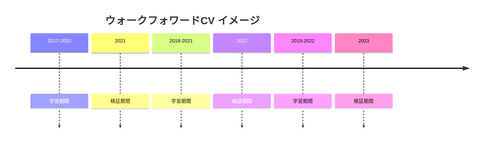

## ホールドアウト検証

[「モデルが一度も見たことがないデータ」での最終テスト。
期間: 2022-01-01 〜 2024-12-31（3年間）
モデル選択やパラメータ調整には一切使用しない。
これが「実運用に近い」性能の見積もり。]

## パラメータ凍結プロトコル

[パラメータ = AIの「設定値」（学習率、葉の数等）。
ホールドアウト検証の前にパラメータを「凍結」する。
凍結後にパラメータをいじると、ホールドアウト検証の意味がなくなる（過学習）。

ParameterFreezeProtocol がこのルールを強制。]

## 評価指標

| 指標 | 意味 | 理想的な値 |
|------|------|-----------|
| ROI（回収率） | 投資100円に対する返り | 100%超 |
| 最大DD | 資金の最大減少幅 | 小さいほど良い |
| 月次勝率 | 月次でプラスだった割合 | 高いほど良い |
| プロフィットファクター | 総利益 / 総損失 | 1.0超 |

## 合格基準

[backtest_config.yaml から:
| 基準 | 値 | 意味 |
|------|---|------|
| 複勝ROI | >= 100% | 複勝で損益ゼロ以上 |
| ワイドROI | >= 103% | ワイドで3%以上の利益 |
| 全体ROI | >= 101% | 全体で1%以上の利益 |
| 最大DD | <= 16% | 資金の減少を16%以内に |
| 月次勝利月 | >= 22/36 | 36ヶ月中22ヶ月以上でプラス |]

## 分析ノートブックガイド

[notebooks/ ディレクトリにある12個のJupyterノートブックの紹介:]

| NB | ファイル名 | 目的 | 結論 |
|----|-----------|------|------|
| 00 | 00_setup.ipynb | 環境セットアップ | 依存とデータ確認 |
| 01 | 01_eda.ipynb | 探索的データ分析 | データの全体像 |
| 02 | 02_odds_dynamics.ipynb | オッズ動態分析 | オッズ変化の予測力確認 |
| 03 | 03_market_model_diff_analysis.ipynb | 差分Market Model分析 | 差分のみ出力の有効性確認 |
| 04 | 04_twostage_win_place_ab_test.ipynb | 2段階vs1段階ABテスト | 2段階の優位性確認 |
| 05 | 05_wide_risk_adjusted_score.ipynb | ワイドリスク調整 | Var_proxyの有効性確認 |
| 06 | 06_race_quality_independence.ipynb | レース品質独立性 | リークなしを確認 |
| 07 | 07_submodel_2split_vs_7split.ipynb | 2分割vs7分割比較 | 2分割が十分な精度 |
| 08 | 08_dd_rolling_roi_simulation.ipynb | DD Rolling ROI | DD制御の有効性確認 |
| 09 | 09_ev_correction_analysis.ipynb | EV補正分析 | P×E分解の有効性確認 |
| 10 | 10_log_error_normalization.ipynb | log_error正規化 | 正規化の効果確認 |
| 11 | 11_holdout_final_evaluation.ipynb | ホールドアウト最終評価 | 全合格基準を満たすことを確認 |

> **詳しい技術設計:** [design.md §13](../design.md#13-バックテスト-v54)

---

> **次のドキュメント:** [アーキテクチャ](../reference/01_architecture.md) | **前のドキュメント:** [投資戦略](04_betting_strategy.md) | **ドキュメント一覧:** [README](../../README.md)
```

- [ ] **Step 2: 構造とリンクを確認**

- [ ] **Step 3: Commit**

```bash
git add docs/concepts/05_backtest_validation.md
git commit -m "docs: バックテストと検証解説を作成 (concepts/05)"
```

---

## Task 11: docs/reference/01_architecture.md

**Files:**
- Create: `docs/reference/01_architecture.md`
- Read: `docs/design.md` (§10, §16), CLAUDE.md

- [ ] **Step 1: アーキテクチャ解説を作成**

以下の構成で200-350行。

```markdown
# システムアーキテクチャ

[1段落の概要: 技術的な全体像。開発者向け]

## パッケージ依存関係

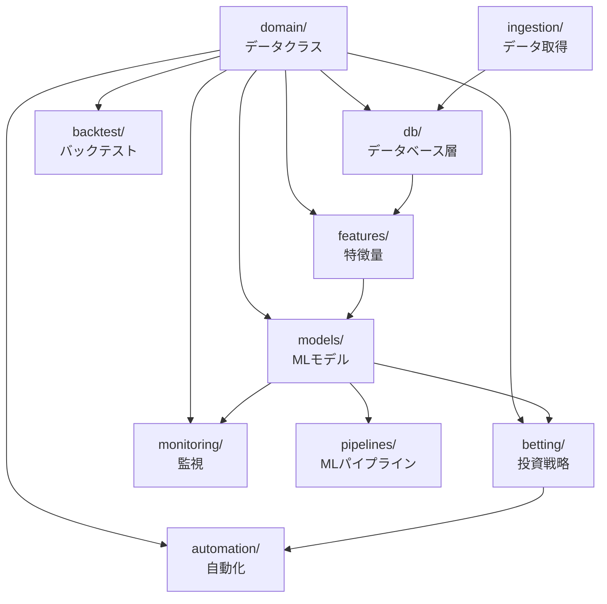

## 全10パッケージの役割

| パッケージ | 行数 | 責任 | Phase |
|-----------|------|------|-------|
| domain | ~290 | データクラス・型定義 | A |
| db | ~330 | PostgreSQL DDL・接続 | A |
| features | ~620 | 特徴量エンジニアリング | B |
| models | ~1,620 | MLモデル群 | C |
| betting | ~1,010 | 投資戦略 | D |
| backtest | ~910 | バックテスト・検証 | E |
| pipelines | ~300 | ML学習パイプライン | E |
| automation | ~470 | PAT投票・スケジューラ | F |
| monitoring | ~380 | モデル監視・再学習 | F |
| ingestion | ~220 | データ取得 | F |

## 主要な設計決定

### SQLAlchemy Core のみ（ORM不使用）
[理由: データの流れを明確に制御するため。ORMの自動キャッシュや遅延読み込みによる
予期せぬ動作を防ぐ。Core の SQL 表現力で十分。]

### 2段階モデル
[ゼロ偏重問題の根本解決。詳細: [予測モデル](../concepts/02_prediction_models.md)]

### Market Model 差分専用
[市場コピーの防止。p_market_pred を出力に含めない。]

### レース識別子
[複合PK (year, month_day, jyo_cd, kaiji, nichiji, race_num)。
GENERATED ALWAYS AS で race_id 文字列を自動生成。

import path: `from domain.types import ...` (pythonpath = [".", "src"])]

## 設計思想: 19の絶対ルール

[design.md から主要なルールを要約して箇条書きで列挙。
例: ゼロ偏重の排除、市場コピーの防止、リーク防止、p_predクリップ等]

> **完全な技術設計:** [design.md](../design.md)

---

> **次のドキュメント:** [コード構造](02_code_structure.md) | **前のドキュメント:** [バックテストと検証](../concepts/05_backtest_validation.md) | **ドキュメント一覧:** [README](../../README.md)
```

- [ ] **Step 2: 構造とリンクを確認**

- [ ] **Step 3: Commit**

```bash
mkdir -p docs/reference
git add docs/reference/01_architecture.md
git commit -m "docs: アーキテクチャ解説を作成 (reference/01)"
```

---

## Task 12: docs/reference/02_code_structure.md

**Files:**
- Create: `docs/reference/02_code_structure.md`
- Read: 全 `src/` パッケージの `__init__.py` と主要モジュール

- [ ] **Step 1: コード構造解説を作成**

以下の構成で250-400行。安定性アノテーション付きで各モジュールを解説。

[各パッケージについて以下のフォーマットで記述:
### domain/ ✅ 安定

[パッケージ概要]

#### models.py
- `Race`: レース情報。複合PK + 計算プロパティ (surface, distance_band, race_id, is_good_track)
- `Entry`: 出走馬情報。finish_pos, win_odds_actual, popularity_rank 等
- `Bet`: 投票情報。stake, ev_lower_corrected, result
- `OddsSnapshot`: 時系列オッズスナップショット
- `DDState`: ドローダウン状態
- `RegimeConfig`: レジーム検知設定
- `TwoStageConfig`: 2段階モデルHP
- `SubmodelSet`: サブモデルセット（芝/ダート各1セット）
- `TrainedModelsV5`: 学習済みモデルのコンテナ
- `SafetyConfig`: SafetyGuard 設定

#### types.py
- `Surface`: TURF, DIRT
- `BetType`: WIN, PLACE, WIDE
- `RecoveryState`: NORMAL, CAUTION, RECOVERY
- `RegimeState`: AGGRESSIVE, CONSERVATIVE, COLLAPSED

（他のパッケージも同様のフォーマットで）]

[🚧 パッケージ（automation, monitoring, ingestion）は
「インタフェースが定義済みで、実装が浅い」と注記し、
主要クラス名と責任の概要のみ記述]

## テスト構造

[43テストファイル、6163行。全て unittest.mock 使用（DB不要）。
pythonpath = [".", "src"] で `from domain.types import ...` が動作。
pytest で実行: `python -m pytest tests/ -v`]

---

> **次のドキュメント:** [設定リファレンス](03_configuration.md) | **前のドキュメント:** [アーキテクチャ](01_architecture.md) | **ドキュメント一覧:** [README](../../README.md)
```

- [ ] **Step 2: 全パッケージのクラス一覧を確認**

実際のソースコードと照合して、クラス名と責任が正確か確認。

- [ ] **Step 3: Commit**

```bash
git add docs/reference/02_code_structure.md
git commit -m "docs: コード構造解説を作成 (reference/02)"
```

---

## Task 13: docs/reference/03_configuration.md

**Files:**
- Create: `docs/reference/03_configuration.md`
- Read: `config/settings.yaml`, `config/backtest_config.yaml`, `pyproject.toml`

- [ ] **Step 1: 設定リファレンスを作成**

以下の構成で200-350行。全設定項目の型・デフォルト値・説明を記述。

```markdown
# 設定リファレンス

[1段落の概要: 全設定ファイルの項目解説]

## config/settings.yaml

### database

| 項目 | 型 | デフォルト | 説明 |
|------|---|-----------|------|
| host | string | "localhost" | PostgreSQL ホスト |
| port | int | 5432 | PostgreSQL ポート |
| dbname | string | "everydb2" | データベース名 |
| user | string | "postgres" | ユーザー名 |
| password | string | "" | パスワード（環境変数 PGPASSWORD で上書き） |

### paths

| 項目 | 型 | デフォルト | 説明 |
|------|---|-----------|------|
| data_dir | string | "data" | データディレクトリ |
| model_dir | string | "models" | モデル保存先 |
| mlflow_tracking_uri | string | "file:///mlruns" | MLflow トラッキングURI |

[logging, feature_engine, late_money, submodel も同様に表形式で全項目を列挙]

## config/backtest_config.yaml

### walk_forward

| 項目 | 型 | デフォルト | 説明 |
|------|---|-----------|------|
| train_years | int | 4 | 学習期間（年） |
| test_years | int | 1 | 検証期間（年） |
| step_years | int | 1 | ウィンドウの移動幅（年） |

[holdout, pass_criteria, ev_correction, validation も同様に全項目を列挙]

## 環境変数

| 変数 | 説明 | 必須 |
|------|------|------|
| PGPASSWORD | PostgreSQL パスワード | ✅ |

## MLflow 設定

[mlflow_tracking_uri の設定方法。
ローカル: file:///mlruns
リモート: http://localhost:5000 等]

---

> **次のドキュメント:** [開発ガイド](04_contributing.md) | **前のドキュメント:** [コード構造](02_code_structure.md) | **ドキュメント一覧:** [README](../../README.md)
```

- [ ] **Step 2: 全設定項目をYAMLファイルと照合**

- [ ] **Step 3: Commit**

```bash
git add docs/reference/03_configuration.md
git commit -m "docs: 設定リファレンスを作成 (reference/03)"
```

---

## Task 14: docs/reference/04_contributing.md

**Files:**
- Create: `docs/reference/04_contributing.md`
- Read: `CLAUDE.md`, `pyproject.toml`

- [ ] **Step 1: 開発ガイドを作成**

以下の構成で150-250行。CLAUDE.md の内容をリンクで参照し重複を避ける。

```markdown
# 開発ガイド

[1段落の概要: このプロジェクトに貢献するための開発環境とルール]

## 開発環境のセットアップ

### 前提条件
[Python 3.11, PostgreSQL, mise]

### セットアップ
```bash
mise install
mise activate
pip install -e ".[dev]"
```

> **詳細:** [セットアップガイド](../guide/04_getting_started.md)

## コーディング規約

### Python バージョン
[Python 3.11 固定（mise.toml）]

### リントとフォーマット（Ruff）
```bash
# チェック
ruff check src/ tests/
ruff format --check src/ tests/

# 自動修正
ruff check --fix src/ tests/
ruff format src/ tests/
```

[設定: target py311, line-length=100, rules E/F/I/N/W]

### 型チェック（Mypy）
```bash
mypy src/
```

[設定: disallow_untyped_defs = true（全関数に型アノテーション必須）]

> **詳細な規約:** [CLAUDE.md](../../CLAUDE.md)

## コミットメッセージ

[Conventional Commits（日本語）を使用:
- feat: 新機能
- fix: バグ修正
- docs: ドキュメント
- test: テスト
- refactor: リファクタリング

例: `feat: EV補正モデル P/E分解で独立性破綻を解決 (C-5)`]

## テスト

### テストの実行
```bash
# 全テスト
python -m pytest tests/ -v

# カバレッジ付き
python -m pytest tests/ -v --cov=src --cov-report=term-missing
```

### テストの書き方
[全て unittest.mock を使用（DB不要）。
各ソースモジュールに対応するテストファイルを作成。
テスト関数名: test_<機能名>]

### テスト構造
[43テストファイル、6163行。test-to-source 比 約 1:1]

## 関連ドキュメント

- [CLAUDE.md](../../CLAUDE.md) — プロジェクトの開発指示書
- [設計書](../design.md) — 技術設計書 v5.5
- [設定リファレンス](03_configuration.md) — 全設定項目

---

> **前のドキュメント:** [設定リファレンス](03_configuration.md) | **ドキュメント一覧:** [README](../../README.md)
```

- [ ] **Step 2: CLAUDE.md との重複を確認**

CLAUDE.md と内容が重複する部分はリンクに置き換える。

- [ ] **Step 3: Commit**

```bash
git add docs/reference/04_contributing.md
git commit -m "docs: 開発ガイドを作成 (reference/04)"
```

---

## Task 15: リンク整合性チェック

**Files:** 全14ファイル

- [ ] **Step 1: 全ファイルのリンクを検証**

以下のチェックを実行:

1. **内部リンクの存在確認**: 各ファイルから参照している相対パスが実際に存在するか
2. **双方向ナビゲーション**: 各ファイルの末尾に「次」「前」リンクがあるか
3. **README.md のドキュメントマップ**: 14ファイル全てにリンクが張られているか
4. **design.md へのリンク**: concepts/ と reference/ からのリンクが正しいか
5. **Mermaid 構文**: 全図の ```mermaid ブロックが正しく閉じているか

```bash
# 全.mdファイルからリンクされているファイルの存在確認
grep -roh '\[.*\](.*\.md)' docs/ README.md | grep -oP '\(([^)]+)\)' | tr -d '()' | sort -u | while read link; do
  target=$(echo "$link" | sed 's|../||')
  if [ ! -f "$target" ] && [ ! -f "docs/$target" ] && [ ! -f "$target" ]; then
    echo "BROKEN: $link"
  fi
done
```

- [ ] **Step 2: 問題があれば修正**

見つかったリンク切れを修正し、個別にコミット。

- [ ] **Step 3: 最終コミット**

全リンクが正常であれば:

```bash
git add -A
git commit -m "docs: ドキュメント整備完了 — 15ファイル全リンク整合性確認"
```
